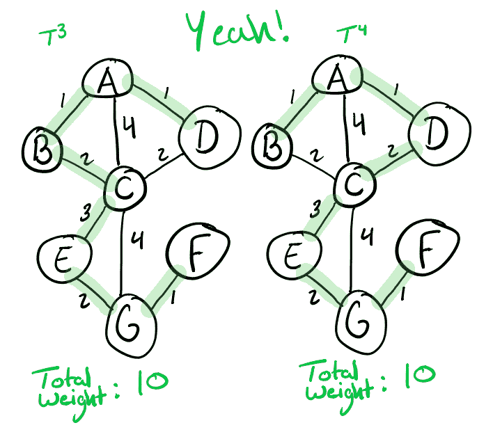

# 对于屏幕阅读器来说，给图形图像添加注释/标题的有效方法是什么？

> 原文：<https://dev.to/downey/what-is-an-effective-way-to-annotate-caption-images-of-graphs-for-screen-readers-39b1>

大家好，

我一直在将我的一些课堂笔记整理成博客帖子，如下所示:

 [## 用 Kruskal 算法求最小生成树

### 蒂姆唐尼 6 月 17 日 197 分钟阅读

#algorithms #computerscience #omscs](/downey/finding-minimum-spanning-trees-with-kruskal-s-algorithm-4j21)

我非常依赖我在 iPad 上绘制的图形图像，并且我尽力提供体面的 [alt 文本描述](https://webaim.org/techniques/alttext/#basics)，但是我意识到，除了粘贴到完整的邻接表中之外，我没有办法确切地描述图形中的内容。以这个为例:

这张图片真的胜过千言万语，我想不出如何用现有的工具更好地诠释它。我可能会非常罗嗦地描述图中正确的最小生成树，但我觉得这篇文章的整体可理解性会受到影响。我只能看到它在某种“仅用于辅助技术”的元素中工作，但我很确定一个`alt`标签不是这样..

有没有人有什么建议或者小技巧可以让这类内容更容易获取？

谢谢！