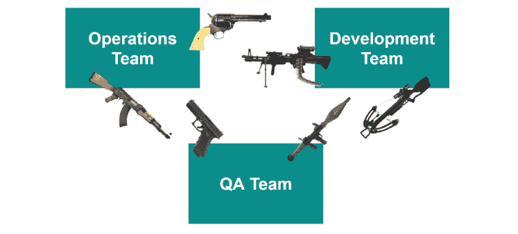
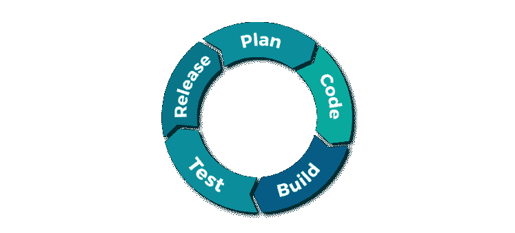
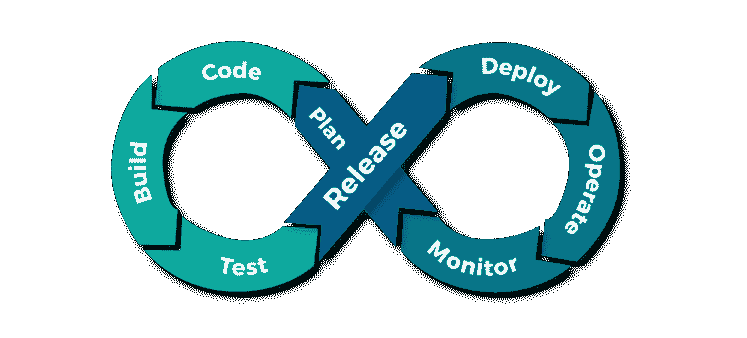

# 什么是 devo PS——一个开发过程或一套工具

> 原文：<https://dev.to/thomasardal/what-is-devops-a-development-process-or-a-set-of-tools-4hm5>

开始之前，我想问你一个问题。你对什么是职责有明确的定义吗？或者这就是你来这里的真正原因？如果你感到困惑，我可以理解。DevOps 这个词可能是这十年来最流行的词了。如果你用谷歌搜索“什么是 DevOps”，你会得到大约 880 万个结果。如果你仔细检查每一个结果，你可能会得到 870 万个不同的定义。在不同的结果中，您会发现“DevOps 工程师”的招聘信息、声称在您的组织中实现 DevOps 的工具等等。在这篇文章中，我会告诉你为什么所有这些都是错的。

先说一个定义。敏捷管理员的欧内斯特·穆勒写了这个简洁明了的解释:

> DevOps 是运营和开发工程师共同参与整个服务生命周期的实践，从设计到开发流程再到生产支持。
> 
> — *敏捷管理员欧内斯特·穆勒*

所以基本上，DevOps 告诉我们要让我们的开发人员和运营人员一起工作。为了理解我们为什么要这么做，让我们回顾一下历史。

大多数软件项目都定义了一组角色。根据你所做的事情和你团队的规模，一个或多个角色可能由一个人来分担。然而，所有的软件项目都需要:

1.  开发商
2.  试验装置
3.  操作

让我们孤立地看一下每个角色:

**开发者**

负责构建新的软件功能。开发人员喜欢构建复杂的东西。有时候开发人员制作的解决方案极其复杂，只是为了好玩(当然你不觉得好玩，但我猜你知道有人觉得好玩:)。为了构建新的特性，开发人员需要不断地改变。大多数开发人员讨厌测试，当其他人破坏他们的代码时更是如此。最后，开发者从不妥协。对这些人来说，拥有漂亮且可维护的代码是最重要的。

**测试人员**

接下来是测试人员。他们负责确保新功能实际上可以工作，并且开发人员没有破坏现有的功能。测试人员喜欢破坏东西。基本上，这些家伙每天早上起来都是为了在别人的代码中寻找 bug。和开发人员一样，测试人员不喜欢妥协。拥有实用功能是世界上最重要的事情。

**操作**

最后，我们有操作人员。运营部门负责将新功能部署到生产环境中，维护基础设施，监控错误和性能等。与开发人员不同，运营人员不喜欢变化。他们的全部目的是保持事情稳定，最后，当软件出故障时，他们不得不在周末工作。运营人员从不妥协。拥有一个稳定的环境对他们来说是最重要的。

看到这里的问题了吗？

三个不同的角色有三个不同的议程，需要为一个共同的目标而合作。这当然是一种致命的鸡尾酒。10 年前，我们通过引入像 Scrum 和看板这样的敏捷流程，开始解决其中的一些问题(以及瀑布带来的许多其他问题)。使用敏捷，你在小的迭代中构建软件，所有的产品人员、开发人员和测试人员被迫一起工作，以产生软件发布的持续流。

在小迭代中工作可能是几乎每个软件项目的正确解决方案。在实施敏捷时，我们大多数人都忘记了一件事，那就是操作人员。虽然我们突然能够产生一个稳定的经过良好测试的版本流，但是我们仍然有在这个特性生命周期循环之外的操作人员。可以理解的是，操作人员开始抱怨。我们刚刚从每 6 个月生产一个新版本发展到每天生产多个版本，我们只是依靠操作人员来处理这个问题。过去，大多数项目都是手工部署新版本，或者使用一些简单的脚本，而不是真正面向持续交付。

使用 DevOps，我们将运营人员纳入开发周期，最后，每个人都朝着同一个目标努力:向生产发布工作特性，同时确保我们的生产环境正常工作，并在不正常时采取行动。达到这个目标花了大约 50 年时间，但我们最终似乎与 DevOps 一起实现了这个目标。

与瀑布过程相比，敏捷引入了一系列新的工具，这些工具是保持高质量发布流动所必需的。当把操作部分扔进组合中时，现有的工具变得和以前一样相关，并且还需要新的和更智能的自动化工具。像 Git、GitHub、TeamCity 和类似的工具，已经改变了我们今天构建软件的方式。Octopus Deploy、Visual Studio Team Services、NuGet、Azure、Docker 等新工具再次改变了我们的工作方式。

回答题目中的问题，DevOps 是一种新的改进的工作方式。从这一天开始，你甚至可以认为它是敏捷 2.0。当具有不同议程和需求的多个角色需要围绕发布工作软件一起工作时，新的过程和工具是必要的。要在您的组织中实现 DevOps，您需要考虑以下几点:

*   人们需要交流和合作。
*   拥有跨职能团队是让人们朝着共同目标一起工作的最佳方式。
*   没有一个工具能为你实现 DevOps。相反，选择合适的工具来适应开发运维的每个阶段以及您的组织将会。

## 你的用户会喜欢更少的错误吗？

elmah.io 是一个简单的错误记录和正常运行时间监控服务。NET web 和日志框架。

➡️ [错误监控。NET 网络应用](https://elmah.io/?utm_source=devto&utm_medium=social&utm_campaign=devtoposts) ⬅️

本文首次出现在 elmah.io 博客上，网址为[https://blog . elmah . io/what-is-devo PS-a-development-process-or-a-set-of-tools/](https://blog.elmah.io/what-is-devops-a-development-process-or-a-set-of-tools/)