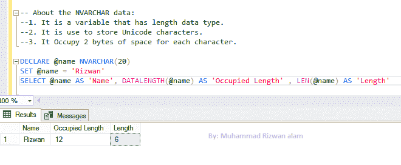

# nvarchar vs varchar SQL server 中 varchar，nvarchar 的区别？

> 原文：<https://dev.to/twostepdeveloper/what-is-difference-between-varchar-nvarchar-4bki>

在本文中，我将区分 varchar 和 n varchar 数据类型。

关于 Varchar:

1.  它是一个长度数据类型的变量。
2.  它用于存储非 Unicode 字符。
3.  它为每个字符占用 1 字节空间。

例:
DECLARE @ name VARCHAR(20)

SET @ name = ' Rizwan '

SELECT @ Name 为' Name '，DATALENGTH(@name)为'占用长度'，
LEN(@name)为' Name Length'
结果:Name 占用长度
Rizwan 6(6*1 byte=6bytes) 6

## T2】

关于 NVARCHAR 数据:

1.  它是一个长度数据类型的变量。
2.  它用于存储 Unicode 字符。
3.  它为每个字符占用 2 字节空间。

例:
DECLARE @ name NVARCHAR(20)

SET @ name = ' Rizwan '

SELECT @ Name 为' Name '，DATALENGTH(@name)为'占用长度'，
LEN(@name)为' Name Length'
结果:Name 占用长度 Length
Rizwan 12(6 * 2 byte = 12 bytes)6

结论

这篇小文章只是让您了解 VARCHAR 和 NVARCHAR 数据类型之间的基本区别，它们用于存储字符、数字或特殊字符。
这是我的第一篇文章
我希望你们都会喜欢，这对你们会有帮助。当我们应该使用 varchar，nvarchar 时，大多数开发人员对 varchar，nvarchar 感到困惑。
请留下您对您观点的评价，无论是好是坏。
分享就是关爱:)