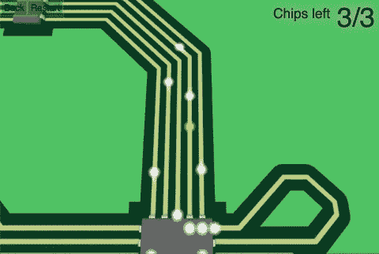
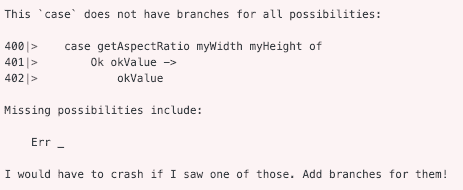
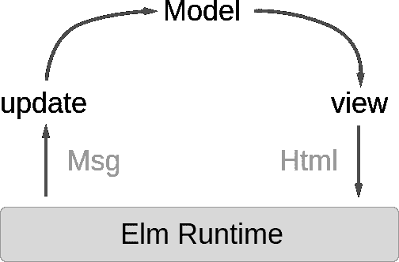

# Elm 是什么(以及我用它做的一个游戏)

> 原文：<https://dev.to/martinsstewart/what-is-elm-and-a-game-i-m-making-with-it-3di1>

# 榆树是什么？

> 可靠的 web 应用程序的令人愉快的语言。

- [榆树官网](https://elm-lang.org/)

我在业余爱好项目上使用 Elm 已经一年多了。我开始使用它是因为希望能够创建 web 应用程序，同时避免 Javascript 及其生态系统中的特性。

我的经验是，“可靠的 web 应用程序的令人愉快的语言”是一个诚实的描述。虽然还有改进的空间，但我发现 Elm 是我用来创建 web 应用程序的最令人愉快和最高效的语言。

声明:我只用过 JS，Elm，和 briefly Typescript，所以无法评论其他 web 语言。

在这篇文章中，我将解释什么是 Elm，为什么它是好的，以及它如何帮助我开发一个游戏。

## 断路器

[](https://i.giphy.com/media/JRJcPCvE9hpbPH26uF/giphy.gif)

简单介绍一下我的游戏吧！

你是黄色的圆圈(我猜是一个电子)，你的目标是通过在相邻的电线之间跳跃来躲避白色的电子，同时“入侵”你遇到的计算机芯片。

还有一个关卡编辑器和每个关卡前的一些愚蠢的对话(只有我的朋友会得到的内部笑话)。

[你可以在这里尝试一下](https://martinsstewart.gitlab.io/hackman)尽管要知道它还不能在移动平台上运行。

## 回到榆树

那么什么是 Elm 呢？

*   生产中没有崩溃
*   这是一种函数式语言
*   没有空的或未定义的
*   使用静态类型，但类型注释是可选的
*   应用程序使用类似 React 和 Redux 的单向数据流

让我们回顾一下这些要点，看看它们如何帮助编写应用程序。

### 生产中没有死机？这并不难，只需围绕整个应用程序进行尝试即可！

当然，应用程序范围内的 try-catch 可以防止应用程序崩溃，但它只是隐藏了问题，而你最终会遇到奇怪的逻辑错误。

Elm 根本没有例外。在函数中出现某种错误的情况下，我们不使用`throw`而是返回表示错误的数据，让调用函数的代码决定如何处理它。

举个例子，在 Javascript 中，我们可能会做这样的错误处理

```
function getAspectRatio(width, height) {
    if (height === 0) {
        throw "Invalid aspect ratio";
    }
    return width / height;
}

// default to 0 if we don't have a valid aspect ratio
var aspectRatio = 0;
try {
    aspectRatio = getAspectRatio(myWidth, myHeight);
}
catch {
} 
```

这样做的缺点是程序员可能会忘记包含 try-catch，或者没有意识到某个函数可能会抛出异常。

等效的 Elm 代码如下所示

```
getAspectRatio width height =
    if height == 0 then
        Err "Invalid aspect ratio"
    else
        Ok (width / height)

aspectRatio = 
    case getAspectRatio myWidth myHeight of
        Ok okValue -> okValue
        Err _ -> 0 -- default to 0 if we don't have a valid aspect ratio 
```

如果你不习惯这种语法，可能很难理解。重要的是没有扔。

相反，`getAspectRatio`返回`Ok`或`Err`，当我们调用`getAspectRatio`时，编译器会确保我们处理这两种情况。

如果我们忘记了`Err _ -> 0`行，编译器会告诉我们犯了一个错误。

[](https://res.cloudinary.com/practicaldev/image/fetch/s--mfUZ6Bus--/c_limit%2Cf_auto%2Cfl_progressive%2Cq_auto%2Cw_880/https://i.imgur.com/K2KrxkD.png)

对未处理的运行时异常的情况进行解释，通常可以捕捉到最终会出现在产品中的 bug，并使开发人员不必为试图从模糊的 bug 报告中重现它们而头疼。

对我的游戏来说，这尤其有用。游戏因为有很多边缘案例而臭名昭著(游戏的关卡编辑更是如此)。拥有一整类的错误是不可能的，这让我可以专注于其他事情。

顺便说一句，Elm 的编译器错误消息通常是直观且有用的。它们读起来更像一个口语句子，而不像神秘的机器噪音。

### 什么是函数式语言？

对于什么使得一门语言“函数化”并没有一个严格的定义，但是这里有一些经常出现的特性

*   代数数据类型
*   模式匹配
*   不变
*   纯函数

这些听起来可能不切实际，更适合学术界，但它们实际上非常有用。

让我们看看最后两点。

#### 永恒性

不变性意味着一旦我们创建了一个数据结构或者给一个变量赋值，我们就永远不会改变它。相反，如果我们想要“改变它”,我们用对副本所做改变来制作副本。

为什么这很有用？假设我们想在应用程序中添加一个撤销按钮。如果我们已经编写了没有不可变状态的应用程序，那么这是很困难的。

我们想要撤销的更改需要额外的代码和状态，以便知道如何撤销它们。数据看起来和以前一样可能还不够，州的不同部分之间的引用也需要重置到它们以前的样子。

这个很难调试，测试很烦，容易坏。

相比之下，如果我们的数据是不可变的，那么当我们进行更改时，我们会创建当前状态的副本并保存对它的引用。当我们撤销时，只需用旧状态替换新状态。

"这听起来很容易做到，但效率低得惊人！"

如果我们对此很天真，并且在每次发生变化时都制作状态的深层副本，那么是的，这是低效的。

然而，我们的状态是不可改变的。我们知道这是无法改变的，所以我们不需要复制一切。只有我们状态中想要复制和改变的部分才需要深度复制。剩下的可以浅复制再利用。

一般来说，不可变性使得理解和调试代码变得更加容易。有了 Elm，我们所有的数据都是不可变的。

#### 纯函数

纯函数是既确定又没有副作用的函数。

改变全局状态、改变传递给它的参数、发出 HTTP 请求等的函数。有副作用而且不纯。

对于相同的输入参数可以返回不同值的函数是不确定的，也是不纯的。

纯函数非常有用，因为它们的行为完全可以根据函数对给定输入参数返回的内容来理解。测试纯函数轻而易举。不需要模仿各种服务，也不需要担心测试会与其他测试混淆，或者对生产系统进行 API 调用。

所有用 Elm 写的函数都是纯函数。在这种规模下，这也意味着很容易将一个程序嵌入到另一个程序中。

通过在 Elm 中编写一个简单的类似 powerpoint 的应用程序，然后将我的游戏嵌入其中，我能够在 meetup 上展示我的游戏。我可以在不离开演示文稿的情况下展示游戏，甚至包括一个俗气的过渡效果(前一张幻灯片发出爆炸声，然后落下来展示游戏。太棒了。)

### 静态打字？更像是，过度打字！

如果您曾经使用过像 Java 这样的语言，您可能会厌恶静态类型的语言。他们只是让你重复类似`Person person = new Person();`的事情，对吗？

榆树不是这样的！你不需要做任何类型注释。Elm 编译器可以计算出整个程序中每个变量、参数和返回值的类型(尽管通常添加类型注释有助于提高可读性)。

这给你留下的只有静态类型的优势，防止程序员混淆不同的类型并提供更好的工具。

在我的游戏中，这不仅能捕获我犯的许多简单错误，还能让我重构代码库的大部分，而不用担心我会引入许多新的错误。

### 榆树建筑(茶)

[](https://res.cloudinary.com/practicaldev/image/fetch/s--UTW6U6og--/c_limit%2Cf_auto%2Cfl_progressive%2Cq_auto%2Cw_880/https://dennisreimann.de/files/elm/architecture-overview-diagram.svg)

-从 dennisreimann.de/articles/elm-architecture-overview.html 借来的

几乎所有用 Elm 编写的应用程序都有一个类似于 React + Redux 应用程序的架构。

这包括

*   一个`update`函数
*   一个`view`功能
*   一种`message`类型
*   还有一个`model`

`model`代表我们应用程序的当前状态。我们的 Elm 程序可以使用的所有数据都包含在其中。在 Redux 中，我们称之为“商店”。

`view`获取`model`并返回 html，Elm 运行时可以用它来更新虚拟 DOM。

`message`代表我们的应用程序中可能发生的所有操作。

最后,`update`将一个`message`和一个`model`作为参数，并返回一个新的【the Elm 运行时将其用作`view`更新 DOM 的参数。

这种体系结构非常有用，原因有很多

*   我们不需要关心*如何*更新 DOM，我们只需要写一个描述它应该是什么样子的函数，让运行时高效地更新实际的 DOM。我过去和 WPF 一起工作过。不必为每个模型变化编写`OnPropertyChanged`,这为我节省了大量的打字和 bug 搜索。
*   数据流是单向的。这样更容易理解事情发生的原因和顺序。当与专门存储在我们的模型中的状态相结合时，这允许 Elm 支持时间旅行调试器(又名，一种让我们跳转到过去的状态并查看 DOM 当时的样子的工具)。
*   当每个人都以相似的方式编写 Elm 应用程序时，就更容易理解某人的代码库。

## 总结

我用 Elm 已经一年多了。这很有趣，也让我在这个过程中成为了一名更好的程序员。

更少担心类型错误、遗漏的边缘情况、更新 DOM、如何构建我的应用程序等等。，让我更有动力，让我专注于为我的游戏编写新功能。