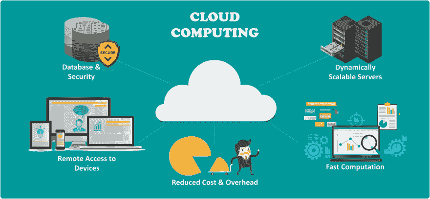
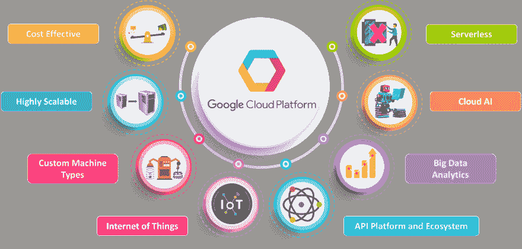

# 什么是谷歌云平台？

> 原文：<https://dev.to/coderoo7/what-is-google-cloud-platform-47k7>

今天我叔叔问我什么是谷歌云平台，因为他正在帮助他的孙女完成她的假期作业。这篇文章是献给他的。

### 首先我们需要了解什么是云？

用技术术语来说,**云**是互联网上的计算机集合，其服务可以被用户(人们)远程使用，而不需要物理地成为他们的。

**云**提供的服务是按需存储和检索用户数据、维护用户数据、数据安全等。

### 其次什么是云计算？

 
*根据维基百科云计算是按需提供计算机系统资源，特别是数据存储和计算能力，而无需由用户(人)直接主动管理*

用外行人的话来说，如果你想去某个地方，但你没有车，你会怎么做？比起购买新车，你更喜欢乘坐优步或其他公共交通工具的出租车。现在试着理解这个概念，即

1.  现在这个世界上不仅仅只有出租车，还有大量的公共交通工具，它们的设施使用者(人)都可以利用，所以我们可以说**出租车群体就是我们提供公共交通设施的云**。

2.  其次，他们是像优步这样的国际巨头和印度的 OLA 提供出租车服务。从这个上下文中，我们可以说这些是用户交互的云平台，类似于**谷歌云平台**、**亚马逊云**、**微软 Azure** 等。

3.  第三个关键点是，为了利用出租车设施，用户(人们)不必走出家门去出租车预订部门，**用户可以使用互联网**远程预订出租车，而不是去第三方预订出租车。因此

    *   用户按需使用出租车设施。
    *   用户无需担心优步或 OLA 如何提供出租车服务。
    *   用户可以选择可用的服务类型，如交流电汽车或非交流电汽车或两轮汽车，类似地，在云计算中，用户可以调整所需的存储量和计算能力。

### 谷歌云平台

它是谷歌提供的各种云计算服务的套件。意味着谷歌拥有自己专用的强大服务器(电脑)和硬件，提供云计算服务。
[T3】](https://res.cloudinary.com/practicaldev/image/fetch/s--GkOymSEQ--/c_limit%2Cf_auto%2Cfl_progressive%2Cq_auto%2Cw_880/https://www.edureka.co/blog/wp-content/uploads/2018/02/GCP_benifits.png)

**谷歌云平台提供的服务**

*   计算
*   存储和数据库
*   建立工作关系网
*   大数据
*   机器学习

**使用谷歌云平台的应用**

*   谷歌驱动
*   谷歌邮箱
*   油管（国外视频网站）

简而言之，别人拥有一台电脑。
你通过网络把东西放在上面。当你想访问它的时候，你连接到网络，访问别人的电脑。这都是关于云计算的