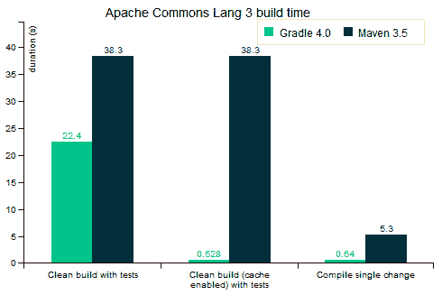

# 格拉德是什么？为什么 Google 选择它作为 Android 的官方构建工具。

> 原文：<https://dev.to/jay_tillu/what-is-gradle-why-google-choose-it-as-an-official-build-tool-for-android-18gd>

#### Gradle 是一个构建工具。

但是在理解 Gradle 之前，我们需要理解什么是构建工具以及我们为什么需要它。

> ***什么是构建工具？*T3】**
> 
> Build tool 是一款帮助应用程序创建过程自动化的软件。构建过程包括编译、链接和将代码打包成可执行的形式。

**构建用于自动化繁琐任务的工具，例如:**

*   下载依赖项
*   将源代码编译成可执行代码
*   将可执行代码打包，生成 APK 或可执行形式
*   运行不同的测试等。

*构建工具也叫构建系统。*

在 Android 中，Build system 获取所有源文件(如`.java`、`.kt`或`.xml`)，然后应用适当的编译过程(如使用 kotlin 编译器进行编译。kt 文件)并生成可执行包或 APK。

你有没有问过自己，为什么 android 对文件夹的命名如此严格？为什么每个资源都进入一个`res`目录，为什么布局必须进入`layout`目录，那是因为这些构建系统。构建系统使用一些命名约定，它们以这样一种方式设计，即它们基于命名约定执行它们操作。

在生成 APK 时，每当构建系统需要任何资源时，它都被设计为在一个`res`目录中找到该资源。这就是为什么 android 对目录命名如此严格。

为了自动化这些任务，我们使用脚本。您可以使用 Linux 中的 shell 脚本和 windows 中的批处理文件来创建自己的构建系统。

#### 为什么我们需要构建工具？

在小型项目中，开发人员可以手动创建构建过程。当只有两到三个文件时，这种方法是有效的。但是在大型项目中，这种方法是行不通的，因为很难跟踪需要构建什么、构建过程中的顺序和依赖关系。这就是为什么我们需要构建工具，因为它们提供了更容易、更强大和更快速的构建过程。

## grad le 是什么？

* * *

Gradle 是一个开源的构建工具。它是用 Java、Groovy 和 Kotlin 编写的。Gradle 包含 Apache Ant 和 Apache Maven 的顶级特性。但是它比它们中的任何一个都更快、更灵活、更强大。

Gradle 是一个基于 JVM 的构建系统，这意味着你可以用任何基于 JVM 的语言编写你自己的脚本，比如 Java，Kotlin，Groovy，Scala 等等。

Gradle 还统计了前 20 个开源项目，谷歌、Adobe、LinkedIn、网飞和 elastic 等科技巨头都将其作为项目的构建工具。

Gradle 还支持所有主流的 ide，比如 Android Studio、IntelliJ、Visual Studio、Eclipse 和 Xcode 等。您也可以通过命令行终端调用它。

## Google 为什么选择 Gradle for android？

* * *

市场上有许多构建系统，如 Maven、Ant、Atlassian Bamboo、CircleCi、TeamCity、Travis Ci 等。

但谷歌希望让应用程序开发过程更快、更容易，在当时和今天也没有人能像 Gradle 那样快速灵活。这也是谷歌选择它作为统治安卓 70%市场的操作系统的原因。

谷歌选择它有三个主要原因:

1.  表演
2.  灵活性
3.  用户体验

#### 表现

在所有场景中，Gradle 比 Maven 快近两倍，对于使用构建缓存的大型构建，gradle 快 100 倍。上图可以看到 Gradle 的性能曲线图。不仅仅是快，而是超快。

#### 灵活性

谷歌选择 Gradle 不仅仅是因为它比其他公司快得多。但是 Gradle 也很灵活。Gradle 的模型被设计成可以扩展到任何生态系统。

Gradle 是一个基于插件的构建系统。这意味着，即使你有自己的编程语言，如果你想从源代码自动生成可执行文件，你也可以用任何基于 JVM 的语言编写自己的插件，比如 Java、Kotlin、Scala、Groovy 等等，然后使用它。这使得 Gradle 比其他人灵活得多。

#### 用户体验

为了提供更好的用户体验，Gradle 支持广泛的 ide，如 Android Studio、IntelliJ、Eclipse、Visual Studio、Xcode 等。

虽然 ide 很重要，但是大量用户还是喜欢用终端工作。这就是为什么 Gradle 提供了现代 CLI(命令行界面)，它有几个强大的功能，如“Gradle 任务”，命令行完成等。

Gradle 还提供了[构建扫描](https://gradle.com/build-scans/)交互式的基于 web 的 UI，用于调试和优化构建。

伙计们，毕业典礼到此结束。如果我错过了什么，请随时告诉我。

直到那时，继续编码，继续爱，在下一篇文章中赶上你。

> 想和我联系吗？以下是链接。我很乐意成为你的朋友。T3】😊
> 
> [推特](https://twitter.com/jay_tillu)
> [脸书](https://www.facebook.com/jaytillu.1314/)
> [insta gram](https://www.instagram.com/jay.tillu/)
> [Medium](https://medium.com/jay-tillu)
> 或者发邮件给我[jayviveki13@gmail.com](mailto:jayviveki13@gmail.com)