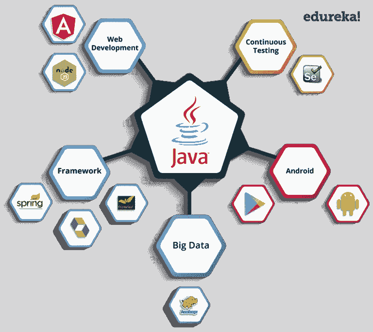
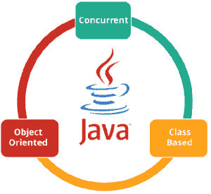
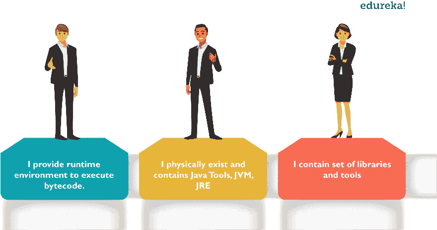

# Java 是什么？Java 及其发展的初学者指南

> 原文：<https://dev.to/aayushi94/what-is-java-a-beginner-s-guide-to-java-and-its-evolution-1o0c>

Java 是一个通用的、并发的、面向对象的、基于类的运行时环境(JRE ),它由 JVM 组成，是 Java 平台的基石。这篇关于什么是 java 的博客将消除你对为什么要学习 Java、特性以及它是如何工作的所有疑虑。

# Java 是用来做什么的？

在我回答 Java 是用来做什么的这个问题之前，让我简单介绍一下你为什么要选择 Java。Java 非常受欢迎，从 2000 年初到现在的 2018 年一直统治着这个领域。

Java 已经被用于不同的领域。其中一些列举如下:

**银行:**处理交易管理。
**零售:**你在商店/餐厅看到的账单应用程序完全是用 Java 写的。
**信息技术:** Java 旨在解决实现依赖。
**Android:** 应用要么用 Java 写，要么用 Java API。
**金融服务:**用于服务器端应用。
**股市:**编写算法，决定他们应该投资哪家公司。

**大数据:** Hadoop MapReduce 框架是用 Java 写的。
**科研界:**处理海量数据。等等！Java 能做的更多。

让我们看看一些技术如何利用 Java 作为其功能的核心。

让我们看看一些技术如何利用 Java 作为其功能的核心。

你可以在上面的图片中看到，Java 是一个充满机会的海洋。

让我们来看看 Java 的简史。

# 爪哇历史

Java 是一种编程语言，由詹姆斯·高斯林和他的团队成员 Mike Sheridan 和 Patrick Naughton 开发，他们在 1995 年被称为绿色团队，为 Sun Microsystems 开发数字设备，如机顶盒、电视等。现在，让我们详细看看什么是 Java。

# 什么是 Java？

它是一种类似于 C++的面向对象语言，但是具有高级和简化的特性。Java 可以免费访问，可以在所有平台上运行。

Java 是:—

Concurrent，可以执行许多语句，而不是顺序执行。

基于类和面向对象的编程语言。
遵循“一次编写，随处运行”逻辑的独立编程语言，即编译后的代码可以在所有支持 java 的平台上运行。

简单来说，它是一个计算平台，您可以在其中开发应用程序。

# Java 的特性

简单:Java 消除了所有的复杂性，如 C++或任何其他编程语言中的指针、操作符重载，从而使生活变得更加简单。

可移植性:Java 是独立于平台的，这意味着在一个平台上编写的任何应用程序都可以很容易地移植到另一个平台上。

面向对象:一切都被认为是一个“对象”,它拥有某种状态、行为，所有的操作都是用这些对象来完成的。

安全的:所有的代码在编译后都被转换成字节码，这是不可读的。java 不使用显式指针，而是在沙箱内运行程序来防止来自不可信来源的任何活动。它能够开发无病毒、无篡改的系统/应用程序。

动态:它能够适应不断发展的环境，支持动态内存分配，从而减少内存浪费，提高应用程序的性能。

分布式:Java 提供了一个有助于创建分布式应用程序的特性。使用远程方法调用(RMI)，一个程序可以通过网络调用另一个程序的方法并获得输出。您可以通过从 internet 上的任何计算机调用这些方法来访问文件。

健壮:Java 有强大的内存管理系统。它有助于消除错误，因为它在编译和运行时检查代码。

高性能:Java 通过使用字节码实现了高性能，字节码可以很容易地翻译成本机代码。通过使用 JIT(实时)编译器，Java 实现了高性能。

解释的:Java 被编译成字节码，由 Java 运行时环境解释。

多线程:Java 支持多线程执行(也称为轻量级进程)，包括一组同步原语。这使得用线程编程更加容易。

# Java 中的组件

## JVM (Java 虚拟机)

它是一台抽象的机器。它是一个提供运行时环境的规范，Java 字节码可以在这个环境中执行。它遵循三种符号:

规范:它是一个描述 Java 虚拟机实现的文档。它是由 Sun 和其他公司提供的。
实现:是符合 JVM 规范要求的程序。
运行时实例:每当您在命令提示符下编写 java 命令并运行该类时，就会创建一个 JVM 实例。

## JRE (Java 运行时环境)

JRE 指的是可以执行 Java 字节码的运行时环境。它实现了 JVM (Java 虚拟机),并提供了 JVM 在运行时使用的所有类库和其他支持文件。所以 JRE 是一个软件包，包含了运行一个 Java 程序所需要的东西。基本上，它是物理上存在的 JVM 的一个实现。

## JDK(Java 开发工具包)

这是必要的工具:-

编译
文件
打包 Java 程序。

JDK 完全包含了 JRE，其中包含了面向 Java 程序员的工具。Java 开发工具包是免费提供的。除了 JRE，它还包括一个解释器/加载器、一个编译器(javac)、一个归档器(jar)、一个文档生成器(Javadoc)和 Java 开发中需要的其他工具。简而言之，它包含了 JRE +开发工具。

来源: [Edureka](https://www.edureka.co/blog/what-is-java/)