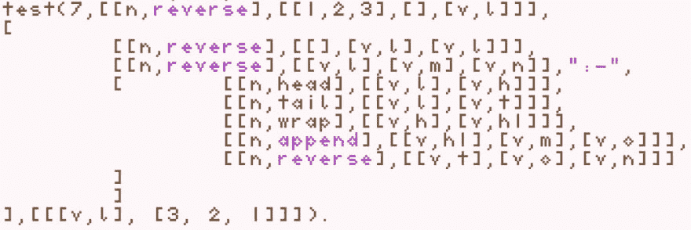

# 什么是 List Prolog？

> 原文：<https://dev.to/luciangreen/what-is-list-prolog-3h19>

一、什么是口译员？它用我写的叫做 List Prolog 的语言运行代码。什么是 List Prolog？语言中的一切都是列表(Prolog 的主要输入和输出格式)，包括要运行的算法。

那么，List Prolog 能做什么呢？

它可以

*   运行带有谓词的代码
*   运行递归代码
*   解析语法，对于文件解析和将原子(字符串)转换成术语(列表)很有用
*   用户可以把它作为研究工具。我最喜欢的功能之一是 List Prolog 中的列表，因为你可以双击 BBEdit 中的一对括号，它会选择整个短语。这有助于错误检查。列表使解释器能够以列表的形式处理包括算法在内的所有数据，因此可以很容易地使用算法生成代码。
*   它的变量命名比 Prolog 的变量名字符串操作(即大写到小写)更快。

假设有人问我为什么选择用 Prolog 写“列出 Prolog 解释器”。我在序言中写了 List Prolog 来写 CAWP。那个词的意思不是“复制”，而是“用谓词组合算法编写器”。这是一种归纳或规则发现算法。我需要一个 CAWP 用过的翻译。我考虑过使用我大学时代的解释器，但是它不能处理谓词，我想定制它。列表是可行的方法。

实际上，我过去的一个程序，数据库公式查找器启发了 List Prolog 解释器。与 Prolog 不同，它使用逻辑从表中选择数据。我想写数据库公式查找器，因为我想写一种用 Prolog 编写数据库语言的方法。我注意到在 Prolog 中，当处理列表时，列表作为一种计算机语言工作得很好。

看看数据库公式查找器如何启发 List Prolog 解释器:[https://www.youtube.com/watch?v=dVOUz74Kwlk&t = 13s](https://www.youtube.com/watch?v=dVOUz74Kwlk&t=13s)

在解释器上工作已经花了几年的时间，我一直在利用这些时间编写算法思想，这些思想可能更容易用解释器编写，例如，在你打字时发现错误。

List Prolog 的另一个特性是语法。他们可以解析具有特定结构的文件。所以我做了一个关于 List Prolog 中语法如何工作的视频。这是什么是语法的快照(以及它们如何帮助解析和回答问题)。
看语法工作在:[https://www.youtube.com/watch?v=HBB6NWCxu3I&t = 33s](https://www.youtube.com/watch?v=HBB6NWCxu3I&t=33s)

结论

如何运行 List Prolog 解释器？人类学影响了我一边学习写算法一边写解释器，可以写算法，像船一样。

参见[https://github . com/lucian en/listprolog in terner](https://github.com/luciangreen/listprologinterpreter)

我能用 List Prolog 解释器做什么？它能写算法吗？
研究神学启发了我写 CAWP，一个可以像领袖一样写算法的算法。
参见[https://github . com/luciangreen/Combination-Algorithm-Writer-with-Predicates](https://github.com/luciangreen/Combination-Algorithm-Writer-with-Predicates)