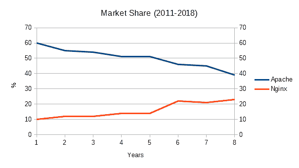
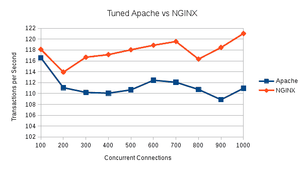
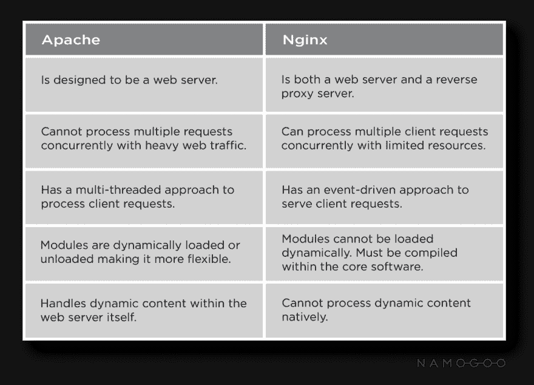

# NGINX 是什么？

> 原文：<https://dev.to/jovanhernandex/what-is-nginx-26b2>

### NGINX 简介

如果您一直在关注我的帖子，那么您已经对 [Apache Web 服务器](https://medium.com/@jovanshernandez/introduction-to-apache-web-server-2138af643039)有了很好的介绍，它是如何工作的，它在历史上的地位，以及 Sumo Logic 如何帮助您整理提供的大量日志。Apache 访问和错误日志对于理解用户访问 web 应用程序时面临的流量模式和问题是不可或缺的。Sumo 逻辑帮助管理员解析日志，隔离问题，并确定错误的根本原因。Sumo Logic 还为业务和产品开发团队提供了宝贵的洞察力，以衡量用户交互和导航模式。

今天我们将讨论 NGINX，它是一个开源软件 web 服务器，也是 Apache HTTP 服务器的主要替代者/竞争对手。NGINX 自诞生以来越来越受欢迎，广泛应用于 web 服务、反向代理、缓存、负载平衡、媒体流等等。

#### NGINX 的快速历史

在 2002 年，互联网上的 web 开发人员承担了设计能够处理一万个并发 web 连接的 web 服务器的任务，这被认为是现代 web 的必要基准。俄罗斯软件工程师伊戈尔·塞索耶夫发布了 NGINX 的首个公开版本。依靠异步、事件驱动的架构来应对这一挑战。这意味着与 Apache HTTP Server 不同，NGINX 在一个工作进程中处理请求的多个进程和线程，而不是 Apache 所熟知的专用进程或线程。

NGINX 在 Apache 上取得进展

### NGINX vs Apache

曾经有一段时间，阿帕奇人毫无疑问地统治着一切，每个人都离他们很远。今天，在 2019 年，网络服务器的格局已经发生了变化，取决于你的来源，NGINX 和微软的 [IIS](https://www.sumologic.com/blog/iis-logs/) 并驾齐驱，排名第二，或者可以根据你的服务器的具体功能，排名第二或第三。不管怎样，随着 web 应用程序和它们的功能变得越来越动态和特定，Apache 正在迅速失去阵地。十年前，当 web 应用程序和服务器几乎完全相同时，Apache 几乎可以处理您需要的一切，但是随着 web 的发展和不同需求的出现，NGINX 开始满足 Apache 无法满足的需求。Apache 非常适合多个站点的共享托管，但是 NGINX 在不断变化的 web 内容环境中展示了它在动态内容、复杂功能和纯粹的灵活性方面的优势。

就像 Apache 和 LAMP stack 一样，NGINX 通过为软件开发人员提供 LEMP 解决方案而变得流行起来(E 被用作 NGINX 的语音拼写)。Linux、NGINX、MySQL 和 PHP/Python 已经成为一个非常流行的堆栈，它反映了经典的 web LAMP 堆栈。虽然 Apache 和 LAMP 栈仍然是一个非常受欢迎的解决方案，但是根据您的用例，您可能会考虑将 NGINX 和 LEMP 作为您的 web 应用程序的下一个首选栈。

### NGINX 和 Apache 有什么不同？

NGINX 是在 Apache 之后进入服务器领域的，因此它的开发人员更清楚困扰 Apache 的问题和技术限制。如前所述，NGINX 依赖于事件驱动、异步、单线程架构。与 Apache 相比，通过利用 Linux 和 Unix 等现代操作系统的底层能力，NGINX 能够在每台服务器上处理至少 10 倍(通常是 100-1000 倍)的请求。NGINX 有效地优化了内存和 CPU 的使用，能够快速扩展以提供更多的用户连接，同时还提供更好的带宽，与其他现代操作系统相比，资源占用更少。

NGINX 处理请求的方式与 Apache 不同，这使得 NGINX 适用于角色多变的动态环境。除了为动态 web 内容提供服务之外，NGINX 在 web 应用程序中的一些最受欢迎的用例场景包括:在您的堆栈中使用 NGINX，开发人员可以将其用作 HTTPS 和其他 TCP 协议的反向代理服务器，负载平衡以实现高效的流量分配，以及 HTTP 缓存。

虽然 Apache 用作负载均衡器是完全可行的，但 Apache 更以其功能和耐用性著称，而 NGINX 则以速度、响应能力和资源效率著称。因此，更常见的是 NGINX 作为反向代理，Apache 作为后端服务器。

### NGINX 如何处理动态请求？

您可以整天运行基准测试，但真实世界的用例是确定服务器在野外如何运行的更好方式。我们可以看看静态和动态内容，以及每个服务器如何处理这两种请求。

**Apache—**Apache 之所以伟大，部分原因是它具有 MPMs 的模块化可配置性，或“多处理模块”。Apache 完全能够通过传统的基于文件的方法以及它的 MPM 工作人员来处理静态和动态内容。通过在每个 worker 实例中嵌入所需的语言处理器，Apache 可以为动态内容提供 PHP、Python 和其他流行语言。

能够在内部处理动态内容而不传递给外部流程，这使得 Apache 能够相当简单地提供其内容。

**NGINX—**NGINX 本身无法处理动态内容。为了处理 PHP 之类的脚本语言，NGINX 必须将请求传递给处理脚本执行的外部处理器，然后等待内容被发回、呈现并准备好提供给最终用户。虽然这听起来很复杂，而且比 Apache 更复杂，但是它有一些优点。

NGINX 使用 http、FastCGI、SCGI、uWSGI 等协议。由于动态解释器是外部的，没有与工作进程集成在一起，所以总开销减少了，这又使 NGINX 在速度和响应性方面享有盛誉。

NGINX 和 Apache 之间的差异概述

### 结论

在这篇 NGINX 简介中，我们介绍了 NGINX 服务器的简史，它是如何出现的，它在服务器领域的地位，以及 NGINX 相对于 Apache 的优势。虽然这两种类型的服务器都是领导者，并且各自功能强大，但重要的是要认识到具体的用例场景，以便开发人员和管理员在制定基础架构决策时能够更好地做好准备。

在 NGINX 简介的第 2 部分中，我们将更深入地探讨 NGINX，包括配置管理、日志文件、错误页面，以及可用于增强您的 web 应用程序和服务器架构的不同类型的模块。请继续关注第 2 部分。

* * *

[*注:这篇文章最初发表在相扑逻辑的资源中心博客*](https://www.sumologic.com/blog/what-is-nginx/) 上