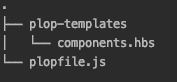
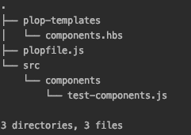

# 什么是扑通-文件生成器工具系统

> 原文：<https://dev.to/apium_hub/what-is-plop-file-generator-tool-system-3o0m>

## 什么是扑通？

扑通是一个文件生成器工具系统，它允许你定义一个脚本文件来为你生成所有的样板文件。类似于 [Angular schematics](https://angular.io/cli#schematics) 的工作方式，您可以定义一组动作，这些动作会自动或通过响应一些 CLI 提示为您生成所有预定义的代码。

首先你需要定义一个`plopfile.js`，它将包含一个函数，该函数将接收一个能够访问[所有方法](https://plopjs.com/documentation/#plopfile-api)来生成代码的`plop`对象。

```
module.exports = function (plop) {
    plop.setGenerator('components', {
        description: 'This will generate the components folder',
        prompts: [{
            type: 'input',
            name: 'name',
            message: 'type the name for your components folder'
        }],
        actions: [{
            type: 'add',
            path: 'src/components/{{name}}.component.js',
            templateFile: 'plop-templates/components.hbs'
        }]
    });
}; 
```

*   首先我们将使用 [`.setGenerator`](https://plopjs.com/documentation/#setgenerator) 函数，使用`'components'`作为发生器名称，所以如果我们想要触发这个发生器，我们将使用`plop components`。
*   然后，在`prompts`数组中，我们将定义一个 [InquirerQuestion](https://github.com/SBoudrias/Inquirer.js/#question) 的数组，稍后我们可以使用这些问题的输入值作为模板中的参数。
*   最后，`actions`，他们接受了一组 [ActionConfig](https://plopjs.com/documentation/#interface-actionconfig) ，这些动作将作用于我们将要创建的文件，并根据我们的需要对它们进行修改。

我们还需要添加一个新文件夹来存储我们的模板，我将其命名为`plop-templates`并添加一个新文件`components.hbs`。

```
<br />{{name}} 
```

我们将拥有以下结构:

[](https://res.cloudinary.com/practicaldev/image/fetch/s--FfTujfNs--/c_limit%2Cf_auto%2Cfl_progressive%2Cq_auto%2Cw_880/https://user-images.githubusercontent.com/32362841/55502320-99d6b880-564c-11e9-9102-9fda329dbc98.png)

现在，如果我们跳转到控制台，在我们的文件夹中，我们有 plopfile 文件，并键入`plop components`，我们将被要求`'type the name for your components folder'`，这是我们在提示数组的对象的`message`键中定义的消息。回答后，它会生成一个文件夹，里面有我们提供的答案，在我的例子中是`test-components`。

在此之后，我们将有以下结构:

[](https://res.cloudinary.com/practicaldev/image/fetch/s--puLMsZ8B--/c_limit%2Cf_auto%2Cfl_progressive%2Cq_auto%2Cw_880/https://user-images.githubusercontent.com/32362841/55502251-7449af00-564c-11e9-934c-617f92da0d00.png)

如果我们打开生成的`test-components.js`,我们会看到`{{name}}`变量已经用我们在控制台中提供的名称
进行了修改

```
test-components 
```

## 什么时候用扑通

既然我们已经看到了一个简单的例子，我们可以开始创建更复杂的模板来自动化我们的任务。例如，我们将创建一个新的生成器来为我们生成所有的 Redux 样板文件。

`main.hbs`

```
import { Action } from '@ngrx/store';

// constants

// actions

export type {{pascalCase fileName }}Actions =
; 
```

`constants.hbs`

```
export const {{constantCase actionName}} = '[Talents] {{actionName}}';
export const {{constantCase actionName}}_FAIL = '[Talents] {{actionName}} Fail';
export const {{constantCase actionName}}_SUCCESS = '[Talents] {{actionName}} Success'; 
```

`actions.hbs`

```
export class {{pascalCase actionName}} implements Action {
public readonly type = {{constantCase actionName}};
constructor(public payload) {}
}

export class {{pascalCase actionName}}Fail implements Action {
public readonly type = {{constantCase actionName}}_FAIL;
constructor(public payload) {}
}

export class {{pascalCase actionName}}Success implements Action {
public readonly type = {{constantCase actionName}}_SUCCESS;
constructor(public payload) {}
} 
```

`typeExport.hbs`

```
| {{pascalCase actionName}}
| {{pascalCase actionName}}Success
| {{pascalCase actionName}}Fail 
```

`ploplfile.js`

```
module.exports = function (plop) {
    plop.setGenerator('actions', {
        description: 'This will generate the actions file',
        prompts: [
            {
                type: 'input',
                name: 'fileName',
                message: 'type the name for your file'
            },
            {
                type: 'input',
                name: 'actionName',
                message: 'type the name for your action'
            }
        ],
        actions: [
            {
                type: 'add',
                path: '{{pascalCase fileName}}.actions.ts',
                templateFile: 'plop-templates/actions/main.hbs',
                skipIfExists: true
            },
            {
                type: 'append',
                path: '{{pascalCase fileName}}.actions.ts',
                pattern: /(\/\/ constants)/g,
                templateFile: 'plop-templates/actions/constants.hbs',
            },
            {
                type: 'append',
                path: '{{pascalCase fileName}}.actions.ts',
                pattern: /(\/\/ actions)/g,
                templateFile: 'plop-templates/actions/actions.hbs',
            },
            {
                type: 'append',
                path: '{{pascalCase fileName}}.actions.ts',
                pattern: /(export\s+type\s[\w]+\s=)/g,
                templateFile: 'plop-templates/actions/typeExport.hbs',
            }
        ]
    });
}; 
```

[链接到回购](https://github.com/arnausd23/plopfile-article/tree/master/test-plop)

帖子[什么是扑通——文件生成器工具系统](https://apiumhub.com/tech-blog-barcelona/plop-file-generator-tool/)最早出现在 [Apiumhub](https://apiumhub.com) 上。