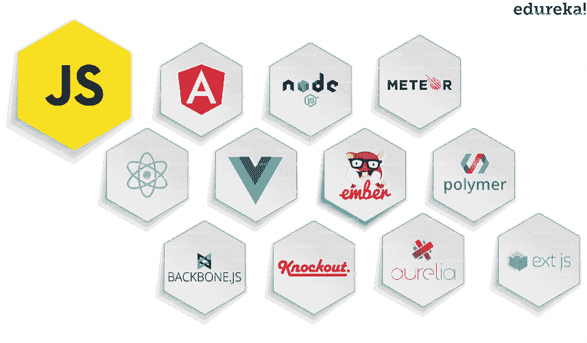
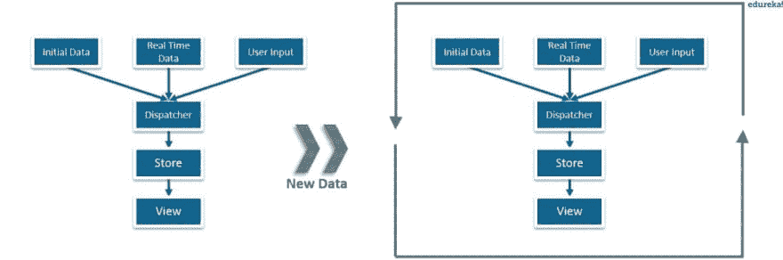
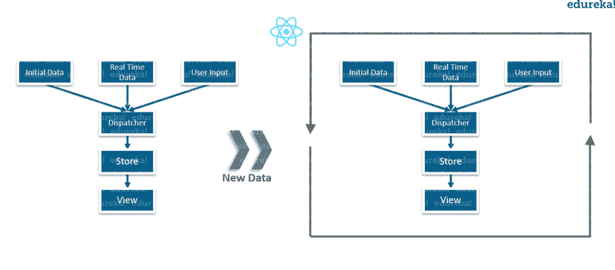

# 什么是反应？–使用 React 揭开交互式用户界面的神秘面纱

> 原文：<https://dev.to/swa12edu/what-is-react-unveil-the-magic-of-interactive-ui-with-react-e08>

# 什么是反应？

你还记得几年前脸书的 UI 或者它的 messenger 是什么样子吗？在那段时间里，你不得不为新的更新或消息反复刷新或重新加载整个页面。但是现在已经不需要了。今天，每次有新的更新或消息时，都会弹出通知。点击它会自动刷新你的页面并显示最新的更新。那么，这到底是怎么发生的呢？这就是 ReactJS 的神奇之处，在这篇博客中，我将讨论什么是 React 以及为什么你应该选择 React。

# JavaScript 框架

Javascript 是一种动态编程语言，广泛用于开发 web 应用程序。它是非常轻量级的，并且被大多数现代浏览器所支持。而且，JavaScript 既支持面向对象编程，也支持过程化编程。因此，它被用于创建具有客户端脚本的网页，以与用户交互，并使网页动态和健壮。JavaScript 有许多框架，我们可以根据自己的需要选择。下图显示了一些流行的 JavaScript 框架。

以下是 JavaScript 框架提供的主要优势:

**效率:**通过使用预构建的模式和功能，应用程序的开发变得很容易。过去需要几个月开发的项目现在可以在很短的时间内完成。这提高了效率，也减少了时间和精力。

**安全性:**由于 JavaScript 是一个开源社区，其顶级框架都有很强的安全性安排。这些大型社区支持框架，其中的成员和用户也可以充当测试人员。这增加了检测框架中存在的任何后门或 bug 的机会。从而以更低的成本提供更好的安全性。

**降低成本:** JavaScript 框架是免费的，因为它们是开源的。因此，当我们使用这些框架开发一个 web 应用程序时，应用程序的总成本要低得多。

由于所有这些优点，JavaScript 框架被大量用于开发 web 应用程序。在过去的几年里，他们已经证明了自己的潜力。其中最受欢迎的是 React 和 Angular。“尽管 React 很年轻，但它正在与 Angular 展开并驾齐驱的竞争”。如果你计划在 web 开发领域取得成功，那么 [React 认证培训](https://www.edureka.co/reactjs-redux-certification-training)是你的正确选择。

因此，通过这个博客，我们将了解所有关于 ReactJS。但是在理解什么是 React 之前，你首先需要理解我们为什么需要它。

# 为什么会有反应？

市场上有如此多的 JavaScript 框架可用，但 React 仍然占据了一席之地。让我们再深入一点，找出需要 ReactJS 的原因。

从下图可以看出，以前的框架使用的是传统的数据流。

这里，数据是从各种来源接收的，如初始数据、实时数据和传递给调度程序的用户输入数据。然后，调度程序将这些数据转发到商店，最终从商店到达视图。现在，视图是您或用户与应用程序交互的部分。所以，你在浏览器上看到的网页就是视图本身。

但是，您认为使用这种传统数据流的框架后端会发生什么情况呢？

每次在后端添加新数据或更新任何数据时，浏览器都会重新加载网页并再次重复整个过程。只有在这之后，我们才能在视图上看到更新的数据。但是这种传统的数据流有一个主要的缺点，它使用了 DOM(文档对象模型)。DOM 是浏览器在每次加载网页时创建的对象，它可以在后端动态添加或删除数据。但是每次修改后，都会为同一个页面创建一个新的 DOM。DOM 的重复创建导致了不必要的内存浪费和应用程序性能的下降。

此外，操作 DOM 非常昂贵。因此，人们寻求新的技术来拯救我们。这就是 ReactJS 来拯救我们的地方。使用 ReactJS，您可以将整个应用程序分成不同的独立组件。ReactJS 应用程序仍然使用相同的传统数据流，但是在后端发生了一些变化。下图显示了后端到底发生了什么。

现在，每次从后端添加或更新任何数据时，ReactJS 都会使用新的策略来处理它。React 所做的不是重新加载整个页面，而是破坏旧的视图。之后，它用更新或新数据呈现视图组件，然后用新视图代替旧视图。作为对 DOM 造成的内存浪费的解决方案，React 引入了虚拟 DOM。你可能会好奇这个虚拟 DOM 是什么，它是如何解决我们的问题的？不要担心，我会在这个博客的后面详细解释，但是现在，让我们先了解什么是 React。

# 什么是反应？

React 是一个基于组件的库，用于开发交互式 UI(用户界面)。它是目前最受欢迎的 JavaScript 前端库之一，拥有强大的基础和支持它的大型社区。

注意:ReactJS 只是一个前端库，并不是整个框架，它处理的是 MVC(模型-视图-控制器)的视图组件。

在 ReactJS 中，一切都是组件。考虑一个乐高房子作为一个完整的应用。然后将每个乐高积木与一个作为积木的组件进行比较。这些块/组件被集成在一起以构建一个更大的动态应用程序。

使用组件的最大优点是，您可以在任何时间点更改任何组件，而不会影响应用程序的其余部分。当在数据频繁变化的大型实时应用程序中实现时，此功能最为有效。每次添加或更新任何数据时，ReactJS 都会自动更新其状态实际上已经改变的特定组件。这将浏览器从重新加载整个应用程序以反映更改的任务中解救出来。

ReactJS 是由在脸书工作的软件工程师乔丹·沃克开发的。脸书于 2011 年在其 newsfeed 部分实现了 ReactJS，但它是在 2013 年 5 月向公众发布的。ReactJS 实施后，脸书的用户界面得到了极大的改善。这导致了满意的用户和它的受欢迎程度的突然提高。

# 反应过来的特征

既然您已经理解了什么是 React 以及为什么使用它，那么现在让我们揭开它的一些有趣的特性。

JSX: JSX 代表 JavaScript XML。React 使用类似 XML/ HTML 的语法。它扩展了 ECMAScript，使 XML/ HTML 之类的文本可以与 JavaScript react 代码共存。Babel 等预处理程序使用这种语法将 JavaScript 文件中类似 HTML 的文本转换成标准的 JavaScript 对象。有了 JSX，我们可以更进一步，再次将 HTML 代码嵌入到 JavaScript 中。这使得 HTML 代码易于理解，提高了 JavaScript 的性能，同时使我们的应用程序更加健壮。

虚拟 DOM: 与实际的 DOM 一样，虚拟 DOM 也是一个节点树，它将元素及其属性和内容作为对象及其属性列出。React 的渲染函数从 React 组件中创建一个节点树。然后，它更新该树，以响应由用户或系统执行的各种操作引起的数据模型的变化。
这个虚拟 DOM 的工作只需要三个简单的步骤。

1.  每当底层数据发生变化时，整个 UI 都会以虚拟 DOM 表示重新呈现。
2.  然后计算以前的 DOM 表示和新的 DOM 表示之间的差异。
3.  一旦计算完成，真正的 DOM 将只更新实际发生变化的内容。你可以把它想象成一个补丁。由于补丁仅应用于受影响的区域，类似地，虚拟 DOM 充当补丁并应用于真实 DOM 中被更新或改变的元素。

**可测试性:** React 视图可以作为状态的函数使用(状态是一个决定组件如何渲染和行为的对象)。因此，我们可以轻松地操作传递给 ReactJS 视图的组件状态，并查看输出和触发的动作、事件、函数等。这使得 React 应用程序非常容易测试和调试。

**服务器端渲染(SSR):** 服务器端渲染只允许在服务器端预渲染 react 组件的初始状态。有了 SSR，服务器对浏览器的响应就变成了现在可以呈现的页面的 HTML。因此，浏览器现在可以开始呈现，而不必等待加载和执行所有 JavaScript。因此，网页加载速度更快。在这里，尽管 React 仍在下载 JavaScript、创建虚拟 DOM、链接事件等，用户仍能看到网页。在后端。

**单向数据绑定:**与其他框架不同，ReactJS 遵循单向数据流或单向数据绑定。单向数据绑定的主要优点是，在整个应用程序中，数据是单向流动的，这使您可以更好地控制它。因此，应用程序的状态包含在特定的存储中，因此，其余组件保持松散耦合。这使得我们的应用程序更加灵活，从而提高了效率。

简单:使用 JSX 文件使应用程序变得非常简单，
轻松学习曲线 React 是什么——既能理解又能编码。尽管我们可以在这里使用普通的 JavaScript，但使用 JSX 更容易。React 基于组件的方法以及独特的生命周期方法也使其易于学习。