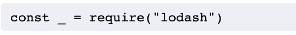
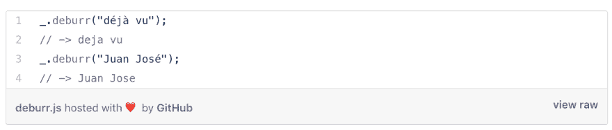
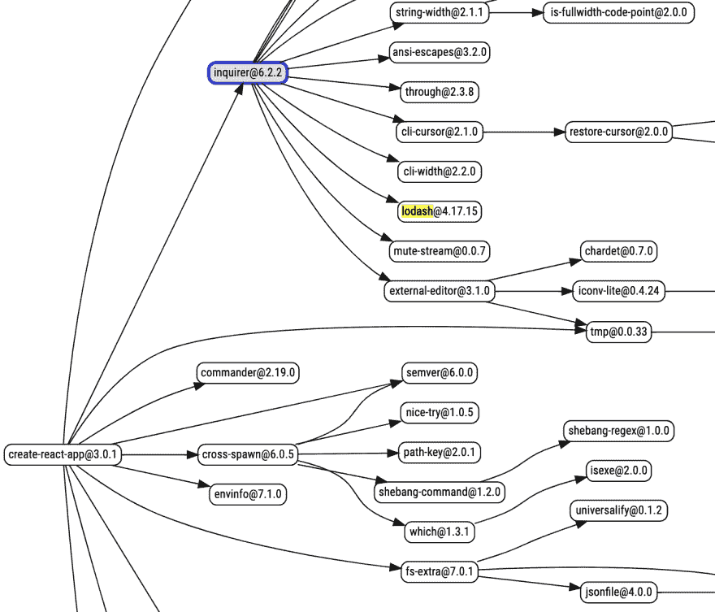

# lodash 是什么？

> 原文：<https://dev.to/calier/what-s-lodash-3fbn>

和你们大多数人一样——或者至少是@ kyleshevlin——我最近似乎在 Github 上很受欢迎。他们给我发了很多邮件，大部分都说“你的一个依赖项有安全漏洞……”

我收到的很多邮件都与 Lodash 依赖有关(看起来你的很多邮件也是如此)，是关于用 Express、React 等各种包构建的项目的回购。我知道我从来没有明确地安装过任何叫 Lodash 的东西，但是这些回复都有它，那么它是什么，它做什么，它是如何到达那里的呢？欢迎收看另一集“拉什顿调查”...

官网-告诉我是:

> 一个现代化的 JavaScript 实用程序库，提供模块化、高性能和额外功能。

Ok, so it's a library. Makes sense. It's written in JavaScript, which also makes sense given the repos that have the issues.

Lodash.com 还说它可以和 npm 一起安装，它有多种版本，它有处理数组、数字、字符串、对象等的方法。酷毙了。您可以使用这些方法进行迭代、处理值(如测试)和创建复合函数(将一个函数应用于另一个函数的结果)。要使用这些方法，可以在下划线上调用它们，并把要使用它们的对象作为参数传入。起初我不明白为什么，但是按照惯例，你应该将 Lodash 库映射到下划线字符，例如:

Vincent D'amour 的这个博客有很好的 Lodash 方法的例子--including _。去毛刺，去除字符中的重音符号:

这就是它的定义和作用，下一个问题是，如果我没有明确安装它，它是怎么来的？

我以为谷歌会很容易地回答这个问题，但不，或者也许我只是没有搜索正确的东西。我发现开发者的一个关键技能是知道如何表达你的谷歌搜索！我用来构建我的项目的库使用 Lodash 作为依赖项似乎是合乎逻辑的，快速搜索“create-react-app lodash”会返回这个顶部结果:

一切都很好，但是当我查看我的一个用 create-react-app 构建的 repo 时，它不在 package.json 中，而是在 package-lock.json 中，84 次！1 次是针对 Lodash 本身，9 次是针对个别 Lodash 方法，其余是其他库需要的。例如，eslint 需要整个 Lodash 库，而 css-loader 只需要“lodash.camelcase”。

老实说，在这一点上我仍然有点困惑——这两个文件中的东西之间有什么联系？这些依赖关系嵌套有多深？在与一位开发朋友讨论时，他建议用依赖图来帮助我可视化关系——我不熟悉这个术语，但我设法找到了一些很好的资源:

*   :生成简单易懂的图表
*   npm.avanka.com:视觉上令人印象深刻，动态地构建了一个漂亮的浮动图形，但我觉得它不容易阅读

From the graphs generated, it was easy to see where lodash came from - create-react-app requires a library of command-line interfaces called Inquirer, which in turn requires Lodash. Boom!

