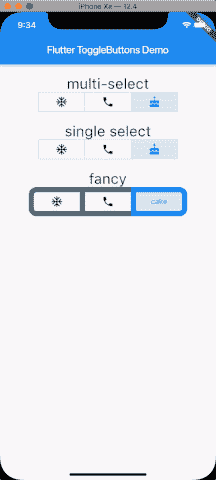
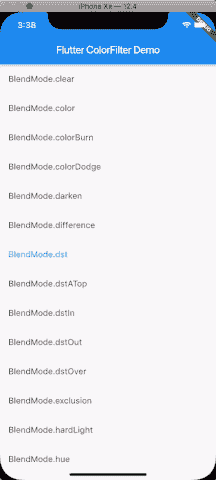
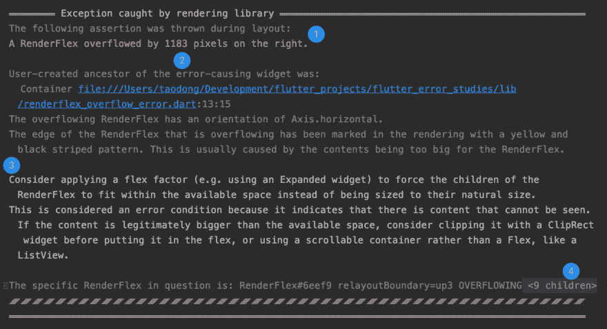
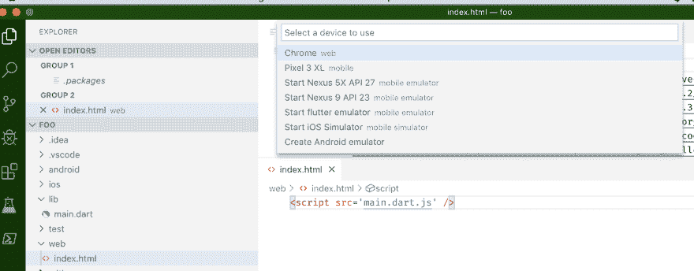

# Flutter 1.9 的新特性&如何升级到最新版本

> 原文：<https://dev.to/shivamgoyal/what-s-new-with-flutter-1-9-how-to-upgrade-to-the-latest-version-44ok>

Flutter 在九月份的发布中有了一个新的改进版本。该版本现已在稳定渠道发布，供用户升级。新功能和更新的范围很广，从对 macOS Catalina 和 iOS 13 的支持到改进的工具支持，以及新的 Dart 语言功能和新的材料小部件。

# 升级到颤振 1.9

如果您的系统上已经有了 Flutter，并且您在默认的稳定通道上，那么您可以通过从命令行运行`flutter upgrade`来升级到 1.9 版本。

如果你想在你的系统上安装 Flutter，这里就是你要找的地方:

 [## 如何在 Mac 和 Windows 上安装 Flutter

### shivam Goyal for Enappd 9 月 26 日 19 时 23 分阅读

#flutter #google #mac #windows](/enappd/how-to-install-flutter-on-mac-windows-339)

* * *

# 新功能&升级

## 新增小部件和框架增强

*   **toggle buttons**
    `ToggleButtons`小部件将一排`ToggleButton`小部件捆绑在一起，通常由一组`Icon`和`Text`小部件组成，形成一组具有完全可定制外观和行为的按钮。你想要单项选择还是多项选择？您想要要求至少一个选择还是不允许选择？你想要一个正方形或圆形的边缘，厚或薄的边界，图标或文本等？你可以在下面看到一些选项。

    

*   **ColorFiltered**
    如下图所示，`ColorFiltered`窗口小部件允许您对一个子窗口小部件树进行重新着色，就像您可以使用几种不同算法中的一种对图像进行重新着色一样(上面的示例截图中显示了其中一些算法)。这有许多用途，例如，为您的用户处理色盲辅助功能问题。

    

## 全球语言支持

谷歌还增加了对 24 种新语言的支持，其中 7 种是印度语言。

新增的语言包括:
*南非荷兰语|阿姆哈拉语|阿萨姆语|阿塞拜疆语|白俄罗斯语|孟加拉语|巴斯克语|古吉拉特语|冰岛语|格鲁吉亚语|卡纳达语|吉尔吉斯语|老挝语|马其顿语|缅甸语|尼泊尔语|奥里亚语|旁遮普语|僧伽罗语|泰卢固语|乌兹别克语|祖鲁语*

## Dart 2.5 发布

端到端的开发者体验不仅取决于 Flutter 的特性，还取决于底层语言本身。作为 Flutter 1.9 版本的一部分，谷歌也在发布 Dart 2.5。Dart 2.5 包括对外函数接口(FFI)支持的预发布，提供本机扩展，因此 Dart 可以直接调用用 c 编写的代码。它还为 IDE 引入了机器学习支持的代码完成。你可以在 [Dart 2.5 公告](https://medium.com/dartlang/announcing-dart-2-5-super-charged-development-328822024970)中了解到这两者以及更多。

## 支持 macOS Catalina 和 iOS 13

随着苹果准备发布 macOS 的最新版本 Catalina，谷歌已经努力确保 Flutter 为您升级做好准备。谷歌已经更新了端到端的工具体验，以确保它能在 Catalina 和 Xcode 11 上很好地工作。这包括添加对新 Xcode 构建系统的支持，在整个工具链中实现 64 位支持，以及简化平台依赖性。

随着 iOS 13 的到来，谷歌也一直在努力确保你的 Flutter 应用程序在最新发布的 iPhone 上看起来很棒。Flutter 1.9 包括 iOS 13 可拖动工具栏的实现，既有长按也有从右拖动，并支持振动反馈。iOS 黑暗模式的工作也进展顺利，许多拉请求已经合并。

最后，在最新的开发版本中，您现在可以打开对 Bitcode 的实验性支持，Bitcode 是 Apple 编译程序的独立于平台的中间表示。以位代码的形式提交你的应用程序，可以让苹果在未来优化你的二进制文件，而无需重新提交，并为 watchOS 和 tvOS 等需要位代码来提交应用程序的潜在支持平台打开了大门。

## 工具链改进

在这个版本中，新项目默认为 Swift 而不是 Objective-C，Kotlin 而不是 Java，分别用于 iOS 和 Android 项目。由于许多软件包都是用 Swift 编写的，因此将 Swift 作为默认语言可以省去将这些软件包添加到用默认选项创建的应用程序中的人工工作。Swift 5 是 ABI 稳定的，由于苹果在最近几个版本中进行的应用程序精简工作，Swift 动态库不再需要包含在 iOS 12.2 或更高版本的分发包中，与以前的版本相比，Swift 应用程序的大小有所减小。

由于 Kotlin 现在是 Android Studio 中新项目的默认语言，为 Android 进行语言切换似乎也是很自然的。这些选项现在是 CLI 工具和 IntelliJ/Android Studio 以及 Flutter 的 VS 代码插件的默认选项，但是如果你愿意，你可以随时切换回 Objective-C 或者 Java。

## 错误消息美化

谷歌一直在努力改善 Flutter 的错误信息，让它们更易读、更简洁、更具可操作性。

在 IntelliJ/Android Studio 的 Flutter 插件和 VS 代码的扩展的最新版本中，Google 提供了一个新功能，以丰富而简洁的格式显示错误消息。日志控制台现在可以显示错误消息，并有以下改进:

1.  用红色突出显示错误摘要
2.  在各部分之间添加空白，使邮件更易于浏览
3.  调出消息中的提示(如果可用)来解决错误
4.  折叠邮件中的长列表和树

## 颤振腹板是稳定的

最后， **flutter_web 库**被弃用，因为 web 支持已经合并到了**主 flutter 库中！**这意味着，如果你从主频道或开发频道获得了最新版本的 Flutter，你可以通过运行`flutter run -d chrome`将最新实验版本的 Flutter 应用于网络。

当你创建一个项目时，Flutter 现在通过一个最小的`web/index.html`文件创建一个 web runner，这个文件引导你的 web 编译的 Flutter 代码。有了这个文件，您就可以使用 Flutter CLI 工具或 IDE 插件来编辑和运行 web 上的 Flutter 应用程序。

上面是启用了 web 支持的 VS 代码截图。注意`web/index.html`文件，以及允许您选择 Chrome 作为目标开发设备的下拉列表。对使用 Flutter 的 web 输出的支持仍然处于早期阶段，但是这个版本代表了在使用 Flutter 实现对 web 开发的产品支持方面向前迈进了一大步。

### 一些主要的颤振 Web 应用有:

*   [Flutter Widget Livebook](https://flutter-widget-livebook.blankapp.org/) 由 Flutter for web 构建，显示在浏览器中实时运行的 Flutter Widget。
*   Panache 是一个为 Flutter 创建主题的工具，你可以下载并直接放到你的代码中。

## Github 上合并了 1500 多个 pr

这一版本是 Flutter 迄今为止最大的更新，自 7 月份上次稳定发布以来的两个月内，来自 100 多个贡献者的 1500 多个 PRs。

* * *

## 🔍多看我的文章

 [## 如何在 Mac 和 Windows 上安装 Flutter

### shivam Goyal for Enappd 9 月 26 日 19 时 23 分阅读

#flutter #google #mac #windows](/enappd/how-to-install-flutter-on-mac-windows-339) [## 理解版本控制系统:用 SourceTree 简化的 GitHub

### GitHub 校园专家 shivam Goyal 2019 年 9 月 27 日 6 分钟阅读

#git #sourcetree #github #versioncontrol](/gh-campus-experts/understanding-version-control-systems-github-simplified-with-sourcetree-4n50)

* * *

## 🎯今天到此为止。

如果你有任何疑问，请在评论中打电话给我，或者通过[hi@shivamgoyal.co](//mailto:hi@shivamgoyal.co)联系我📧

如果你学到了一两件事，尽可能多的点击❤️按钮来表示你的支持！这真的激励我为社区做贡献。

感觉太大方了？请我喝一杯🍺
想合作吗？[让我们来聊聊科技](//mailto:hi@shivamgoyal.co)😄
在[shivamgoyal.co](https://shivamgoyal.co)、 [GitHub](https://github.com/ShivamGoyal1899) 或 [LinkedIn](https://linkedin.com/in/shivamgoyal1899/) 上跟踪我。👀