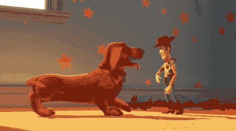

# Debian 和玩具总动员有什么联系？

> 原文：<https://dev.to/andyli/what-s-the-connection-between-debian-and-toy-story-1dmg>

Debian 是一个流行的 Linux 发行版。 [Ubuntu](https://ubuntu.com/) ，很多 Linux 新手的首选，基于 Debian。

今天刚刚发布的 Debian 10 代号为 Buster。Debian 9 是 Stretch，Debian 8 是 Jessie，更早的是 Wheezy，Squeeze，Lenny...都是皮克斯的玩具总动员里的角色！

## 但是为什么玩具总动员要代号呢？

原来，在 Debian 发布代号为 Debian 1.1 Buzz(是的，巴斯光年)的第一个版本时，当时的项目负责人(Bruce Perens)正在皮克斯工作。

你可以在[Debian 简史](https://www.debian.org/doc/manuals/project-history/ch-releases.en.html)中找到其他的 Debian 代码名称。

如果你靠近本帖的封面图片 [Debian 10 壁纸](https://wiki.debian.org/DebianArt/Themes/futurePrototype)，你会注意到安迪的宠物狗巴斯特的隐藏形状。