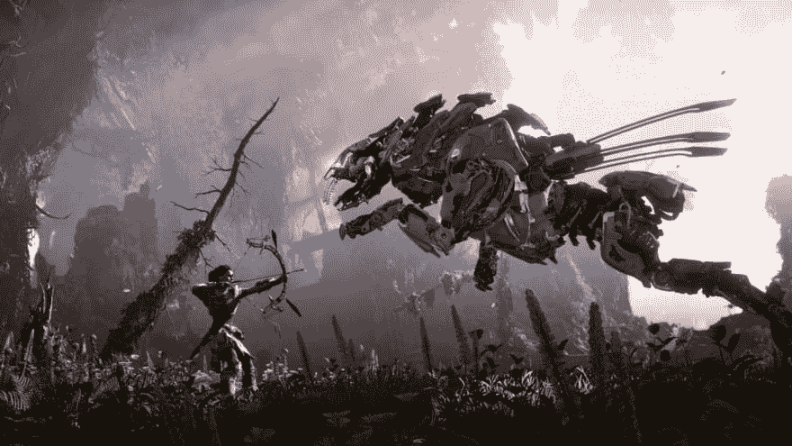
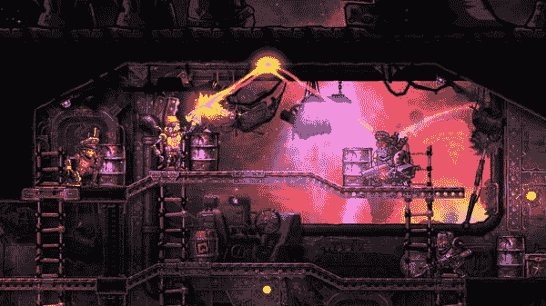

# 在你看来，什么是完美的电子游戏？

> 原文：<https://dev.to/isaacdlyman/what-s-your-perfect-video-game-3pi6>

还有其他电子游戏玩家吗？你认为哪些游戏是完美的？

我的是:

[**《地平线:零点黎明**](https://www.playstation.com/en-us/games/horizon-zero-dawn-ps4/)(PS4)——一款后启示录的开放世界科幻弓箭 RPG。光是想到这个游戏就让我心潮澎湃。故事非常精彩，阿洛伊是一个绝对标志性的女主角，游戏流畅而扣人心弦，游戏中的每个生物都提出了一个极其困难(但公平)的挑战。我*吞噬了*这个游戏，我非常感激它的存在。

[**蒸汽世界大劫案**](https://store.steampowered.com/app/322190/SteamWorld_Heist/) (PC，Switch，Wii U，PSN，iOS)——一款设定在蒸汽朋克狂野西部外太空的侧滚回合制精准射击游戏。我已经从头到尾玩了好多次了。它在我的 Surface Book 上运行顺利，一切都令人愉快，从低赌注的游戏到牛仔和强盗的对话。

[**0h h1**](https://0hh1.com/) 和 [**0h n0**](https://0hn0.com/) (Web、Android、iOS)——简单、丰富多彩的益智游戏。我喜欢一个好的益智游戏，这些符合我的所有要求:必须有一个唯一的解决方案，必须通过纯逻辑(没有猜测)可解，必须足够简单，我可以自己找出解决策略。我玩过很多手机益智游戏，但这两个是我一直想玩的。

* * *

总之，这是我的前三名。我还喜欢其他游戏，但我不会称之为完美。

你有哪些完美的游戏？