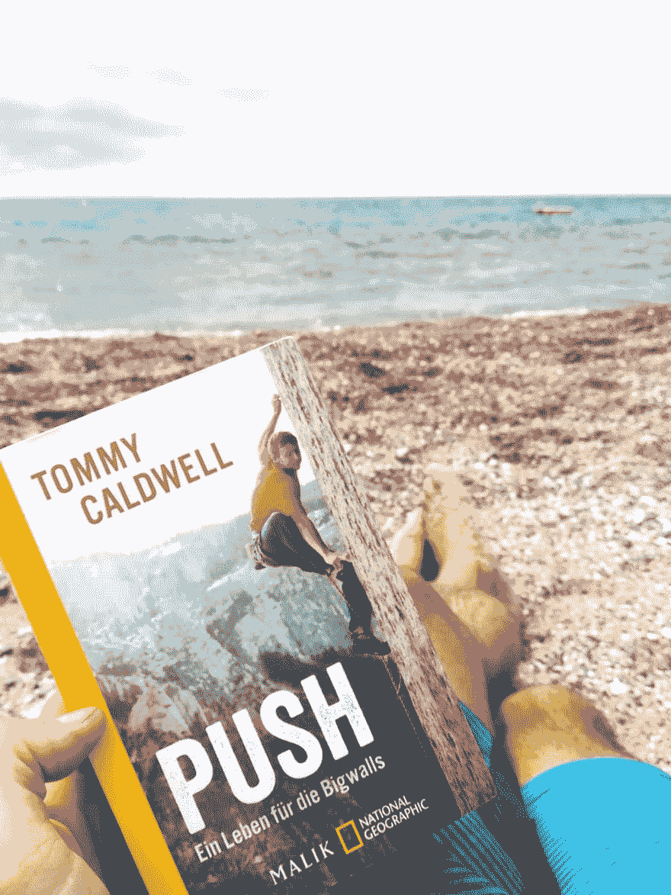

# 你的目的是什么？

> 原文：<https://dev.to/dvddpl/what-s-your-push-30b5>

正如我在这里写的我通常在假期远离屏幕，我通常做很多体育活动，我读很多书，在纸上！！:-)

自从**我设定了每周写一篇文章的目标**我就破例了，我用智能手机艰难地写着。所以我长话短说。

我现在正在读的是著名登山者[汤米·考德威尔](https://www.amazon.de/Push-Climbers-Search-Path/dp/0399562710/ref=asc_df_0399562710/?tag=googshopde-21&linkCode=df0&hvadid=310780560952&hvpos=1o2&hvnetw=g&hvrand=14953585376676412441&hvpone=&hvptwo=&hvqmt=&hvdev=c&hvdvcmdl=&hvlocint=&hvlocphy=9043445&hvtargid=pla-521485409933&psc=1&th=1&psc=1&tag=&ref=&adgrpid=59941303337&hvpone=&hvptwo=&hvadid=310780560952&hvpos=1o2&hvnetw=g&hvrand=14953585376676412441&hvqmt=&hvdev=c&hvdvcmdl=&hvlocint=&hvlocphy=9043445&hvtargid=pla-521485409933)的**推**。一个承诺和奉献的惊人故事。(这个家伙在一次攀登探险中被塔利班绑架，并用电锯锯掉了一根手指，但他从未放弃专业攀登)。

> 令人难以置信的灵感总是推动你的极限。

成功和个人成长需要很多自律，是什么让你坚持下去？是什么让你坚持你的计划并朝着你的目标努力工作？是什么驱使你？你的内在动力是什么？