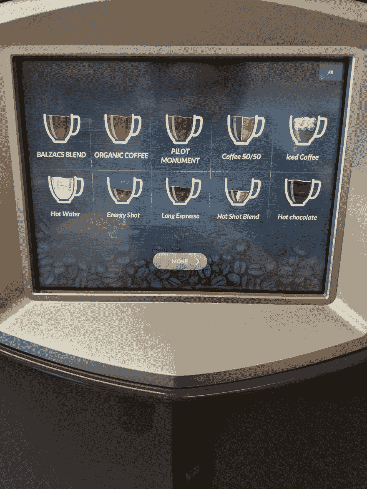

# 到底什么是声明式编程？

> 原文：<https://dev.to/brewsterbhg/what-the-heck-is-declarative-programming-anyways-2bj2>

有可能—在某个时间点—你已经听到有人提出声明式编程的概念。也许是在某个媒体的文章里，或者你在 Twitter 上看到有人提到过。也许你正在当地的一个科技社交聚会上闲逛，突然，某个可疑的初创房地产颠覆者的才华横溢、精神变态的首席技术官开始在吧台上砸空啤酒瓶，挥舞着粗糙的玻璃武器&威胁说如果房间里的每个人不停止使用 if/else 语句，就砍他们。

[](https://res.cloudinary.com/practicaldev/image/fetch/s--6QSkRAmy--/c_limit%2Cf_auto%2Cfl_progressive%2Cq_auto%2Cw_880/https://thepracticaldev.s3.amazonaws.com/i/5rfk747vw3e78njrcgm9.jpg)

> 它们可能看起来像这样。

“声明式编程？”你想，“也许维基百科能够以简单易懂的方式为所有对这个主题感兴趣的新手做一些简单的研究。”除了你不会问自己这个问题，因为你知道阅读维基百科上的任何技术都会让你头疼，只有在当地酒类商店狂饮 12 小时最便宜的麦芽毒药后的宿醉才能与之匹敌。你看到的文章都是同一种痛苦的不同味道。一个冗长的术语最终导致下一个，直到它成为一个自我毁灭的互联网侦探的永无止境的兔子洞，当你在另一边的时候，你甚至不能再认出镜子中的自己。

[](https://res.cloudinary.com/practicaldev/image/fetch/s--o13KnlA_--/c_limit%2Cf_auto%2Cfl_progressive%2Cq_auto%2Cw_880/https://thepracticaldev.s3.amazonaws.com/i/x7jl67gddjhw1qs09rpt.jpg)

> 我为这篇文章所做研究的真实照片。

行...所以这可能有点夸张，但希望我能减轻一点痛苦。很多人会争论什么是真正的声明性的语义；我没有在写我的博士论文，所以我们将学习*有趣的*方式(如果你想要博士版本，请参见[这个](https://stackoverflow.com/questions/602444/functional-declarative-and-imperative-programming/15382180#15382180) StackOverflow 答案)。

如果您曾经查阅过什么是声明式编程，您可能会非常熟悉这个常见答案的一些变体:

> 声明式编程描述的是*什么*，命令式编程描述的是*如何*。

好吧，但那是什么意思？首先要解开几件事:声明式编程有一个对立面，叫做命令式编程。你几乎总能找到这两种对立范式的比较。但问题是，虽然这两种方法在执行中是对立的，但这并不意味着它们不能共存。这让我想起了我的第一课:

## 第一课:声明式编程不能没有命令式抽象(它只是层)

我知道我说过这将是一个初学者友好的指南，所以让我简化一下我的意思。我的作品有一个奇怪的，别致的咖啡机，里面有两页不同的咖啡，可以冲泡，你只能喝其中的两种。

[](https://res.cloudinary.com/practicaldev/image/fetch/s--bmQeh515--/c_limit%2Cf_auto%2Cfl_progressive%2Cq_auto%2Cw_880/https://thepracticaldev.s3.amazonaws.com/i/jqy0uvsmz49plzd6hqv3.jpg)

> 第二页有一个“香草巧克力拿铁”的选项，但是没有人有足够的勇气去发现这些味道来自哪里。

想想用这个邪恶的装置对抗法国媒体。比方说，你觉得自己特别厌恶风险，并决定坚持喝普通的咖啡。你走近这个巨大的咖啡分发怪物，点击“飞行员纪念碑”。机器发出令人吃惊的剧烈的突突声，咖啡被分送到你的杯子里。你真的不需要关心从你按下按钮到你拿到咖啡之间发生了什么——你只需要拿到你要的饮料。咖啡机是声明式编程的一个粗略的例子。实现细节被隐藏；你*表达* **你想要什么**，你不指定**应该怎么做**。让我们来看看法国媒体的迫切态度:

1.  挑选你的豆子并研磨它们。
2.  用水壶烧水。
3.  从法式压榨中取出活塞，倒入你的咖啡粉。
4.  将沸水倒入法国压机中。
5.  3-4 分钟(或所需的浸泡时间)后，慢慢按下柱塞，将粉末从水中分离出来。
6.  将结果倒入马克杯中享用。

有一个明确定义的控制流程要遵循；该流程的每一步都有清晰的规划和执行。告诉应用程序你想让它做什么是很好的，但是仍然需要一些东西在幕后推动这些杠杆！

这是在更实际的环境中应用的相同概念。你可能对 ES6 增加的高阶函数`map`比较熟悉。如果你不熟悉，让我简单总结一下:`map`是 JavaScript `Array`对象的一个属性，它将遍历被调用的数组，并对每一项执行回调。它返回一个数组的新实例；不会对原始对象进行任何修改。让我们来看一下映射到字符串数组并追加 octopus '的函数(声明性的和命令性的)的比较🐙每个末尾的表情符号(客观上是最好的表情符号)。

```
// Declarative
const addOctopusEmoji = arr => arr.map(str => str + "🐙");

// Imperative
const addOctopusEmoji = arr => {
  for (let i = 0; i < arr.length; i++) {
    arr[i] = arr[i] + "🐙"
  }
  return arr;
} 
```

相当简单，很好地展示了第一课。是一种比传统循环机制更具声明性的方法。您没有对决定如何迭代数组的每个索引并应用必要操作的控制流进行编程。`map`为你做这件重活。但是`map`有一个强制性的抽象概念。这不是魔法，它需要在引擎盖下做些什么。不同之处在于，您不需要关心它如何执行其业务的实现细节(另外，它会返回一个新的数组实例。这意味着你没有像命令性例子&中那样改变任何现有的引用，导致任何意想不到的副作用；稍后将详细介绍)。只是层，朋友们！好了，现在你离成为声明式编程冠军又近了一步。

[](https://res.cloudinary.com/practicaldev/image/fetch/s--qcNC4tof--/c_limit%2Cf_auto%2Cfl_progressive%2Cq_auto%2Cw_880/https://thepracticaldev.s3.amazonaws.com/i/itkehht6gle3h4wi5uba.jpg)

> *基本上你现在。*

## 第二课:声明式编程不是函数式编程

这并不是说它们是完全不同的想法。很多人认为函数式编程是声明式编程的一个子集。一个真正的声明式程序被写成一个被执行/求值的表达式，能够指定*你想要的结果是什么*(再次回到你在任何地方读到的描述)。声明性语言的一个很好的例子是 SQL。

```
SELECT
  *
FROM
  tough_guys
WHERE
  name = 'Keith Brewster'

Query returned 0 results. 
```

> 抱歉，基思·布鲁斯特，不要在谷歌搜索我自己的时候表现得好像我没见过你一样。

你不负责手动解析一个表的名称列，并找到每个名为“基思·布鲁斯特”的硬汉。您以表达式的形式提供约束，SQL 返回您所要求的内容。谢谢 SQL。

现在我们来看看 JavaScript。你不能只把一个表达式放进应用程序，然后期望 JavaScript 引擎为你运行一切。你必须用一系列的**函数**来构建你的应用程序的功能。).这并没有从本质上使 JavaScript 成为函数式编程语言，因为 FP 有自己的一套规则和约束。但是，您可以在代码中应用这些概念，像 FP 语言一样使用 JavaScript，就像您如何在 JavaScript 中使用类和继承，像 OOP 语言一样操作一样。这只是构建应用程序架构的另一种方式。

[](https://res.cloudinary.com/practicaldev/image/fetch/s--TfafA8Hh--/c_limit%2Cf_auto%2Cfl_progressive%2Cq_auto%2Cw_880/https://thepracticaldev.s3.amazonaws.com/i/hnsgn17ap8kkjv7dkuzc.jpg)

> 老板，我们应该用什么建筑来建造这座房子？

函数式编程被认为是声明式编程的一个子集，因为它也试图避免以命令式或过程式的方式编写代码。这里不打算过多深究 FP(可能是为以后的一篇文章做铺垫)。在这一点上，你真正需要知道的是，声明性不是函数性的，但函数性是声明性的。

## 第三课:相当多的现代框架以声明方式处理 UI

补充说明:在大学期间，我一直沉迷于 Java。每个学期我们都在学习越来越多的 Java。有时我们接触其他语言(C++，C#，PHP)，但大多数时候我们只是构建计算器的变体或解决我们已经在 *Java* 中涉及的数学问题。不用说，当我离开学校，发现就业市场并非 95%是 Java 时，我感到非常震惊，尽管我的教育让我为这样的现实做好了准备。我在大学时对 web 开发没什么兴趣，但毕业后我很快就爱上了它。投身于 JavaScript 对我来说是一个巨大的改变；我开始看到人们以不同的、令人兴奋的方式编写代码。如果我能在这篇文章中提出一个建议，那就是让你自己接受不同的观点。作为一名开发人员，观察其他人如何处理问题对我的成长很有帮助。

不管怎样，回到正题。什么是声明式 UI？这只是另一个抽象，但是我们没有隐藏功能的实现细节，而是隐藏了更改 UI 的实现细节——请继续关注我。让我们来看看 React 是如何对 UI 采用声明性方法的:

```
<PotentiallyGreenButton
  handleClick={toggleIsButtonGreen}
  buttonGreen={isGreen}
>
    {buttonText}
</PotentiallyGreenButton> 
```

这是我们潜在的绿色按钮。这个按钮可能是绿色的，也可能不是绿色的。我们永远不会知道。过去，如果想要更新一个 DOM 元素，需要创建一个对它的引用，并将更改直接应用到该元素。这是一个很大的不便；您的功能耦合到单个元素(或者根据您如何定位元素，耦合到所有元素)。React 将更新抽象到 DOM 中，因此您不必管理它。您只关心组件的开发——您不负责 DOM 元素在每个渲染周期中如何更新的实现细节。您也不需要关心如何管理 DOM 事件侦听器。React 为您提供了一个易于使用的[合成事件](https://reactjs.org/docs/events.html)库，它抽象出所有的 DOM 事件逻辑，以便您可以专注于您的重要业务逻辑(在这种情况下，您的*的绿色程度可能是*绿色按钮)。

## 第四课:最终，没有对错之分

我喜欢以声明的方式处理我的代码。也许你不喜欢，也许你喜欢明确地陈述你的控制流。也许这对你来说更容易理解，或者对你来说更自然。这太酷了！这不会降低你作为程序员的价值，所以如果你不习惯，不要难过(也不要让任何人告诉你其他情况)。最重要的是能够理解不同方法背后的思想。你做你的！

在我们结束之前，我只想强调一下我喜欢采用声明式编码方法的几个原因:

#### 上下文无关:

更具声明性的风格允许你有更大程度的模块化。如果您的功能没有耦合到任何类型的应用程序状态，它将变得与上下文无关。您可以在任何应用程序中重用相同的代码，并且它应该以完全相同的方式运行。这意味着您应该避免更改任何位于函数上下文之外的数据(全局变量等)。

#### 可读性

这可能是一个热门话题，但我认为声明式方法更具可读性，只要你努力让函数/变量名自文档化。有些人可能会发现查看控制流(循环、if/else 语句)并遵循每个步骤更容易，所以这更多是一种主观上的好处。

#### 无副作用

嘿，还记得我第一点中括号内的文字简介“以后再详细介绍”吗？嗯，我们到了！副作用是当修改一个区域中的值导致应用程序中其他地方的意外影响时发生的事情。在一个声明式的应用程序中，你应该把所有东西都看作是不可变的。这意味着一旦你初始化了一个变量，它就不能被修改了。如果你想更新一个值，你应该用你想做的任何修改初始化一个基于条目的新变量(就像我们在 octopus 中做的一样)🐙array.map 示例)。如果你没有改变应用程序的状态，它应该不会对应用程序的其他地方产生副作用。

#### 真好玩！

采用一种新的编码方法是一个有趣的挑战，你可能会发现自己发现了解决问题的新方法。因为你不再依赖循环，你更多地使用了[递归](https://dev.to/alexdovzhanyn/recursion-for-beginners-1k7f)。试图减少对 if/else 语句的依赖可能会让你走上[函子](https://dev.to/drbearhands/functors-monads-and-better-functions-26f3)的道路。至少，这是很好的练习！

[](https://res.cloudinary.com/practicaldev/image/fetch/s--s5mBEk6M--/c_limit%2Cf_auto%2Cfl_progressive%2Cq_auto%2Cw_880/https://thepracticaldev.s3.amazonaws.com/i/khngzluyuhkbwlbl1p0o.jpg)

> 终于结束了，你成功了。

咻！谢谢你坚持到现在，我知道有很多内容需要消化。如果你喜欢我做的事情，可以考虑在 Twitter 上关注我。我希望我今天能帮到你一点忙！

干杯！