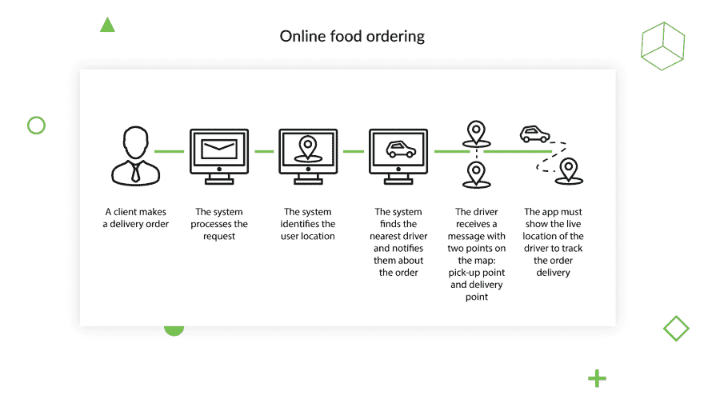
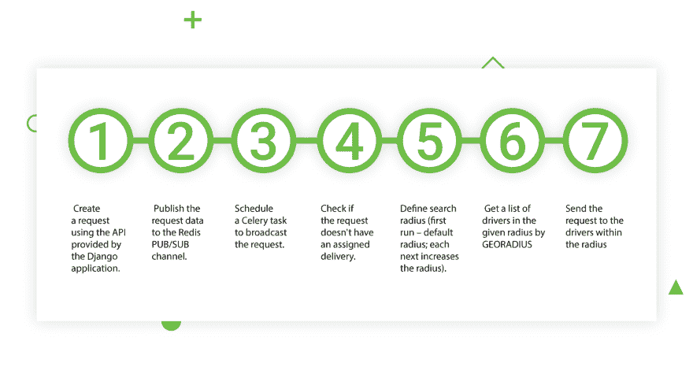
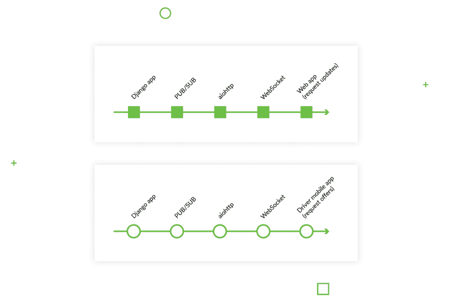

# 为基于位置的服务构建后端时需要考虑什么

> 原文：<https://dev.to/django_stars/what-to-consider-when-building-the-backend-for-a-location-based-service-e4k>

如果你快速浏览一下各种类别的应用——医疗保健、游戏、金融——就会发现，设备的位置比任何人想象的都起着更大的作用。服务可能将位置数据用于主要功能(如优步)，或次要功能(如脸书)。但是，尽管有这样的作用，位置数据使服务的使用更加面向用户，也就是说，更加方便。

创建基于位置的服务是一件大事，但也很现实。这篇文章将展示我们如何处理基于位置的服务的后端——即送货服务 [Azyan](https://djangostars.com/case-studies/azyan/) 。我们将讨论业务逻辑、不同角色的流程，以及我们存储数据的位置和方式。我们开始吧！

## 基于位置的应用程序开发:关键目标

Azyan 是一项连接司机和需要订购食品交付的客户的服务。基本上，他们有一个司机“车队”,随时准备按需提货和交付订单。

客户正在寻找一家 [Python 开发公司](https://djangostars.com/services/python-django-development/)，我们被介绍给了这个项目。它需要考虑三件事:

*   **将有不同的角色**，即与需要个性化功能和用户界面的用户(客户、司机、管理员或操作员)相关的一组功能和权限。
*   该服务将扩展交付类别的范围，为了避免重写整个代码，我们必须在开发的第一阶段就考虑到这一点。
*   它应该可以在全球范围内使用。和上一点一样，必须提前考虑长远的观点。

对于后端，第 2 点和第 3 点意味着高服务器负载。理解了响应性和高性能在积极的用户体验中的重要性，我们决定首先为一个简单的用例创建一个流程，并开始头脑风暴。

## 基于位置的应用后端技术

下面是一个简单用例“在线订餐”的流程。

如您所见，这对于最终用户来说是一个相当典型的用例，对于工程师来说也是一个挑战。为了构建一个基于位置的应用程序，我们确定了我们必须应对的三个主要挑战。记住这些，因为我们将很快回到它们。

项目挑战:

1.  业务逻辑
2.  向司机和服务发送实时数据(关于订单状态、司机位置等。)
3.  数据存储(即存储和处理坐标)。

这有助于我们确定应该选择什么技术。因此，我们使用 **Python 和 Django** 作为产品的业务逻辑。

对于另一个挑战——向用户、司机和客户发送实时数据，我们选择了 **Aiohttp async** 服务。它将确保立即处理数据，并将其实时传输到驱动程序和用户界面。在本文的后面，我们将展示它如何节省我们的工作时间。

然后我们决定使用 **Redis** 来(1)在服务之间传输消息以及(2)存储和显示驱动程序位置(由 [GEOADD](https://redis.io/commands/geoadd) )。最后一项用于应对上述挑战的技术是用于主数据库的 **PostgreSQL** 。

## 基于位置的服务后端解决方案

我们将参考上面提到的三个问题，先从业务逻辑出发。由于订单处理涉及高负载流程，如处理位置数据和向用户和司机传输实时数据，我们决定将整个产品分为两个结构元素。第一个处理一般的业务逻辑；另一个确保实时模式下所有数据的处理和传输。

### 业务逻辑

因为我们已经将业务逻辑从处理和数据传输中分离出来，所以我们对它使用了不同的结构解决方案。如果我们没有清楚地确定它必须处理什么，分离本身就没有用。该清单如下:

*   **处理用户和角色权限**。我们有几个具有不同权限和可用操作的角色。这些主要是关于查看和编辑交付请求(相应的操作员和管理员)。
*   **管理交付请求流程**。我们已经从上面的用户角度描述了“请求订单”用例。这是同一个用例的技术流程:

1.  使用由 **Django** 应用程序提供的 **API** 创建一个请求。
2.  将请求数据发布到 **Redis 发布/订阅**通道。
3.  调度一个**芹菜**任务来广播请求。
4.  检查请求是否没有分配的交货
5.  定义搜索半径(首次运行-默认半径；每次后续运行增加半径)
6.  使用 **GEORADIUS** 获取给定半径内的驾驶员列表
7.  向半径范围内的司机发送请求

### 传输实时数据

非功能性需求中的最初请求指出，系统必须能够在不损失性能的情况下，每天处理来自 2，000 个服务提供商的 20，000 个请求。现在，有个窍门。还记得当我们第一次听说这个项目时，我们选择了全球使用作为我们应该永远记住的事情吗？计划是构建这样一个系统，它可以在未来两到三年内支持 10-50 倍的规模增长，而不会有任何性能损失。我们将业务逻辑和数据转换分开的决定帮助我们完成了这项任务。

**Aiohttp async** 将处理以下实时问题:

*   **向驱动程序应用程序**发送实时请求要约。驾驶员将自动获得关于新报价的通知，而不必不断刷新可用报价的列表。
*   **向网页**发送实时请求更新。这不仅确保了积极的用户体验；它还允许操作员查看最新的请求更新。否则，除非司机手动刷新请求，否则他们可能会发现订单中删除了一些购买的商品。
*   **处理驱动坐标。**这允许所有用户追踪司机的位置，从而让他们估计到达时间。

### 数据存储—实时位置

为了处理实时驱动程序坐标，我们选择了 geo add——一个 Redis 命令，它将地理空间数据(经度、纬度和名称)添加到指定的项目中。数据存储为一个有序集合。需要时，我们可以通过 radius(上面提到的 GEORADIUS)查询来检索所需的项目(位置数据)。

在将一个项目添加到集合中之后，Redis 允许我们使用相同的 GEOADD 命令更新它的位置。当使用列表中的现有项目进行调用时，GEOADD 会使用新值更新与每个项目关联的空间数据(经度和纬度)。这允许我们在应用程序中提供实时位置。

## 通信算法

为了在两个服务(Django 应用程序和 aiohttp 服务)之间传输数据，我们使用了另一个 Redis 命令— PUB/SUB。为了将数据(请求更新或提供)传输给最终用户， *aiohttp* 充当 Django 应用程序和最终用户之间的“传输”，因为它处理 websocket 连接，如下图所示:

所有连接到通道的驱动程序——在我们的例子中是订单列表——都将收到一条包含订单详细信息的消息。这同样适用于接收订单更新的 web 应用程序。

## 结论

在这里，我们分享了我们在为我们的产品 Azyan 构建后端时考虑的主要问题，Azyan 是一种连接司机和那些需要快速送货的人的送货服务。在了解了客户期望服务执行的操作之后，我们确定了产品的技术堆栈:

*   业务逻辑——Python 和 Django
*   收集实时数据–Redis
*   过渡实时数据–aiohttp
*   数据库–PostgreSQL

有了如何组织应用程序的想法后，我们决定将 Django 应用程序从数据传输服务中分离出来。

如果你对构建类似 Azyan 的基于位置的应用程序的其他平台感兴趣，我们建议你阅读[如何使用 React Native 开发基于位置的应用程序。](https://djangostars.com/blog/how-to-develop-a-location-based-application-using-react-native/)许多应用程序都实现了基于位置的功能，也许当你开发自己的应用程序时，你会有机会使用这篇文章中的知识。

这篇关于[构建基于位置的服务](https://djangostars.com/blog/building-backend-location-based-service/)的文章最初发布在 Django Stars 博客上。