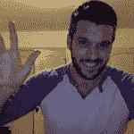

# 你这周赢了什么？

> 原文：<https://dev.to/jess/what-was-your-win-this-week-188j>

👋👋👋

回顾你的一周，你感到自豪的是什么？

所有的胜利都是重要的，无论是大是小🎉

“胜利”的例子包括:

*   升职了！
*   开始一个新项目
*   修复一个棘手的错误
*   打扫你的房子...或者其他任何能激发快乐的事情😄

星期五快乐！

顺便说一句，我将从下周开始做所有与‘结婚’相关的事情，所以迈克尔将接管接下来的三个复古帖子！你应该跟着他:)

## [迈克尔·塔林顿](/michaeltharrington) <button name="button" type="button" data-info="{&quot;className&quot;:&quot;User&quot;,&quot;style&quot;:&quot;full&quot;,&quot;id&quot;:38578,&quot;name&quot;:&quot;Michael Tharrington&quot;}" class="crayons-btn follow-action-button whitespace-nowrap  " aria-label="Follow user: Michael Tharrington" aria-pressed="false">跟随</button>

[I'm a friendly, non-dev, cisgender man from NC who enjoys playing music/making noise, eating veggies, and hanging out with my best friend/wife + our 2 cats + 1 dog. (he/him)](/michaeltharrington)