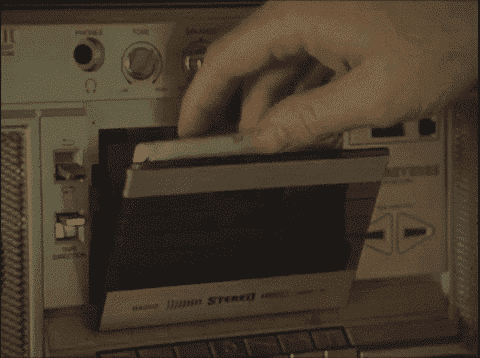

# 你这周赢了什么？

> 原文：<https://dev.to/michaeltharrington/what-was-your-win-this-week-el2>

⏪⏪⏪

回顾你的一周，你感到自豪的是什么？

所有的胜利都是重要的，无论是大是小🎉

“胜利”的例子包括:

*   升职了！
*   开始一个新项目
*   修复一个棘手的错误
*   打扫你的房子...或者其他任何能激发快乐的事情😄

星期五快乐！