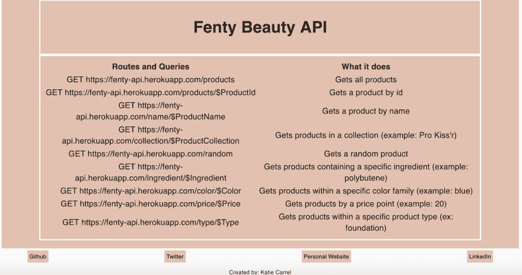

# 公共品牌 API 都去哪了？

> 原文：<https://dev.to/kcarrel/where-are-all-the-public-brand-apis-158h>

> 当他们提供一个 API 时，一个企业的潜力可以被扩大。一家企业能提供的资源有限。拥有一个可用的 API，开发人员渴望在其上进行构建，可以将他们的产品扩展到更多的人。”——陈

# API 牛逼

以我一生中最不冷不热的经历开始这篇文章-
API(应用程序编程接口)非常棒。在我开始从人力资源转向软件工程的职业生涯之前，我记录了我的项目想法，以便我的技能最终允许我解决它们。每个项目(除了一个)都涉及到至少使用一个 API。我喜欢利用公共 API 来增加功能，甚至为我的下一个项目激发我的创造力！话虽如此...

# 品牌 API 都去哪了？

作为一名长期的化妆爱好者，我很高兴能把个人兴趣和技能结合起来。不幸的是，对于我的一些项目想法，我找不到有自己公共 API 的化妆品品牌，坦白地说，这难倒了我。将我的搜索范围扩大到美容领域之外，我发现了一个类似的问题。为什么品牌不把已经公开的关于他们产品的数据提供给开发者，让他们可以方便地使用这些数据进行创作？难道他们不知道有一些开发者想要开发有趣的项目，并增加他们产品的实用性吗？！这篇文章是我对所有品牌的呼吁——“如果你建立了一个公共 API，开发者就会来。”

# 为什么一个品牌要提供自己的公共 API？

*   [轻松扩大品牌覆盖面](https://nordicapis.com/3-steps-to-increasing-brand-awareness-with-apis/)
*   [无需对品牌进行大量投资的创新机会](https://www.zdnet.com/article/opening-up-apis-brings-in-benefits/)
*   [品牌效用增加](https://www.redhat.com/en/topics/api/what-are-application-programming-interfaces)
*   容易和自由的市场验证的潜力

# 构建我自己的示例公共 API

似乎有理由认为，允许他们的产品以新的方式互动，将是一个品牌的最佳利益，但我们在这里。因此，我从我最喜欢的化妆品品牌 Rihanna 的 Fenty Beauty 收集了公开可用的信息，以创建一个我可以继续使用的公共 API，其他开发者可以尝试并作为一个品牌自己实现它是多么容易的例子。
[T3】](https://res.cloudinary.com/practicaldev/image/fetch/s--tGF73dfo--/c_limit%2Cf_auto%2Cfl_progressive%2Cq_auto%2Cw_880/https://thepracticaldev.s3.amazonaws.com/i/mtu2kejd0qyaatwm22gj.png)

我估计使用 Ruby on Rails 和 Heroku 完成这个任务花费了我不到一天的时间来处理 295 个项目(想象一下，对于一个拥有自己数据的品牌来说，这有多快！)用于前 9 个端点。概述 Fenty Beauty API 端点的静态页面可以在这里找到。

# 外卖

对于品牌来说，向开发者提供公共 API 将是容易且有益的。如果品牌创建并维护他们自己的公共 API，他们有可能增加客户与其产品交互的端点，并促进他们自己产品的创新。

## 资源:

什么是 API:

*   [https://medium . com/@ TebbaVonMathenstien/what-a-an-API-and-why-should-I-use-one-863 c 3365726 b](https://medium.com/@TebbaVonMathenstien/what-is-an-api-and-why-should-i-use-one-863c3365726b)
*   [https://sproutsocial.com/insights/what-is-an-api/](https://sproutsocial.com/insights/what-is-an-api/)

API 经济性:

*   [https://medium . com/IPG-media-lab/what-is-the-API-economy-and-how-brands-can-benefit-b 46210d 0434d](https://medium.com/ipg-media-lab/what-is-the-api-economy-and-how-brands-can-benefit-from-it-b46210d0434d)
*   [https://mashable.com/2011/01/04/brand-open-api-developers/](https://mashable.com/2011/01/04/brand-open-api-developers/)
*   [https://www . red hat . com/en/topics/API/what-are-application-programming-interfaces](https://www.redhat.com/en/topics/api/what-are-application-programming-interfaces)

精彩的公共 API:

*   [https://www.programmableweb.com/category/all/apis](https://www.programmableweb.com/category/all/apis)
*   [https://github.com/n0shake/Public-APIs#product](https://github.com/n0shake/Public-APIs#product)
*   [https://github.com/public-apis/public-apis](https://github.com/public-apis/public-apis)
*   [https://last-air API . herokupp . com/](https://last-airbender-api.herokuapp.com/)