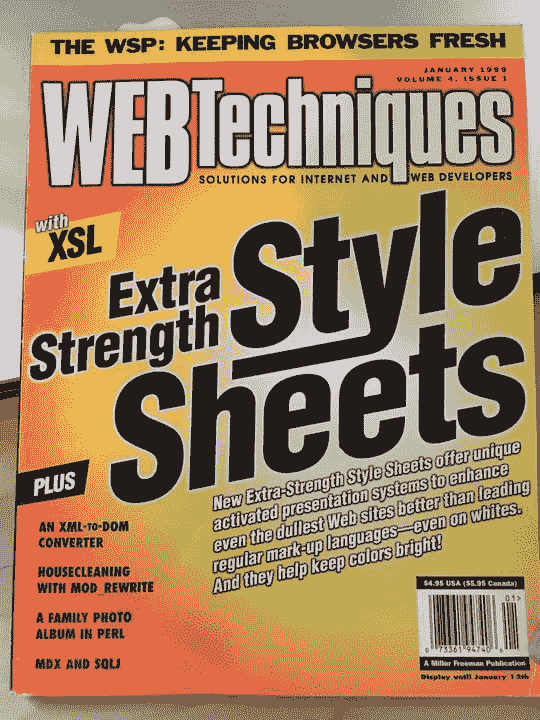

# CSS 命名颜色从何而来？

> 原文：<https://dev.to/huijing/where-did-css-named-colours-come-from-l8>

说话。CSS 是新加坡每月的 CSS meetup，有一个名为“每月 CSS 颜色”的部分，在那里我们提到了 148 种命名的 CSS 颜色中的一种。这相当于超过 12 年的聚会，我想我们会在用完颜色之前用完聚会。

自从[魏](https://uuei.io)成为联合组织者，我们每个人都轮流挑选本月的 CSS 颜色，对于八月版，她选择了`snow`。`snow`的十六进制代码是`#fffafa`，它的 RGB 值为`rgb(255, 250, 250)`。

熟悉这个符号的一些人可能已经意识到，这给了我们一种柔和的红色。非常非常轻微，但仍然是红色的。魏注意到`snow`是红色的。我不知道这是为什么，但我想弄清楚。

## 说明书怎么说？

有一个名为 [CSS 颜色模块级别 4](https://drafts.csswg.org/css-color/) 的规范目前处于编辑草案状态，它定义了 CSS1、CSS2 和 CSS Color 3 中已经存在的颜色相关属性和值，以及新的属性和值。所以我觉得这是个好的开始。

向下滚动到关于命名颜色的第 6.1 节[，我们发现:](https://drafts.csswg.org/css-color/#color-keywords)

> CSS 的 16 种命名颜色最初来自 HTML:水绿色、黑色、蓝色、紫红色、灰色、绿色、石灰色、栗色、海军蓝、橄榄色、紫色、红色、银色、蓝绿色、白色和黄色。其余大部分来自 X11 颜色系统的一个版本，在 Unix 派生的系统中用于指定控制台的颜色。

啊哈！X11 颜色系统！该规范还将我们引向 [Alex Sexton](https://twitter.com/SlexAxton) 在 [CSSConfUS 2014](https://2014.cssconf.com/) 题为 *Peachpuffs 和 lemonchifons*的演讲中关于 X11 色彩系统的历史:

[https://www.youtube.com/embed/HmStJQzclHc](https://www.youtube.com/embed/HmStJQzclHc)

这是一个很棒的演讲，也是我最喜欢的演讲之一。如果你不喜欢文字，就跳过文章的其余部分，看亚历克斯谈论颜色。超级有娱乐性。❤️

另外，作为一个认识克里斯·莉莉的人，我想公开承认他是我认识的最好、最可爱的人之一。只是把它放在那里。

我在阅读规范时发现的另一个有趣的事情是 CSS 定义了一组`<system-color>`值，允许我们“以一种将颜色融入用户图形环境的方式来指定颜色”。"

这一特殊功能有安全和隐私方面的考虑，因为从理论上讲，这暴露了用户操作系统设置的细节，可用于[指纹](https://en.wikipedia.org/wiki/Fingerprint_(computing))。此外，这可能使恶意软件网站构建者更容易创建无缝对应于用户系统的用户界面。

该规范确实说明了几种系统颜色现在被定义为“通用的”，因此降低了这种风险。这让我很欣赏 CSS 工作组在编写规范时考虑的许多不同角度。

我真的很喜欢这个规格，所以如果你和我一样喜欢颜色的话，一定要读一读。

## 那么这个 X11 到底是怎么回事呢？

在我进入 web 开发之前，我已经对 Linux 操作系统进行了相当多的研究，所以 X11 对我来说并不陌生。x 是一个可移植的、网络透明的窗口系统。X11 是 X Window 系统的版本 11。

x 是建立在麻省理工学院的吉姆·盖蒂斯和 T2·鲍勃·谢弗勒的想法基础上的。为什么叫 X？它是 1983 年以前的 window 系统 W 的派生，W 在 V 操作系统下运行。

从[文档](https://www.x.org/releases/X11R7.7/doc/man/man7/X.7.xhtml):

> X Window 系统是一个网络透明的窗口系统，它运行在各种各样的计算和图形机器上。

文档中也包含了一个关于颜色名称的简短部分，但是它没有涉及颜色名称的选择。它只是提到 X 支持抽象颜色名称的使用，并且这个抽象名称的值是通过搜索一个或多个颜色名称数据库获得的。

我看到了麻省理工学院校友、数学家和自由软件开发者[奥布里·贾费尔](http://people.csail.mit.edu/jaffer/)对颜色名称词典的精彩深入探究。从那里，我找到了一些早期 X11 色彩词典的链接，也了解了色彩空间和调音。

包含所有颜色名称的 X 服务器数据库通常位于 */usr/share/X11/rgb.txt* 。进一步挖掘版本控制日志，我们可以找到吉姆·盖蒂斯在 1985 年 8 月 19 日[登记到版本控制](https://cgit.freedesktop.org/~alanc/xc-historical/commit/xc/programs/rgb?id=0d0ad63237618270e48503a37ce542139d7abab5)的原始颜色名称列表。

在最初的提交中添加了 2 个文件。 *rgb.c* 用于解析颜色列表文本文件和 *rgb.txt* ，其中包含 68 种颜色的列表，每种颜色有两种格式的名称，茶色和小写，带空格。

下一次更新是在 1988 年 2 月 23 日。这给名单增加了`brown`、`grey`和`gray`。`white`的 RGB 值于 1988 年 5 月 13 日从`252, 252, 252`更新为`255, 255, 255`。1988 年 9 月 3 日，由 100 种灰度组成的整个灰度等级被添加到列表中，第二天又添加了`sandy brown`。

我强烈建议看一下提交日志，因为在标准消息中，比如*增加了灰色 0-100* ，还有一些有趣的消息，比如*删除了空行；好家伙，多么愚蠢的程序*和*让基思开心*和其他宝石。

`snow`于 1989 年 10 月 26 日被添加到该列表中，当时该列表增加了由信息科学研究所(ISI)的 Paul Raveling 为惠普显示器调整的颜色。从他的笔记中，我们发现:

> 浅色和米白色，从几个辛克莱油漆颜色样本复制。添加这些的目的是为浅色的窗口背景提供更好的选择。

啊哈！下一条线索是辛克莱颜料。辛克莱涂料公司是由六兄弟在 20 世纪 30 年代创建和经营的家族企业。该公司扩展到几个不同的产品部门，个人家庭成员专门从事某些方面的业务。

不幸的是，该公司现在已经倒闭，没有多少可以找到他们原来的油漆样本。PaintTalk.com 上的[论坛帖子](https://www.painttalk.com/f2/sinclair-paint-24403/)的[对](https://www.painttalk.com/f2/research-sinclair-paints-swatches-29863/)对我们来说是唯一剩下的了。

从 Alex 的谈话中，我还设法挖掘到了 *comp.windows.x* 邮件列表评论的链接，这些评论涵盖了颜色的问题，比如标题为“[这是粉红色？？](https://groups.google.com/d/msg/comp.windows.x/eF3SibkdzVI/ztU9Xm2W0PAJ)”。

### 续入油漆颜色名称

也许我们无法弄清楚为什么`snow`是红色的，但这确实引出了一个问题，即涂料公司是如何给它们的颜色命名的。英国涂料公司 [Farrow & Ball](https://www.farrow-ball.com/) 成立于 1946 年，以其创造性的颜色名称而闻名。

Slate.com 对此做了一些研究，发现这些古怪的名字都有自己的背景故事，但在某种程度上，这可以被认为是一种营销手段。

贝尔油漆公司甚至贴出了一份[色彩调查员](https://behr.wyng.com/5cae7a903b945305f1665cab)的工作清单，该职位已经招满。对感兴趣的人来说，2015 年在 Reddit 上有一个由在 [PPG 建筑涂料](https://www.ppg.com/)给油漆颜色命名的人做的 [AMA，在那里回答了关于命名颜色的问题。](https://www.reddit.com/r/IAmA/comments/3tyt69/we_create_the_names_of_paint_colors_for_a_living/)

## 为什么 CSS 使用 X11 的颜色？

围绕 CSS 规范开发的所有讨论都是公开进行的，所以只要有点耐心，就有可能在 [www 风格的邮件列表档案](https://lists.w3.org/Archives/Public/www-style/)中挖掘出相关的讨论线索。

大部分讨论发生在 1996-1998 年 CSS1 和 CSS2 发布期间，以及 2001-2002 年 CSS 颜色模块 Level 3 发布期间。如果你想阅读一些偶尔措辞强硬的观点，请随意阅读邮件主题。

*   [CNS 颜色](https://lists.w3.org/Archives/Public/www-style/1996Feb/0006.html)
*   [颜色名称；was Re:New CSS1 draft-Reply-Reply](https://lists.w3.org/Archives/Public/www-style/1996Jul/0166.html)
*   [颜色关键字(was RE:层叠样式表)](https://lists.w3.org/Archives/Public/www-style/1997Dec/0114.html)
*   [灰色，颜色关键词](https://lists.w3.org/Archives/Public/www-style/1997Dec/0185.html)
*   [VGA 在 CSS 中做什么？](https://lists.w3.org/Archives/Public/www-style/1998Aug/0110.html)
*   [CSS 中的颜色](https://lists.w3.org/Archives/Public/www-style/1998Nov/0071.html)
*   [回复:发布新工作草案:CSS3 模块:颜色](https://lists.w3.org/Archives/Public/www-style/2001Mar/0074.html)
*   [CSS3 模块上的最后一次调用注释:颜色](https://lists.w3.org/Archives/Public/www-style/2002May/0122.html)

要通读整个线程，向下滚动到底部并点击线程链接中的下一个*。*

当然，也有一些轻松的时刻。在那个邮件列表中，半开玩笑似乎是一种流行的幽默风格。

*   [颜色标准(傻)](https://lists.w3.org/Archives/Public/www-style/1997Dec/0039.html)
*   [pantone 颜色怎么了？](https://lists.w3.org/Archives/Public/www-style/1997Dec/0038.html)
*   [ChromaFuzz](https://lists.w3.org/Archives/Public/www-style/1997Dec/0040.html)

### 一个关于`orange`的故事

[Eric Meyer](https://meyerweb.com/) 提供了这个关于`orange`如何将其纳入 CSS2 规范的可爱故事。事实证明，他在 CSS1 测试套件中使用了`color: orange`进行大量测试，W3C 发布了 CSS1 测试套件，浏览器也很好地支持 CSS1 测试套件。

然而，因为`orange`在 CSS1 中从来不是一个颜色名称，它在技术上是无效的 CSS。(参考[预览:CSS1 测试套件](https://lists.w3.org/Archives/Public/www-style/1998Apr/0003.html)，伊恩·希克森在[对原帖的回复](https://lists.w3.org/Archives/Public/www-style/1998Apr/0025.html)中指出了`orange`不在 CSS1 中，而是 IE4 发明的事实)

基本上，`orange`被添加到 CSS2 是为了使 CSS1 测试套件有效，这导致了类似“CSS2:现在有更多的橙色！”。这一事件在 1999 年 1 月的[网络技术](https://en.wikipedia.org/wiki/Web_Techniques)中也被称为复活节彩蛋风格。

Eric 在那期杂志上写了一篇关于 CSS2 的封面文章，并要求用橙色作为主色调的洗涤剂风格封面。文章的标题也是橙色的。我喜欢它。我将用埃里克的一句话来结束这个小故事:

> 记住，它的根源是:我犯了错误。孩子们，永远要验证！

## 包装完毕

因此，我没能找到辛克莱油漆公司将略带红色的白色命名为“雪”的真正原因，但我确实发现了许多关于颜色的有趣的东西。

这里的表面很少被触及。作为一个热爱颜色的人，我相当确定这不是一切的终结。朋友们，敬请期待！

## 相关链接

*   [维基百科:X11 颜色名称](https://en.wikipedia.org/wiki/X11_color_names)
*   [Git X11 上 rgb.txt 的日志](https://cgit.freedesktop.org/~alanc/xc-historical/log/xc/programs/rgb/rgb.txt)
*   [颜色名称词典](http://people.csail.mit.edu/jaffer/Color/Dictionaries)
*   [Unix & Linux 栈交换:rgb.txt 的起源是什么？](https://unix.stackexchange.com/a/75466)
*   [“番茄”对“# ff 6347”——CSS 颜色名称的悲喜剧历史](https://arstechnica.com/information-technology/2015/10/tomato-versus-ff6347-the-tragicomic-history-of-css-color-names/)