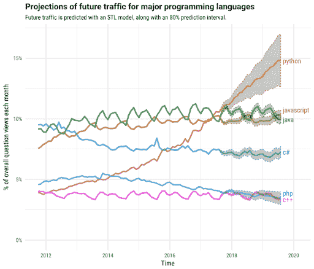

# 哪种语言最适合机器学习？当然是“Python”

> 原文：<https://dev.to/jasmineronald/which-language-best-suits-machine-learning-of-course-python-16i2>

我希望你意识到这样一个事实:Python 是最顶级的编程语言。Python 被认为是一种高级编程语言，拥有*动态语义*。程序维护的成本非常低，因为这种语言非常容易和可读。

作为所有编程语言中最简单的一种，它的使用也排在最前面。关于这一点，需要几秒钟来看看下面给出的图表:

Python 简单的一个主要优点是它非常容易与其他语言接口，尤其是 C 和 C++。所以我们先花点时间了解一下用 **Python 进行机器学习**会有什么影响。

### 为什么机器学习最好选择 Python？

机器学习是人工智能的一种应用，它使计算机和软件在没有人类干预的情况下自动学习和预测结果。

这里开始机器学习工程师的角色。他们的主要工作是积累、管理、整理和理解数据，以便他们可以将数据开发成智能算法。

因此，考虑到这一事实，可以说 Python 是机器学习项目的最佳语言，因为与其他语言相比，这是一种简单的语言，只有在这种简单语言的帮助下，才能处理机器学习的困难项目。

Python 是机器学习项目的首选，因为它的*语法结构有点容易理解*，它的*数据处理能力简直惊人*。

由于易于理解语法结构，Python 是机器学习项目的首选。

根据 Hackerrank Stat 2018 开发者调查([https://research.hackerrank.com/developer-skills/2018/](https://research.hackerrank.com/developer-skills/2018/))“JavaScript 可能是雇主最需要的语言，但根据我们的爱恨指数，Python 赢得了所有年龄段开发者的心。”

#### 以下是 Python 被认为是机器学习的最佳选择的原因:

### *库和框架的大选择*

Python 有大量的框架，这是 Python 被用于机器学习的主要原因之一，因为这些框架有助于简化编码，此外还有助于节省开发时间。

让我们来讨论一下 Python 的一些库和框架，它们对机器学习非常有益。“Numpy”用于科学计算，“Scipy”用于高级计算，SciKit-learn 用于数据挖掘和数据分析。这些库正在为 TensorFlow、CNTK 和 Apache Spark 等框架工作。

**PyTorch** 是专门为机器学习编写的 Python 框架之一。

### *理解力*

因为 Python 是最简单的语言，所以理解和处理起来可读性很高。由于可读性，它也有助于学习开发人员。

Python 是最适合机器学习的语言，因为 Python 是简单的语言，而 ML 算法是非常复杂的，难以解决和理解。所以最终它对开发者来说也是非常有益的。

同样真实的是，开发人员可以轻松快速地测试复杂的算法，而无需在实现上花费太多时间。

### *大量支持*

Python 是最顶级的编程语言，众所周知它受到各种资源和高质量文档的支持。在各种类型的高质量资源的支持下，Python 能够在其建议和协助的帮助下支持不同开发水平的开发者。

### *灵活性*

Python 语言的灵活性是将其用于机器学习项目的另一个优势，因为您可以自由选择 OOPs 方法或脚本。借助于此，您可以将不同的数据链接在一起。此外，它还可以帮助各种苦苦挣扎的开发人员检查 IDE 中的大多数代码。

### *人气*

继续前进，同时记住前面的陈述，Python 是最顶级的编程语言，因为它的语法结构易于理解，开发人员可以很容易地掌握它，因为它对于开发人员来说很容易理解。最终可以说，你可以很容易地找到 ML 项目的 Python 开发者。

## **最后的话**

简而言之，可以说 Python 最适合机器学习的主要原因是 Python 是最简单的语言，因此只有这种语言才能处理复杂的机器学习算法。

如果你渴望构建高端的 ML 项目，去找最好的[机器学习开发公司](https://www.pixelcrayons.com/machine-learning-services-and-solutions?utm_source=dev&utm_medium=devmama&utm_campaign=devmama)，他们应该有高技能的 [Python 开发者](https://www.pixelcrayons.com/hire-python-developers-in-india?utm_source=dev&utm_medium=devmama&utm_campaign=devmama)，他们可以构建最好的基于 Python 的 ML 项目。