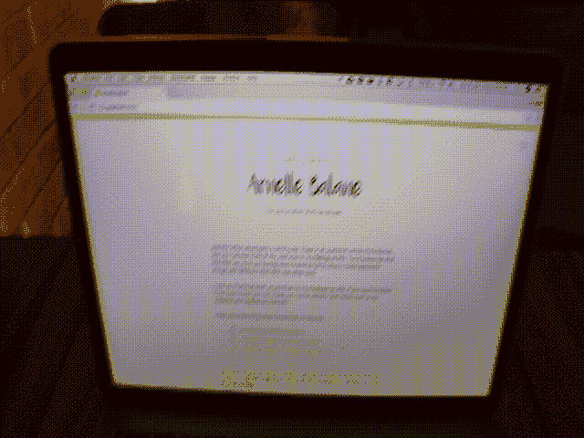

# 还有谁不喜欢黑暗模式？

> 原文：<https://dev.to/yaser/who-else-does-not-like-dark-mode-41p5>

如果你没有意识到，黑暗模式是用户界面/UX 的新趋势。

你使用的每个热门应用/网站都在添加“黑暗模式”功能。

最近让我惊叹的是浏览器中的环境光传感器:

*src:[https://blog . arnellebalane . com/using-the-ambient-light-sensor-API-to-add-brightness-sensitive-dark-mode-to-my-website-82223 e 754630](https://blog.arnellebalane.com/using-the-ambient-light-sensor-api-to-add-brightness-sensitive-dark-mode-to-my-website-82223e754630)*

更多信息，请点击此处:

 [## 根据环境光线在网站上启用黑暗模式

### Ananya Neogi ・ Jan 4 '19 ・ 2 min read

#webdev #javascript #experimental](/ananyaneogi/enabling-dark-mode-on-websites-based-on-surrounding-light--3jel)

但是，我真的觉得黑暗主题在很多方面都很烦人。

只是我吗？