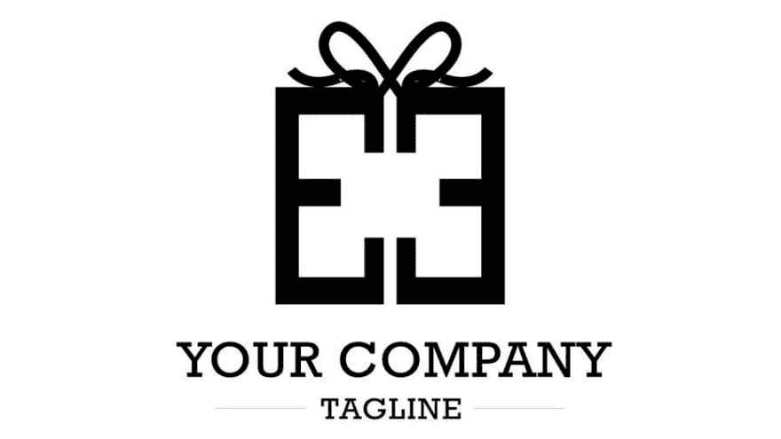

# 为什么一个标志对一个企业成为一个品牌如此重要？

> 原文：<https://dev.to/dmitriylevin/why-a-logo-is-so-much-important-for-a-business-to-become-a-brand-4hll>

嗯，有了你欣赏的标志，你就一定能在你周围的大市场中发展你的业务。事实上，标志在你的视觉识别中起着重要的作用。它将用于营销和促销的不同努力，从而使你在获得认可的同时获得专业形象。

以下是 15 个最好的品牌创意，非常容易使用，会让你的商标看起来更生动。除此之外，这些创意还包括您在每一个创意上需要使用的所有资源。如果你还没有一个标志，试着用 [Logaster](https://www.logaster.com/logo/) logo maker 在一分钟内创建它。
T3T5】

## 添加到您的网站

一般来说，网站在任何企业的品牌塑造中都扮演着重要的角色。因此，在你的网站上添加你的 logo 将是确保你优化其重要性的最好的主意之一。在你的网站中有两个公共区域可以放置徽标。它们包括:

*   **收藏夹图标**–通常是地址栏旁边或浏览器标签标题旁边的一个小图标。在这种情况下，您应该使用 monogram 或图标版本的徽标，这样它通常适合非常小的空间(32×32 像素或 16×16 像素)
*   **标题**–通常在左上方。在这种情况下，您需要确保在使用不同尺寸的屏幕时，您的徽标仍然清晰可见。这样一来，一旦有人上了你的页面，就会造成很大的冲击和影响。

添加到您的徽标时，您需要的进一步说明将取决于您在构建网站时使用的平台。这是因为他们可能会随着不同的平台而改变，因此有必要看看他们的一些文章。这些平台包括:GoDaddy、Etsy、Squarespace、Shopify、Wix 和 Weebly。此外，在你使用 WordPress 的情况下，你的 logo 的位置将取决于主题的选择。

## 添加邮件签名

添加您的电子邮件签名至关重要，因为它可以在您向人们发送邮件时提醒他们您的品牌。除此之外，你还可以通过这种方法联系新的客户来通知潜在客户。

你应该把你的 logo 通过 PNG 版本上传到你的 Google Drive 或者 Dropbox。在这之后，右键单击以便您可以复制图像的 URL，然后最后将此 URL 粘贴到生成器工具。

## 在您不同的社交媒体平台上使用您的徽标

在不同的社交媒体平台上保持标识使用的一致性。用它作为不同平台上的个人资料照片，这将是最好的营销策略之一。除此之外，客户将很容易在不同的渠道上识别您，因为所有平台上的徽标都是相似的。如果你有一个图标版本的 logo，那么你可以用它在一个小空间里产生巨大的影响。

## 名片的使用

名片将是最常见的地方之一，你会发现标志。它实际上代表了你的品牌，可以与任何对你的产品和服务感兴趣的顾客分享。

首先，你要确定你喜欢垂直布局还是水平布局。此外，您可以指定是否需要传统尺寸，通常为 3.5 英寸 x 2 英寸，并选择是彩色还是白色卡片。

可以打印名片的一些资源包括:

*   [哞哞叫](https://www.moo.com/us/)
*   [GotPrint](https://www.gotprint.com)
*   [Avery](https://www.avery.com/)
*   [Vistaprint](https://www.vistaprint.com/)

## 将它添加到帽子、帽衫、t 恤和其他衣服上

在你的广告和推广你的品牌的过程中，把你的 logo 放在服装上，在获得口碑广告的同时，也在炫耀你的品牌。在这方面，矢量标志文件将是最好的，其中包括 SVG 或 EPS。

在已经实施了服装品牌的地方，你应该考虑标志的大小、位置和所用的材料，以确保它看起来优雅。

以下是一些你可以打印衣服的地方:

*   自定义油墨
*   维塔普敦
*   现在就去

## 使用定制的标签或贴纸

贴纸将作为一种营销工具，可以在你的品牌活动中发布。这些贴纸可以贴在笔记本电脑上，笔记本电脑上，以及更多有助于便携式品牌的东西上。此外，您可以轻松选择所需的定制形状，如模切/定制形状、方形、圆形等。

如果您需要大量贴纸用于包装，建议您成卷或单张购买。

一些地方，你可以得到自定义标志贴纸印刷包括:

*   粘性物质
*   牛叫声
*   粘性油
*   贴纸骡子

## 将它融入你的图像中

嗯，因为你会在社交媒体平台上不断更新你的帖子和其他照片，所以让你的 Instagram 帖子、产品照片和封面图片伴随着你的标志是一个好主意。您可以使用编辑程序(如 PicMonkey)来创建带水印的图像，或者使用其他付费程序(如 Adobe Illustrator)。但是，您需要确保您的徽标版本是透明背景。

## 把它加在你的信封和信笺上

在信封和信笺上添加你的商标会增加你的企业从顾客那里得到的信任。在彩色或白色背景上加入透明版本的标志。但是，这有时可能取决于您使用的文档。

你可以使用谷歌文档或微软 Word 在你的信头或信封上添加一个标志。

## 在您的收据、发票和购买后的电子邮件中添加徽标

赋予你的标识以生命的另一个最好的想法是，在完成工作或销售服务产品后，将它添加到你的文档中。这些文件包括收据、发票和购买后的电子邮件。这可能会给你的客户留下印象，并在未来的销售中留住他们。

这种添加将取决于您在构建网站时使用的软件。您将获得的一些主要发票平台包括:

*   波浪
*   QuickBooks
*   新书

另一方面，您应该在发送购买后电子邮件、电子邮件营销活动或使用自动发货通知的电子邮件标题上添加您的徽标，从而对您的信息进行品牌化定制。您可以查看如何将您的徽标添加到您的 Shopify 和 MailChimp 电子邮件模板中。

## 创建品牌展示

在 Google Slides、PowerPoint、Prezi 或其他平台上创建演示文稿时，通过在每张幻灯片的页脚添加一个透明的背景徽标版本来标记它们是非常重要的。除此之外，它还应该主要出现在结尾和开头的幻灯片中，让你的品牌回家。

此外，您还可以在演示模板中加入您的品牌和徽标颜色，以便为培训演示、客户推介等做好准备。

您可以使用 PowerPoint 创建它，在创建模板后，您应该单击另存为> PowerPoint 模板(。potx)。

## 将其设置为手机和桌面上的壁纸

解锁平板电脑、手机和电脑时，您会希望随时看到您的品牌。让你的壁纸成为一个标志版本将是必不可少的，这样员工可以在某些时候使用它，比如在活动中。

为了定制你的壁纸，你可以加入名为 Canva 的免费程序。

## 包装上的附加物

在您开展零售或电子商务业务的地方，这将是一个在包装上使用您的徽标的绝佳机会，通过它，您可以在每次向客户销售或发送包装商品时提高品牌的认知度。

包装的形式可以是盒子、纸袋、衬垫信封、聚合邮件、标签和贴纸、纸板管、包装纸、包装带、明信片等等。

在定制邮票、贴纸或包装带时，您可以从实用包装开始，选择适合口袋的选项，如空白盒子。在此之后，您可以在以后的业务中将其升级为定制印刷的盒子或袋子。

获得品牌包装材料的一些领域包括:

*   乌林
*   贴纸骡子

## 打印菜单、宣传册、明信片、便签卡等等！

炫耀你的商标不会比在印刷品上使用它更好。最有可能的是，如果你在一些行业，如房地产，餐饮，或时装业。

使用专业打印机，您可以为他们提供矢量徽标文件，这些文件可以是 SVG 或 EPS，然后将它们打印出来。但是，请确保在打印前对它们进行校样，以确保得到您需要的内容。

印刷明信片、小册子和其他宣传材料的区域包括:

*   Primoprint
*   牛叫声
*   隔夜印刷品

## 使用有品牌的办公用品

好吧，有品牌的办公用品会对你的品牌有很大的帮助。你应该把你的商标印在你的大部分用品上，比如钢笔、咖啡杯、台历、笔记本、鼠标垫、便利贴等等。

您可以在以下网站定制办公用品:

*   现在就去
*   4 印记
*   Inkhead

## 为您的车辆、窗户或墙壁贴花

这是一种给你的空间甚至你的车辆打上品牌的廉价方法。此外，这是有趣的，通过它可以很容易地将贴花添加到墙上，并在移除它们时更加容易。你可以把它们放在你的会议室和办公室里。窗户贴花对于吸引路人的注意力至关重要。一些防风雨的贴纸非常适合在你的户外窗户或车辆上添加你的企业标志，这将吸引你周围任何人的注意。您可以获得徽标贴花的一些区域包括:

*   维塔普敦
*   贴纸巨人
*   贴纸骡子

总之，有了以上 15 个在全球展示你的商标的好主意，你一定会让你的生意遍布全球。检查最适合你的和对你的业务类型有意义的最佳选择。此外，你应该注意到，有不同的方式，你可以通过溢价在任何阶段推广你的业务。有了这个，你就一定能让你的商标发挥最大的效用。

原文来源:[https://www . the geeks club . com/why-a-logo-is so-important-for-a-business to-be-a-brand/](https://www.thegeeksclub.com/why-a-logo-is-so-much-important-for-a-business-to-become-a-brand/)