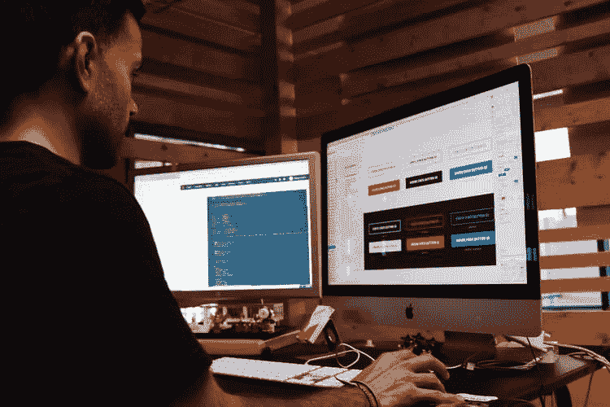

# 为什么自举？为什么不自举？

> 原文：<https://dev.to/feevah1/why-bootstrap-why-not-bootstrap-3og2>

### 到处使用

#### 如今大多数网页都是激动人心的文档，有动画、图标和分割部分，可以吸引用户。但是像大多数事情一样，如果用户不得不考虑太多，你的网站会变得很难理解。现在许多网站都使用 Bootstrap，所以如果你决定使用类似的布局，客户可以更容易地找出并找到你到底在卖什么。对于我想快速找到信息的任何网站来说，边框、间距和文本的标准都是一个受欢迎的补充。想一想；你有可能买一辆带方向盘的车，或者是一辆类似于 F-14 战斗机控制的车吗？在正确的情况下，像马华力和古斯追赶米格机一样驾驶你的车会很有趣，但大多数时候，我们只需要我们的车按时上班或上学。对于正常的日常事务来说，一架战斗机或一个时髦的动画网站可能太麻烦了，很难真正搞清楚。另一个好处是 Bootstrap 在任何设备上都很好看。你可能没有 1000 种个性化网站的选择，但如果你想要一些在智能手机、平板电脑和电脑上看起来不错的东西，Bootstrap 是一个很好的解决方案。普通 CSS 很棒，现在有了 grid 和 flexbox，CSS 的响应速度和 bootstrap 一样快，但出于某种原因，每当我使用普通 CSS 时，我总是会遇到内容居中或文本被截断的问题。使用 Bootstrap 时，这不是问题。

### 你不必重新发明轮子来设计新轮胎

#### 如果真的要从零开始做自己的全栈站点，至少对于我这样的新手来说，很容易迷失在酱里。在设计你的网站时会出现成千上万的问题，很难只见树木不见森林。对我来说，复制一个设计比即兴创作要容易得多。如果你的目标是成为一名 CSS 设计师，那么我猜你不会比 CSS 更好了，现在有 SASS 和一大堆你可以用动画做的不同事情。然而，如果你像我一样，构建功能性的应用程序和获得后端的经验是一个主要的关注点，目前，这比使用 CSS 将文本放在 div 的中心更值得关注。虽然我真的很喜欢思考设计想法，但有时我需要跑完比赛，穿过终点线，然后才能思考赛道上的每一个重音或曲线。Bootstrap 允许我看到一个更精致的产品，反过来也允许我更深入地研究，比我最初的梦想更远大。如果我能想象胜利，胜利会变得容易得多。Bootstrap 允许你有一个漂亮的布局并快速运行，这样你就可以忘记设计，专注于细节。

### Bootstrap 和 CSS 一起工作

#### 当我第一次开始学习如何改变颜色、字体和其他许多东西时，CSS 就像魔术一样。但是就像任何新的玩具一样，CSS 很容易被过度使用。我觉得我正在创建的布局过于丰富多彩，有太多风格化的字体。Bootstrap 产品干净、简单，在任何设备上都很好看。也就是说，您可以轻松地将 CSS 合并到您的 Bootstrap 项目中，并使用个性化的 CSS 类覆盖任何类。因此，如果你正在寻找特殊的颜色或特殊的字体，你仍然可以这样做。

### 最后的想法

#### 我想归根结底还是要看你在努力做什么。是的，我认为 CSS 在网页设计中非常重要。正如我前面提到的，这是吸引我把 web 开发作为一种职业的原因，也是吸引用户到你的网站的原因。但是，如果你的目标是构建一个全栈应用，花几天时间在布局上，让你的文本框恰到好处，可能不是最好的利用你的时间。尽管我很钦佩并希望有一天能效仿一些设计师正在做的事情来创建引人入胜的网站，但我们日常使用的许多网站看起来都一样是有原因的——更容易快速找到你正在寻找的信息。我会一直对 Bootstrap 有这种感觉吗？大概不会。有如此多的新技术被创造出来，以简化复杂的设计，并且不仅仅是显示内容(反应和角度)，一旦我开始了解这项技术，我确信 Bootstrap 将成为过去，但在此之前，如果我需要快速开发一些用户友好和功能强大的东西，我会转向 Bootstrap。

我用 Bootstrap 设计了我的个人资料页面。