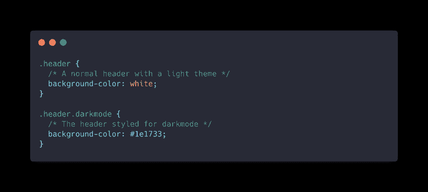
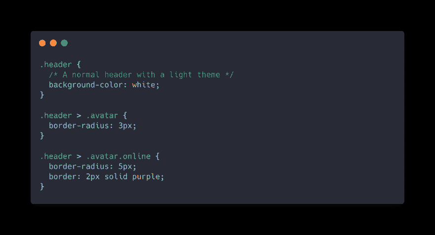

# 为什么 CSS 很难做对？

> 原文：<https://dev.to/darthknoppix/why-css-is-difficult-to-get-right-5a8e>

#### 打破 CSS 污名:不要害怕 CSS

层叠样式表(CSS)是一种将网页从设计者的噩梦变成美观的东西的语言。它帮助打造了我们每天都知道和使用的充满活力和有用的网络。作为一名 web 开发人员，我写了很多 CSS 以及 JavaScript 和 HTML。这些是网络的核心技术，也是网络开发者的基础。我喜欢 CSS，它并不完美，但我在这方面已经变得很有能力，而且每个人都很容易参与进来。并不是所有的 web 开发人员都学习 CSS。许多人认为他们不需要。阅读[开发者避免 CSS 的原因](https://blog.sethcorker.com/what-makes-css-difficult-for-web-developers/)了解为什么第二个问题是系统性的，开发者并不总是尊重设计。CSS 并不是每个人都喜欢的语言，但对于 web 开发人员来说，它就像 JavaScript 一样不可避免。

CSS 的核心概念是选择 HTML 元素并对其应用样式。尽管这很容易上手，但对于较大的团队或较老的浏览器来说，这可能会变得更加复杂。如果你是一名程序员，并且习惯于拥有很大的灵活性，那么 CSS 将看起来像一个非常受限的沙箱。通过查看一些绊脚石，我们可以克服它们，变得更加适应 CSS。

### 超载术语

<figcaption>CSS 中的类构成</figcaption>

如果你不熟悉核心概念，CSS 可能会令人生畏，但它并不那么难(大多数时候)。如果你是一名程序员，第一个挑战是理解重载的术语。Class 和 id 在 CSS 中的含义与在 JavaScript 中的含义并不完全相同。

> “我使用了一个 ID，所以它不会破坏网站”

CSS 类是一个选择器，用这个类来设计所有的样式。给一个 HTML 一个 class 属性，你可以*选择*那个类来应用样式化元素的规则。一个元素可以有多个类，这些类将合并规则集并覆盖更多的个别情况。这是样式元素的最灵活和直接的方法，你的元素与你在 CSS 中定义的规则有直接的关系。

#### **常见陷阱**

我看到开发人员在设计元素样式时犯的一个常见错误是给元素一个 *id* 属性来设计单个元素的样式。

一个 *id* 选择器完成了这项工作，您已经选择并设计了一个特定的元素，但是这不是一个可伸缩的方法。这样做的问题是你绕过了 CSS 中的一个核心原则，级联部分。您只能像这样设计单个元素，而不能享受任何代码重用。如果您想让多个元素共享规则集，那么需要为每个元素和规则集添加一个唯一的 *id* 。

### 选择器特异性

<figcaption>CSS 中特异性增加</figcaption>

特殊性很容易学习，但由于 CSS 的级联性质，可能会变得难以管理。继承属性是一个强大但经常被恶意中伤的特性，它让开发人员陷入困境。

> “唯一的办法就是使用！重要，应该没事。”

这个想法很简单，将一个规则集应用于父 HTML 元素，子元素将继承其中一些属性进行样式化。基于元素的父元素来选择元素。子元素继承属性以避免再次定义每个属性。

#### **常见陷阱**

我看到开发人员遇到的特殊性问题有两个方面。注意，当提到子元素将从其父元素继承的属性时，我说了一些。不是所有的财产都是继承的，如果你不想继承财产呢？

在 CSS 中要学习的一件关键事情是什么被继承。虽然并不总是显而易见的，但是学会理解在哪里添加属性以及这如何明显地影响元素是很重要的。

继承财产的一个例子是`color` *。*带有`color: red;`的父代意味着任何子代都将继承红色的颜色属性，除非它被更具体的规则覆盖。

不是继承的财产是`background-color` *。*默认情况下，设置了该属性的父对象的任何子对象将继续具有透明背景。要继承父对象的背景色属性，创建一个新规则`background-color: inherit;`。

我看到的另一个没有经验的 web 开发人员犯的错误是过度使用`!important`。这个关键字意味着在可怕的情况下使用，几乎总是一个完整的黑客。这个问题通常可以通过采用 CSS 并以其他方式选择元素来解决。一旦你知道专一性遵循以下模式，专一性是一种随着时间发展的技能:

**类型>类别> Id**

*从左到右特异性增加*

当你知道特殊性是如何工作的时候，关于 CSS 的推理就变得容易多了。随着时间的推移，你将学会如何最好地选择 HTML 元素。避免使用 hacks 将属性强加到带有`!important`的元素上会容易得多。

### 约束

就语言而言，CSS 有很多限制。它的设计只有一个目的，那就是调整 HTML 的表现形式。它的专注是令人钦佩的，但与其他语言相比，这些限制可能会令人感到累赘。这些约束使得 CSS 对于设计者和开发者来说都很容易解析，但是会阻碍开发。

> “CSS 不是真正的编程语言”

CSS 缺少一些共同的特性，这让初学 CSS 的开发人员感到困惑。最大的抱怨是没有变量，代码重用的方式有限，以及缺乏高级选择器。这似乎是一件大事，但它是可以克服的。关键是要理解 CSS、HTML 和 JavaScript 之间的共生关系，以便在跌倒的地方站起来。

#### 常见陷阱

我从开发商那里听到的抱怨通常是这样的。

> “我不能让这个看起来像设计，因为我不能选择这个元素！”

如果你不能选择一个元素，问问自己为什么？如果不明显，那么也许你需要考虑改变 HTML。在 CSS 中定位元素并不总是直观或简单的。如果你不能用一个元素来做你需要的事情，那么就看不起眼的`
`标签。通常有必要使用`
`标签对元素进行分组以进行样式设计。不要害怕改变你的 HTML 的结构，使其更容易设计风格。

> 我想对所有这些元素使用相同的颜色，但是我不能使用变量

CSS 直到最近才拥有变量，而是选择通过继承来共享属性 [ [1](https://dev.to/darthknoppix/why-css-is-difficult-to-get-right-5a8e#footnote-1) ] 。它没有那么灵活，但是对于许多常见的情况，最好是创建一个具有预期样式的类，并将该类添加到您需要的所有元素中。另一种方法是从父元素继承属性。关键是接受 CSS 的限制，改变你的思维方式。

> **“我如何让这个按钮在 CSS 中做 X？”**

CSS 中的一些东西不直观也不可能。你可以用 CSS 做很多事情，但是有时候它需要一些帮助。一个常见的情况是根据不同的状态改变按钮的外观。大多数情况下，CSS 会这样做，但最直观、最灵活的方式是使用 JavaScript。您可以在 JavaScript 中管理按钮的状态，并根据状态更新类。这样，CSS 就有能力做它最擅长的事情，并根据类适当地设计元素的样式。

接受 CSS 的约束但知道它的局限性是至关重要的。有时有必要用其他核心 web 技术来补充 CSS。每种技术都有自己的侧重点，最好是利用它的优势来避免逆流而上。

### 结论

CSS 受到了开发人员的大量指责，但目前它还没有任何进展。它是网络不可或缺的一部分，对于给网页和网络应用注入活力至关重要。尽管这并不总是最容易有效运用的，但学习和提高是很重要的。作为 web 开发人员，最大的错误是认为 CSS 不重要，不值得投入时间。CSS 有它的缺陷，但它不应该是一个与之斗争的东西。花时间:

*   弄清楚如何最好地使用 CSS 和 HTML 来获得最佳体验。
*   了解选择器和特异性的来龙去脉，避免常见的陷阱，比如在不需要的时候添加`!important`。
*   接受 CSS 的约束并认识到它的局限性。将不适合的任务委托给 HTML 或 JavaScript。

没必要害怕 CSS。现在就动手学习 CSS，这样下次设计师想做一些小调整时你就不会害怕了。

* * *

*   【1】[级联变量的 CSS 自定义属性](https://www.w3.org/TR/css-variables-1/)目前是 W3C 的候选推荐标准，在现代浏览器中受到支持。*感谢 [@couch3ater](https://dev.to/couch3ater) 增加了[功能](https://dev.to/couch3ater/comment/f5b7)，要了解更多信息，请参见 [MDN web docs 关于使用 CSS 属性](https://developer.mozilla.org/en-US/docs/Web/CSS/Using_CSS_custom_properties)。*