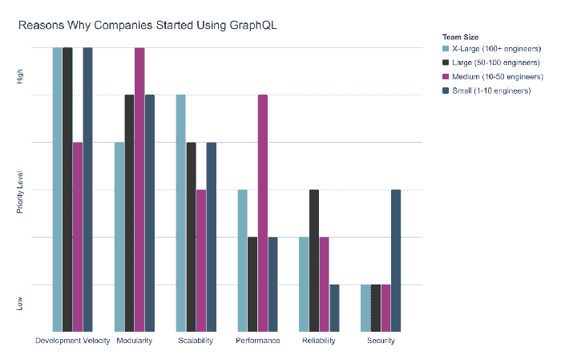
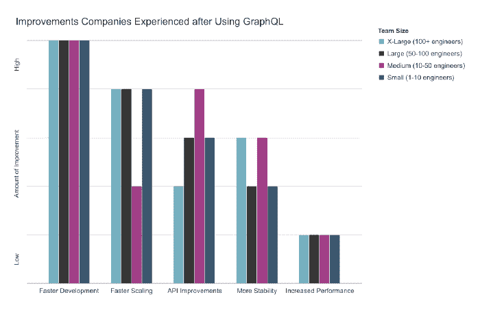

# 为什么开发团队采用 GraphQL？

> 原文：<https://dev.to/graphqleditor/why-development-teams-are-adopting-graphql-11mh>

GraphQL 是一种用于 API 的查询语言，最初由脸书开发，它描述了如何让 T2 从服务器获取数据到客户端，响应格式在查询中描述，由客户端而不是服务器定义。

截至 2018 年底， [npm Inc.](https://www.npmjs.com/) 发布了关于 2019 年 JavaScript 见解和预测的[年度预测](https://blog.graphqleditor.com/javascript-predictions-for-2019-by-npm/)，其中提到:

> 2019 年，开发人员很有可能在新项目中使用 GraphQL，GraphQL 将成为 2019 年的一股技术力量。

你猜怎么着？他们是对的！越来越多的公司采用 GraphQL 并取得了巨大的成功！

#### 为什么企业都在采用 GraphQL？

GraphQL 采用公司之一所做的调查询问了各公司的首席技术官和首席开发人员关于他们在实施 [GraphQL](https://graphqleditor.com/) &时的体验。他们在从优步、Paypal 等顶级[公司，以及那些拥有 1 到 100 多名软件工程师的中小型开发团队收集数据方面做得很好。](https://graphql.org/users/)

调查结果让我们了解到:

*   为什么他们选择**实现 GraphQL** ，
*   他们在转型过程中遇到了哪些障碍，
*   在成功实施后，他们能够确定哪些**主要优势**。

让我们来看看开发人员不得不面对的问题。

#### 问题&答案

嗯，从技术上讲，这些不是问题，但调查要求受访者从 1 到 6 的范围内对他们决定转向的原因进行排名，其中 1 是最重要的原因，6 是最不重要的原因。调查者确定了六个主要优势(*开发速度、模块化、可伸缩性、性能、可靠性、安全性*)，并询问他们对以下陈述的同意/不同意程度:

> *我们能够使用 GraphQL 加快开发速度*
> 
> *我们能够使用 GraphQL 更快地扩展我们的项目*
> 
> *统一我们的 API(例如，微服务、传统端点、第三方服务等)变得更加容易。)*
> 
> *使用 GraphQL 后性能有所提高*
> 
> *我们的架构更加稳定，停机时间更短，错误更少*

结果如下:

###### 来源:[novuvum @ medium](https://medium.com/novvum/why-companies-of-various-sizes-chose-graphql-and-what-they-experienced-7a9d47d06bee)

下表总结了对调查结果的解释。最重要的想法是 GraphQL 设法提供了中小型以及大型企业团队所需要的东西。

| 团队规模 | 他们想要达到的目标 | 他们所取得的成就 |
| --- | --- | --- |
| 50-100 名和 100 多名开发人员 | 更快的开发速度，更好的可扩展性，更好的模块化 | 更快的开发，更好的可扩展性 |
| 10-50 个开发人员 | 更好的模块化，更高的性能 | 更快的发展，更好的基础设施 |
| 最多 10 台设备 | 更快的开发，更好的模块化 | 更快的开发，更好的可扩展性 |

#### 奖励:获得灵感！

如果你还没有看过，一定要看看关于 GraphQL 起源的纪录片，看看它是如何变成现在这个样子的。这是一部由 GraphQL 的联合创作者主演的伟大作品:李·拜伦、丹·斯查费、尼克·施勒克以及社区中的其他知名人士。

> GraphQL:这部纪录片“探索了 GraphQL 为什么和如何出现的故事，以及它对全球大型科技公司的影响，包括脸书、Twitter、Airbnb & Github。

