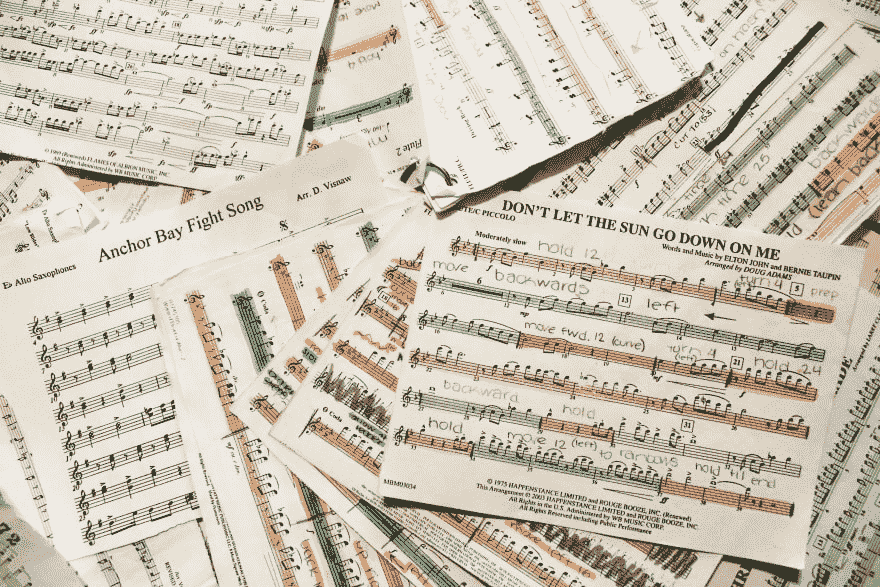
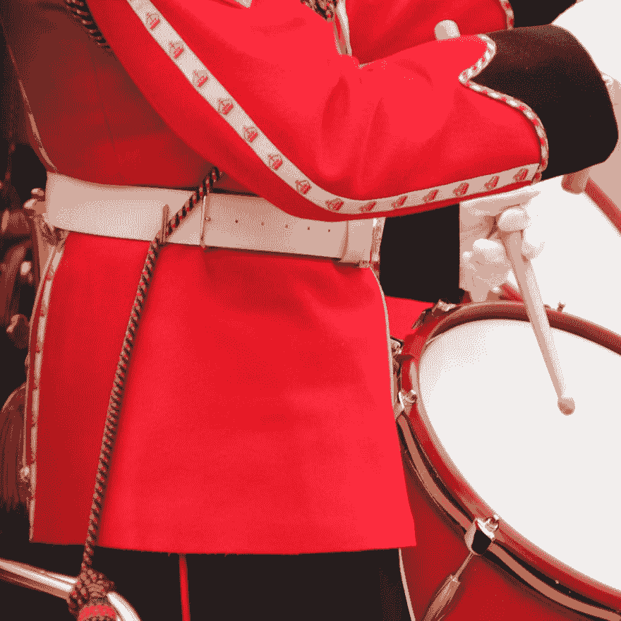

# 为什么鼓手能成为伟大的软件工程师

> 原文：<https://dev.to/dealeron/why-drummers-make-great-software-engineers-69p>

在大学的一段时间里，我面临着一个两难的选择——我是希望从事音乐和鼓乐专业，还是计算机科学专业？当我和其他人讨论这个难题时，我经常会被问及“你能再挑两个不同的专业来分配吗？”最后，我从音乐教育开始，转到了计算机专业。在接下来的几年里，我注意到了一些奇怪的事情——越来越多的音乐家加入了我的 CS 班，尤其是鼓手，越来越多的 CS 同龄人消失了，只是在音乐大楼里被再次看到。发生了什么事？

最终，我被一个鼓手兼软件工程师的混血儿推荐给了 DealerOn。虽然这相当令人兴奋，但更令人兴奋的是，今天，在 DealerOn 大约 40 人的开发团队中，我们有 8 名鼓手。那是我们团队的 **20%** 。*到底怎么回事？*

我认为这是由于两个因素:第一，共同的自然倾向有助于两者的成功，第二，从两者相似的挑战中吸取的教训。

* * *

## 才能

毫无疑问，软件工程需要数学和逻辑。也许对一些人来说更令人惊讶的是，音乐——尤其是鼓乐——也是如此。节奏代表了复杂的数学结构。这些结构，写在乐谱上，被解释成产品:我们耳朵里的音乐。这与编程算法没有什么不同，编程算法被解释到产品中:**软件**。

这些产品代表了下一个相似之处:创造力。音乐和软件开发都是创造性的应用数学。两者都需要创意和设计:在编写代码和乐谱的基础层面上的**创意**，以及在大画面中对你的产品的**设计**，不管那画面是你对一个软件产品还是一首歌的愿景。能够利用这些冰冷的数学抽象，并用它们来创造令人惊叹的产品，是这两种激情的核心。

<figure>

<figcaption>Photo of sheet music by [Cassi Stewart](https://unsplash.com/@cassijeanne) on Unsplash</figcaption>

</figure>

另一方面，大多数开发人员和鼓手在与创造力一致的绝对真理中找到了一定的安慰和快乐。编码受到某些具体规则和真理的约束，与更灵活的创造性决策和平共处。Drumline 受到一些解释节奏、动作和动态的严格规则的限制，与创造性自由和无尽的可能性和平共处。在这两种情况下，我们的经历、个性和价值观塑造了创造性的自由和决策。

* * *

## 经历

康威定律(Conway ' s law)指出团队“*”被限制生产复制这些组织的交流结构的设计。*

对此，与音乐组织(如鼓声)和软件开发团队有着巨大的组织相似性。在一条鼓线中，有多个部分——钹、小鼓、低音鼓、男高音——所有这些部分都必须独立运作，以创造各自的产品，同时将目标和愿景与鼓线的整体保持一致，鼓线必须将其目标和愿景与乐队的整体保持一致。这类似于在给定系统上工作的软件开发团队，他们开发他们的产品作为由更大团队处理的更大基础设施的一部分，这也必须符合公司的目标。这些经历带来了独特的挑战，也带来了相互借鉴的教训。

这些经验教训是由于鼓声和软件开发中固有的主人翁意识而产生的。两者都有分层的领导，在个人、分部、分部和整个级别。如果一个人未能完成一项任务，它会直接影响到他们上面和下面所有级别的每个人，从而产生对更大利益的直接责任感。这些更小的小组为每个人创造了更多的机会以某种方式体验领导力，无论是创造性的领导力、对自己的实践和改进的所有权、领导协作还是设定标准。

开发团队和团队都有具体灵活的标准。对于开发团队来说，它们可能以编码指南、协作通道、票证流程、分支策略、部署策略等形式存在。对于鼓点，它们可能以棍高/动态演绎、技法、行进风格、节奏演绎等形式存在。这些指导方针是自然发展的，随着时间的推移而演变，并且从一开始就是一成不变的。这些指导方针的传播、发展和遵守为参与者的成长带来了挑战。

* * *

之前我写过一篇关于[为什么汽车爱好者会成为优秀的软件工程师](https://dev.to/dealeron/why-car-lovers-make-great-software-engineers-2k2d)的帖子。那么，我断言汽车爱好者和鼓手比那些不是的人是更好的软件工程师，我是在建议软件工程师应该出去买一把扳手和鼓槌吗？当然不是。然而，我相信任何激情和经历都可以被利用来建立在另一个之上，即使看起来本质上完全不同。

从任何事情中学到的经验教训都可以，而且很可能应该，应用于跨学科，并有助于你个人的成长。我学到的最重要的一课来自于一堂架子鼓课，当时我压力太大，睡眠不足，无法有效地演奏。那么，我们做了什么？我们坐着谈论鼓和生活。"*我们来这里不是为了更好地打鼓——我们来这里是为了更好地生活，而**打鼓是一种工具。*** “所以，无论你是鼓手、舞蹈家、汽车爱好者、画家、厨师还是运动员，我都希望你将这些追求视为改善自己、产品和同事的途径。

<figure>

<figcaption>Photo by [James Toose](https://unsplash.com/@portablepeopleproduction) on Unsplash</figcaption>

</figure>