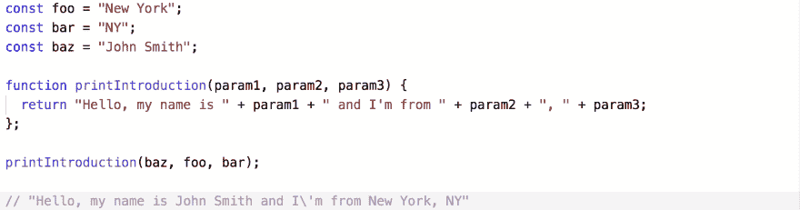
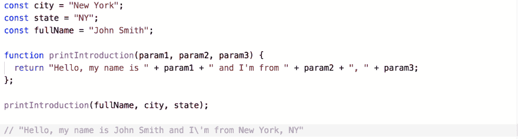

# 为什么我不用 Foo/Bar/Baz

> 原文：<https://dev.to/kiarathedev/why-i-don-t-use-foo-bar-baz-1kf7>

作为一名初级开发人员，我总是很困惑为什么其他人会使用 foo、bar 或 baz。当我接近例子中使用的这些单词时，我假设它们与我正在阅读的代码相关。我很快了解到，这些名字没有任何分量，经常在教学例子中用作更好名字的占位符。

在学习如何编程的过程中，我学会并发现了自己的命名惯例。我发现，多花点时间想出一个清晰的名字，对我理解所展示的代码、我的同事阅读我的代码，以及未来的我更有好处，因为我已经不记得这些代码是做什么的了。

让我们看一个使用 foo/bar/baz 的例子:

这个怎么改进，让以后的程序员看？如果我花额外的时间来重命名变量，那么函数会变得更容易理解，因为每个变量都与其数据相关。

这绝对是一个基本的例子，但是所有的程序员都是从某个地方开始的。我相信用单词或短语命名例子可以:

*   帮助一个人在学习编程时更容易掌握一个概念
*   开始教他们如何清楚地命名数据
*   从一开始就创造一个更好的程序员

谢谢你听我说完。如果你感兴趣，这里有一个关于 foo/bar/baz 历史的很酷的 [Stackoverflow 帖子](https://stackoverflow.com/questions/4868904/what-is-the-origin-of-foo-and-bar)。