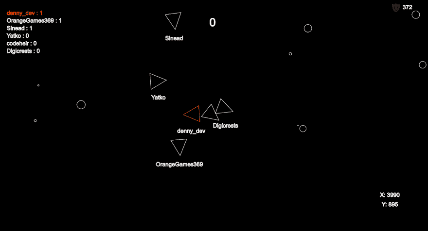
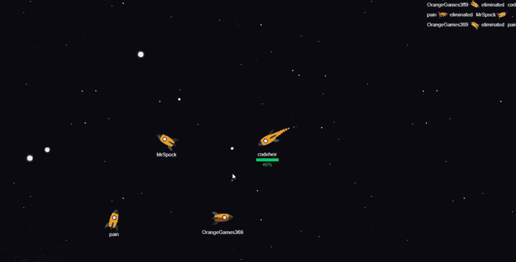

# 为什么我在现场编码上失败了！！🤔💻❌

> 原文：<https://dev.to/lukegarrigan/why-i-failed-at-live-coding-1eie>

# 现场编码

现场编码仍处于起步阶段，但随着越来越多有才华的人每天出现，现场编码肯定会越来越受欢迎。它可能永远不会像视频游戏流一样受欢迎，但这只是因为没有太大的需求。这并不是说这不是一个可行的渠道，有许多全职节目流在那里谁是拉在大数字！

# 我的故事

那是 2018 年 7 月，在连续几个月几乎每天都看现场编码员之后，我决定这么做。决定长一双自己试试，何乐而不为呢？

我的第一次人流我没有真正的计划，我甚至懒得告诉朋友或家人，我只是跳了进去，等待着 1000 英镑的捐款🤣。

当时我正在为一个朋友做 Java 后端，所以我想为什么不在我编码的时候就把这个流出来，这样就一举两得了。我没有吸引很多观众，但和少数前来打招呼的人一起开怀大笑。

## 使 sh*t 移动

有一次，我决定做点不同的事情。我听说过这个名为 [Processing](https://processing.org/) 的开源图形库，我想在完全不了解它的情况下尝试一下。然而，我确实了解 Java，所以我相当快地学会了它，并以一个随机游戏结束了这个流，这个游戏将观看这个流的每个人都融入到游戏中。

[https://player.vimeo.com/video/358477594](https://player.vimeo.com/video/358477594)

这个游戏非常非常简单，但是相对于我的其他流来说，它吸引了相当数量的观看。我刚刚发现，**人们喜欢看到屏幕上的画面移动。只有一定数量的通过测试，观众可以观看并仍然感兴趣。**

下面的流是我在同一个游戏上做的，只是添加了一些小功能，比如开机，当玩家离开流时动态地添加/移除玩家，等等。它吸引了一些观众，但没有上次那么多。

这里有很重要的一课要学，但我错过了。这是我停下来几个月后才明白的一课。

## 捡 P5.js

我想创造一个可以和观众一起玩的游戏。我现在已经对处理做了一点开发，所以逻辑切换到 p5，这实际上是在浏览器中处理(JavaScript 而不是 Java)。

我决定制作的游戏是一个小行星副本，但却是多人游戏版本:

我对任何游戏开发都没有经验，所以我在工作中学习。多人游戏 dev 向我介绍了 Node 和 Socket.io，我在玩的时候也必须弄清楚。在这个游戏中工作的前两个流是我最喜欢的，也可能是我最成功的。我设置了一个 AWS Lightsail 服务器，每次我提交一些新代码时，我都会重新部署，允许每个人和我一起玩和测试。

因为我太没有经验了，不确定游戏的哪一部分应该由客户端或服务器来处理。没过多久，人们就开始破解游戏，在屏幕上瞬间移动，一次射出 1000 发子弹。这是现场编码最棒的地方，观看的人很可能就是程序员，所以他们毫无疑问会发现你做的任何蠢事(即使你希望他们不会发现)🤣).

人们显然喜欢这样做，我最终把这个流的标题改成了“来黑我的多人游戏”。

但最终，我的代码变得更好了，我开始理解服务器应该做什么，客户端应该做什么，所以可能的黑客攻击数量急剧下降，我的视图数量也随之下降。

## 执著于游戏

我在开发这个游戏的过程中获得了如此多的乐趣，以至于我不断地给它添加新的功能，最终它从小行星游戏过渡到了我自己的游戏 Spaceheir！

目前我还没有游戏的现场版，但这是我最新的 gif 图。(它现在看起来有很大的不同，有一个调平系统和电源，但你会明白的)

每一个流最终都与前一个非常相似，收集想法并将其实施到游戏中，或者有时修复人们在玩游戏时发现的错误。我认为，回过头来看，这对观众来说变得单调，这也是收视率下降的原因之一。我只是被困在循环中，不知道如何过渡。

看看像丹尼尔·希夫曼这样的大型现场编码流，他总是做一些不同的事情，从来没有为一个庞大的程序工作过。Daniel 的流中散落着许多简短的编码挑战，允许人们从头到尾观看一些东西的创建，我认为这非常重要，也是我喜欢他的流的原因之一(以及他无与伦比的教学能力和性格)。

我喜欢看 streamers 解决问题，并将其与我解决问题的思维模式进行比较，如果他们像我一样正在开发一个大型程序，我很少能找到一个相关点，即实现不需要现有系统的先验知识。这意味着，如果他们从头开始，我可以立即进行比较，因为我不需要担心他们已经编写的一些现有代码。丹尼尔·希夫曼完全明白这一点。

## 不一致

我的另一个主要问题是我的一致性，我会指定我要流的日子，周三，周五和周日。我只成功地坚持了我的时间表，一次可能两次。在谷歌上搜索任何成为优秀流民的技巧，它们都会在某个地方有**【保持一致】**。我真的不是，我去上班有很长的路要走，有些晚上我会回来，我只是，嗯，*不会喝醉*。

## 组织

因为我几乎每个流都在做同样的事情，我没有费心做任何计划，我会启动它，向任何观看的人问好，然后想出我要为流做什么。我知道现在这样做是错误的，我应该计划好我想在那个特定的流上做什么，即使这个计划确实涉及相同的游戏，至少我对我想做什么有一个清晰的愿景。

## 结论

在我做现场编码的 6 个月左右的时间里，我过得非常开心，我遇到了很多优秀的人，在这个过程中，我开怀大笑。不过，最终这变得有点烦人，我认为这表现在视频流本身的质量上。

我确实认为我会在某个时候回到它，并潜在地应用我所学到的教训。不幸的是，我学到的很多关于实时编码的东西都是在回顾中而不是在工作中完成的，如果我边做边学，也许我会比忍者更伟大😂。

## 说说你们的故事吧！

我很想听听你的现场编码经验，不管你是想进入现场编码，还是已经做了很多年，或者你是一个新手，我想听听你所有的故事和你在这个过程中学到的经验。

另外，如果有人感兴趣，我的抽搐是[twitch.tv/codeheir](https://www.twitch.tv/codeheir)！

如果你不想错过绝对精彩的编程洞察，请在 twitter 上关注我:🤣@luke_garrigan

谢谢你，如果你喜欢我的漫谈，看看我在 https://codeheir.com/的个人博客网站

## 本博客由[代码画布](https://www.codecanvases.com)赞助

用市场上最酷的编程/编码画布让你的房间变得生动起来。[codecanvases.com](https://www.w3schools.com)是 100%独家设计画布的编程印刷的头号卖家。趁**优惠 20%,立即购买！！**
T7】](https://res.cloudinary.com/practicaldev/image/fetch/s--qTjLHF_e--/c_limit%2Cf_auto%2Cfl_progressive%2Cq_auto%2Cw_880/https://cdn.shopify.com/s/files/1/0311/0151/7955/products/jqbr8djyof6ktl8qopmkpvy4_480x480.png%3Fv%3D1585483987)