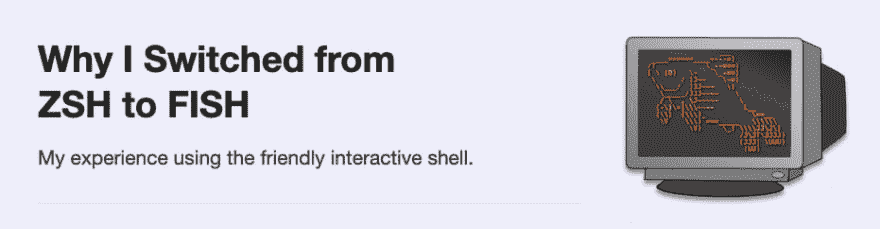

# 为什么我从 ZSH 转向了鱼

> 原文：<https://dev.to/joshmedeski/why-i-switched-from-zsh-to-fish-2j17>

多年来，我一直使用带有臭名昭著的 [oh-my-zsh](https://github.com/robbyrussell/oh-my-zsh) 框架的`zsh`终端。它对 plain old bash 的特性和改进令人印象深刻。但是随着我需求的变化，我的外壳也在变化。大约一年前，我切换到了`fish` shell，以下是我切换的原因。

## 速度

`fish`比`zsh`快。特别是当使用`zsh`插件时，加载时间会明显变慢。但更重要的是，我的总体体验感觉在`fish` shell 中更快更灵敏。因为我使用终端是为了比 GUI 更高效、更快地完成工作，所以速度是我对 shell 的最高要求之一。

## 简朴

oh-my-zsh 配置和插件会增加终端环境的复杂性，尤其是自定义别名。总的来说，我发现`fish`在配置和使用方面要简单得多。我的配置文件只有几行，我只使用了一两个第三方工具的插件(例如: [`fasd`](https://github.com/clvv/fasd) 和 [`nvm`](https://github.com/nvm-sh/nvm) )。我还发现了一个非常简单的主题，只显示我需要的东西，类似于我之前的`zsh`主题。

## 自我暗示

这是我搬到`fish`的主要原因。我最初使用的是[zsh-自动暗示](https://github.com/zsh-users/zsh-autosuggestions)，它是“zsh 的鱼一样的自动暗示”。这就是吸引我去钓鱼的原因，这是我最常用的功能。如果我输错了一个命令，它会显示为红色，表明这是一个无效的命令。但是，更重要的是，当我输入提示符时，它会自动提示我以前的命令(按最近和最常用的)。这比`ctrl+r`要快得多，并且通常在 80%以上的时间里都能显示我想要的命令。再说一遍，这是我使用`fish`的主要原因，也是我电脑上最喜欢的生产力工具之一。

## 我来时尚

我使用 vim 已经很多年了。我喜欢 vim 的地方在于它的直观性和效率(一旦你真正理解了它)。我知道`zsh`提供了 vim 模式，但我很高兴得知`fish`也有一个。这是一种简化的`vi`混合动力车，但它做了我需要它做的一切。

## 结论

快速、简单，提供强大的自动建议和 vim 模式。这些是我现在在终端中最重要的事情，所以我自豪地切换到这个友好的交互式 shell，并且没有回头。

你用的是什么外壳？你爱我吗？还是发现了更好的东西？请在评论中告诉我！