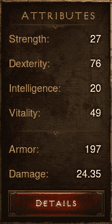

# 为什么我不会雇用你——提高简历质量的 5 个诚实建议

> 原文：<https://dev.to/petrsvihlik/why-i-won-t-hire-you-5-honest-tips-to-a-better-cv-540g>

最近，我非常高兴地浏览了数百份简历。我把 95%都扔进垃圾桶了。你想知道如何进入幸运的 5%吗？请继续阅读并遵循简单的提示:

# 1。保持简短

你的简历应该在一页纸以内；最多两页。如果时间更长，这不是你资历过高的表现，而是缺乏沟通技巧。

# 2。省去不相关的和明显的经验

不要告诉你未来的雇主你在学校兼职的细节，当然，除非这是你唯一的经历。如果你告诉我你在麦当劳准备了多么美味的汉堡或者你挖了多少个坟墓，这真的没有帮助。如果你真的很想在某个地方分享这些东西，那就在 LinkedIn 上分享吧。

如果你申请的是 IT 行业的工作，并且在简历中加入了 Word 或 Excel，那么恭喜你，你已经把自己排除在外了……除非你是一个 Excel 专家，能够制作多页的税务计算表格。

你想加上“10 年 XML 经验”吗？打消这个念头吧！

# 3。不要试图愚弄接受者

不要试图说出你遇到过的每一项技术…列出你擅长的东西。我见过精心制作的表格和图表，显示候选人在每种编程语言中有多少年和几个月的经验。

坦白地说，这些数字并没有告诉我太多。我需要看到你思考和编码。

诚实地写下你做过什么样的项目，你的贡献是什么，并且请简明扼要。

## 图形越少越好

使用饼状图、进度条或其他复杂的视觉效果来表明你的技能水平是绝对不允许的，除非你申请的是平面设计师或商务智能分析师的工作。记住，这是一份简历，而不是信息图。

# 4。让它私人化

不要传播你的简历。通过发布简历，你基本上是在说“我不在乎在哪里工作。我不想在任何事情上出类拔萃，我只想用你的钱做我要做的任何事情。”

这表明你缺乏动力，也是对阅读你简历的人的不尊重。你在浪费每个人的时间。

做适当的研究，精心制作一份简历，以适合少数精心挑选的潜在雇主。

# 5。有意义的时候附上一封求职信

您是否正在转向不同的技术体系？你是否完全改变了角色或专业领域？附上一封求职信，解释你的动机。

* * *

就这么简单。你包含的信息越少，你联系的公司越少，你被录用的几率就越高！这不是很好吗？:D