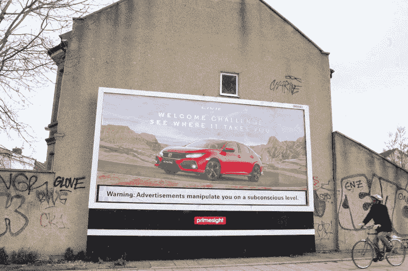
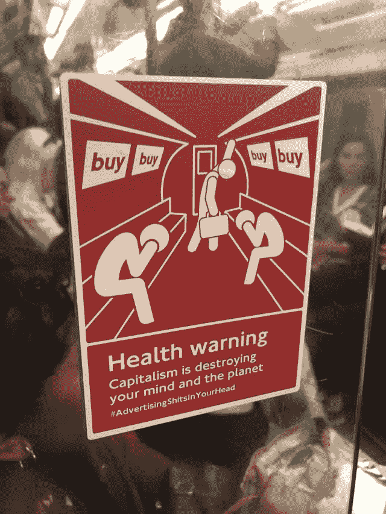

# 数据为什么有价值？GAFA 数据隐私伦理

> 原文：<https://dev.to/psedge/why-is-data-valuable-ethics-of-data-privacy-for-gafa-56f5>

在咖啡馆里，我的团队正在讨论我们每个人采取什么措施来保护我们的在线数据。我们中的一些人使用流行的扩展，如 PrivacyBadger 或 uBlock Origin 来匿名化或删除追踪器，一些人谈论在公共 WiFi 上使用 VPN，其他人谈论使用 NoScript 的糟糕体验，等等，似乎对这些东西*实际上*提供的目的有一个普遍的困惑。很公平！即使对于一群从事网络安全工作的人来说，这个领域也是复杂而广泛的，并不是每个人都是超级技术专家或者对 web 特别感兴趣。

我将回过头来考虑像任何其他恶意软件一样的网络威胁，因为它们符合“违背用户意愿使用的设备或软件”的定义，并将我的团队讨论的这些工具分为 3 类:

1.  **反恶意软件** : *例如 [NoScript](https://noscript.net/) ，[TOR](https://www.torproject.org/)*——任何防止代码在你的环境中被无意执行的工具。虽然这是比较模糊的，但这类工具可能会阻止像 cryptominers 这样的攻击，这些攻击只在网站上的 web 浏览器环境中运行，或者可能有助于部署旨在触发下一阶段攻击的漏洞利用工具包。
2.  **反间谍软件** : *例如[VPN、](https://nordvpn.com/) [代理](https://www.hidemyass.com/en-gb/index)、 [DNS-over-HTTPS](https://developers.cloudflare.com/1.1.1.1/dns-over-https/)* -任何防止第三方(非法或非法)观察您的流量或其他敏感信息的工具。这些工具中的许多可能试图防止中间人攻击，这种攻击通常是由物理访问您的网络的实体执行的，并且可能在反审查的保护伞下出售。我不把追踪者归为这一类，因为我认为他们应该有自己的定义；
3.  **反广告软件**:*eg .[privacy badger](https://www.eff.org/privacybadger)， [DNT](https://allaboutdnt.com/) ， [uBlock Origin](https://github.com/gorhill/uBlock) ， [Firefox Containers](https://www.mozilla.org/en-GB/firefox/facebookcontainer/) ，[duck duck go](https://duckduckgo.com)*——任何阻止广告显示的工具，或者出于商业利益的原因部署或检索有助于跨站点唯一跟踪的设备的工具。

一般来说，知道何时需要使用这些工具是很重要的；你可能不需要在安全的网络上使用 VPN，除非你在做一些见不得人的事情，但是在机场它应该是必要的[1](https://www.forbes.com/sites/johnnyjet/2018/04/18/how-to-stay-safe-when-you-use-airport-wifi/)；您可能无法在手机上使用 NoScript，但也可以尝试访问受信任的网站。目前，我将重点关注第三个类别以及他们寻求改善的方面:隐私。这是目前的一个热门话题，各种财团和国际机构都在起草立法，我真的觉得在过去的 5 年里，这已经成为公众讨论的话题，这是一个很好的改变。在 2010 年告诉别人跟踪饼干的事，他们会当着你的面笑着说“谁在乎啊”！

所以谁在乎呢？我听到最多甚至在某种程度上部分同意的论点是，像谷歌、亚马逊和脸书这样的软件巨头提供的服务远非免费运营和维护——我们如此热爱的那些东西的提供取决于其背后的商业模式，对吗？"如果你不是顾客，你就是产品."这里的选择似乎等于要么:这些公司可以选择开发和提供服务，作为损失来推动其他产品的销售；那些公司可以对所有服务收费；或者那些公司不能提供产品。我们以谷歌地图为例。核心产品不产生收入；人们不为地图或方向付费，但收入来自广告业务和推荐。如果一家公司想在某个地区的搜索词“酒吧”中出现得更靠前，他们就要付费。如果一家公司想让他们的品牌或标志出现在地图上，他们需要付费等。每个人都很高兴，也许用户已经被引导到 Shannigan 的爱尔兰酒吧，而不是当地的 Harry，但欢迎来到资本主义宝贝。*至关重要的*，这些通常是用户已经感兴趣并出于他们自己的意愿搜索的业务——尽管他们很渴，谷歌只是向他们提供了一个方向，而不是另一个方向。本质上，用户直接同意**在他们询问结果时接受谷歌的建议。**

亚马逊完善了电子商务体验，以最低的价格向客户提供来自竞争对手的数千种选择，其速度在业内其他任何地方都是无与伦比的，因此他们主导了这一领域。您可以浏览您喜欢的产品，阅读评论，了解其他用户对这些产品的欢迎程度，或许还可以购买一些东西。一路上，许多产品都做了广告。这里，用户已经给出了一个**暗示同意**；他们没有要求展示他们可能感兴趣的产品，但最终你在这里购买产品，亚马逊正在根据其他用户的选择推荐更多相同或密切相关的商品。购买产品的选择权是你的，关系依然清晰。

公司有权使用用户信息来更好地告知他们如何经营他们通过其获得信息的业务。个人认为亚马逊是这方面最好的例子；如果一个酒保注意到我每周四下午 5 点进来点一杯血腥玛丽，并在他有空闲时间的情况下提前几分钟开始准备，以便他可以应付其他顾客，我不会生气。他利用客户信息来改进流程，并成为一家更好的企业。亚马逊利用海量数据 [4](https://www.investopedia.com/articles/insights/090716/7-ways-amazon-uses-big-data-stalk-you-amzn.asp) 更好地销售产品和服务。还有一个问题是，你对一家持有你个人身份信息的公司有多放心，但只要它的使用环境没有改变，我就不认为这是一个挑战。当你通过你购买的产品向亚马逊提供信息，它使用这些数据为你提供它认为你未来想买的产品的交易时，背景是一样的。然而，如果亚马逊看到你买瑜伽垫，并建议当地的瑜伽馆参加，背景就从“我买什么”转移到了“我去哪里”，跨越了道德界限。

脸书怎么样？与谷歌地图(Google Maps)类似，一个用户可以与朋友和家人分享生活的社交网络是免费提供的，代价是不得不忍受一些广告。众所周知，脸书通过迎合非常具体的人口统计数据，为广告商提供了一个令人难以置信的全面的目标营销前景，从而将这种“生活”信息货币化。我相信，脸书之所以吸引了如此多的“令人毛骨悚然”的名声 [6](https://www.cnet.com/news/facebooks-ad-targeting-has-created-a-creepy-image-problem-it-cant-shake/) 通过辩论，它在一个领域(照片、状态、事件)获取信息，并在另一个领域(一般广告)使用它。如果脸书只宣传与我公开发布的内容直接相关的内容，我个人会觉得受到的侵犯会小得多；照片和签到的位置、状态的内容、与我以前去过的事件相似的事件等。这样，他们就可以维护我自愿提供数据并得到我默许的环境。然而，这并不是他们如何操作的，相反，他们会根据你的共性对你进行推断并针对你。这种复杂程度不仅让消费者更难理解，消除了同意的“理解”前提，而且通常是错误的，会导致意想不到的后果。我看到的广告与我正在使用的服务的上下文无关，因此没有任何明示或暗示的同意。我无法预测我可能会看到什么样的广告，虽然我可以抱怨某些广告，但如果我的数据没有以我不清楚的方式使用，我就无法使用这项服务。透明度是脸书一直努力解决的一个问题，他们滥用了用户。

为什么这对最终消费者很重要？只要你不看广告，这些公司就不会赢，对吗？不对。向我们做广告的方式无处不在，即使你把每一个广告都隐藏为“与我无关”，你也不可避免地会受到你所看到的东西的影响。当你看到你的脸书反馈时，你正处于接受信息、做出影响你潜意识的快速社会判断的状态——不幸的是，同时显示给你的广告以同样的方式被处理。很有意思的是，隐形广告[8](https://www.theatlantic.com/technology/archive/2016/09/the-uncanny-valley-of-instagram-ads/501077/)，与正常内容匹配相同视觉风格的广告更有效[9](https://journals.sagepub.com/doi/abs/10.1177/0002764216660140)[10](https://www.tandfonline.com/doi/abs/10.1080/00913367.2015.1115380)——正是这个原因。

当显示的广告类型控制或监管不力时，危险就来了。为了购买一件你原本不会感兴趣的产品而被颠覆是一回事，这消除了你如何花钱的自由意志因素，但作为一个社会，我们认为宗教和政治自由高于此。在宣传政党或宗教团体的广告活动中滥用数据可能是数据伦理领域最公然和最暴力的侵犯个人自由的行为，对个人的自由意志有巨大影响。

恶意广告是对你精神的攻击，应该被视为非自愿的数据滥用。定义仍然具有挑战性，但我们讨论这些问题的框架随着每一个丑闻、特别委员会和立法变得更加严格。最终，你投资多少时间来保护自己免受旨在改变你的品味或观点的广告的影响是你的选择，但本文开头列出的工具是一个很好的起点。