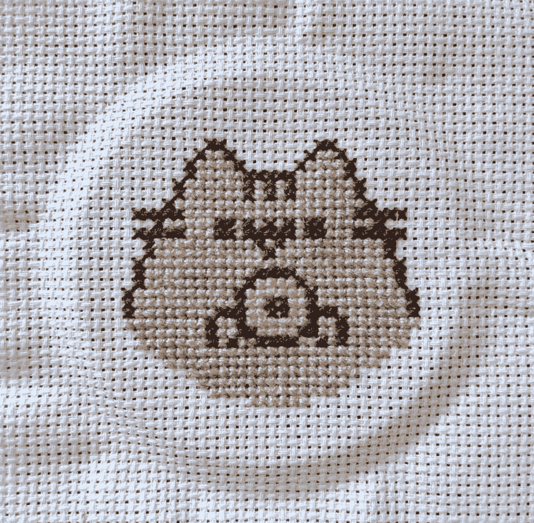
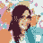
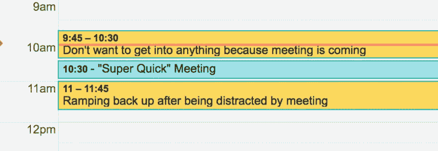

# 为什么这么严肃？#1

> 原文：<https://dev.to/rmnvsl/why-so-serious-1-276j>

暂停一下。把工作放在一边一分钟，看看推特上有多少乐趣。许多博学的人在那里分享了大量的好建议。但是今天，我收集了一些包含有趣的，有时甚至是非常现实的内容的推文。

他们来自不同的地区:[`#development`](https://dev.to/t/development)[`#design`](https://dev.to/t/design)[`#UI`](https://dev.to/t/ui)/[`#UX`](https://dev.to/t/ux)、 [`#philosophy`](https://dev.to/t/philosophy) 、办公室与普通 [`#life`](https://dev.to/t/life) 。随机排序，没有任何偏好，并分为四个职位。

我希望我的选择会让你的星期五更加快乐！

> 大卫克劳福德@达卡塔克创意:混沌猴为历法。随机删除会议，看组织是否继续运转2018 年 10 月 19 日上午 05:5629109

> Roman veselú[@ rmnvsl](https://dev.to/rmnvsl)Me:哦，我改了 var 名突然超过行长限制:(
> QA:减小字号！
> [# QA](https://twitter.com/hashtag/QA)[# simple](https://twitter.com/hashtag/simple)[# code quality](https://twitter.com/hashtag/codequality)2016 年 10 月 18 日上午 08:0002

> 我是开发者@ iamdeveloper——嘿你的黑客马拉松进行得如何？
> -不算太坏，我们得到了巴别塔设置
> -是的…
> -是的。2016 年 10 月 17 日上午 10:5311302115

> 约书亚·麦肯蒂@ jmckenty如果积压货来自法兰西的 Agilé地区，那就只有 scrum 否则它只是闪闪发光的瀑布。2019 年 7 月 03 日下午 18:404111104

> 克里斯蒂娜朱[@ cs Zhu](https://dev.to/cszhu)那些不会让你变丑的事情
> 
> -粉刺
> -超重/体重不足
> -伤疤
> -妊娠纹
> -截肢
> -身体异常
> 
> 那些让你变丑的事情
> 
> -没有提交信息的提交代码

> 丽贝卡·弗兰克斯·🇿🇦[@ riggaroo](https://dev.to/riggaroo)用户界面 vs 底层代码[#编程](https://twitter.com/hashtag/programming)06:23am-30 201916585

👆 *(click the tweet to see all images)* 👆

> 菲尔🍕@ Phil _ wade任何曾经安排与开发人员开会的人，请将此图像刻录到您的大脑中，感谢2017 年 8 月 11 日下午 14:08787612973

> 马里特·范·迪克@马里特·万迪克 77蒂尔:“反向巴士系数”——为了团队做得更好，应该有多少人被巴士撞了。2019 年 04 月 04 日下午 15:517872557

> 丹尼尔拉特克利夫@丹特沃百程序员:总是使用描述性变量名
> 数学家:总是单字母变量名，理想地来自晦涩/死字母表2017 年 9 月 13:26 日463810066

> 潘石屹@ themikepan很快，只要把预先渲染好的位图发给我们就更快更有效率了。06:37AM-06 Feb 2019981345

👆 *(click the tweet to see the original post)* 👆

这是“没那么严重”系列的第一篇帖子:

*   为什么这么严肃？#1 👈
*   [为什么这么严重？精彩推文精选#2](https://dev.to/rmnvsl/why-so-serious-collection-of-remarkable-tweets-2-10hj)
*   [为什么这么严重？精彩推文集#3](https://dev.to/rmnvsl/why-so-serious-collection-of-remarkable-tweets-3-mgo)
*   [为什么这么严重？精彩推文集#4](https://dev.to/rmnvsl/why-so-serious-collection-of-remarkable-tweets-4-28g0)

下周五见。如果你愿意，把你最喜欢的推文放在评论区。🎉