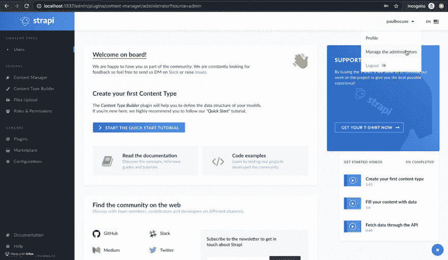
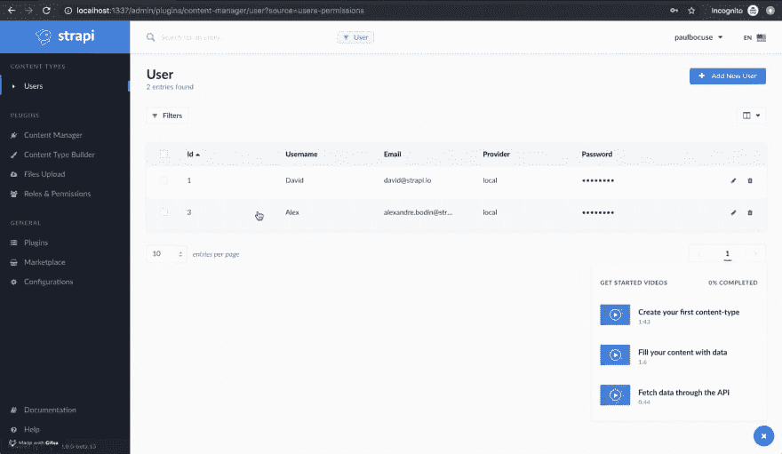

# 为什么我们将管理员用户和最终用户的管理分开

> 原文：<https://dev.to/strapi/why-we-split-the-management-of-admin-users-and-end-users-566j>

最近，我们在对待**管理用户**和**终端用户**的方式上合并了一个关键性的变化。这篇文章将描述我们做了什么，为什么我们这样做，以及当你继续用 Strapi 开发你的项目时它是如何影响你的。

随着 Strapi 测试版[的发布，**管理员用户**(也叫**管理员**)和**用户**(也叫**用户**或**终端用户**)被分开。**管理员用户**主要与 Strapi 仪表板交互。**最终用户**主要消费 API 或访问前端。](https://blog.strapi.io/strapi-beta-is-out/)

我们进行这种分离是为了将来保持关注点的分离。**管理员用户**和**终端用户**都实现了一组不同的功能:

例如，**管理员用户**关注**内容贡献**(创建和编辑内容、审核、翻译、发布、A/B 测试、发布前预览内容等)。)、 **Strapi 管理** (api 令牌、webhooks、API 测试和状态检查、日志/监控、统计等。)还有最后一个例子，**第三方提供者** ( [OAuth](https://oauth.net/) ， [LDAP](https://ldap.com/) ，SAML)。

这些**管理员用户**的功能与**最终用户**可用的功能截然不同。

终端用户的特性围绕着一个认证和授权层，您可以在这个层之上构建您的业务逻辑。类似于我们正在为**管理员用户**开发的功能，我们有我们想要用`users-permissions`插件实现的目标。例如，通过 [OAuth2](https://oauth.net/2/) 和 [OpenID Connect](https://openid.net/connect/) 提供全功能认证和授权服务，提供高级角色和权限系统，自定义策略，管理第三方连接器，如脸书和谷歌。

值得注意的是，通过分离**管理员用户**和**最终用户**，我们可以创建一个逻辑集成，其中**管理员用户**变成**最终用户**。这也适用于**最终用户**成为**管理员用户**的情况。粒度控制现在将成为可能。

**管理员用户**和**终端用户**的分离发生在数据库级和 UI 级。**管理员用户**现在占据了位于**用户名**下的**管理管理员**下的管理面板。

**最终用户**仍然作为一种独特的内容类型出现在左侧菜单中，位于**用户**之下。

除了 UI 级别的变化，Strapi 开发人员将面临的最根本的变化是需要创建一个额外的**最终用户**。例如，如果正在开发的博客或类似项目需要显示**管理员用户**“作者”、“个人资料名称”等。

简单地说，**管理员用户**可以访问 Strapi 仪表板。一个**管理员用户**可以创建内容类型、添加内容、管理 API 访问、安装插件等。

一个**终端用户**只能使用 API。这可能包括通过表单中的 GET/POST 方法添加内容——而不是 Strapi 仪表板。例如，对于电子商务帐户，留下评论/评论，成为一篇文章的作者或以其他方式拥有个人资料。

* * *

但是其他博客平台呢？那些没有将管理员用户和最终用户分开的。这是一个很好的观点，但这些平台主要是围绕显示网站内容和博客开发的。在这种情况下，将**管理员用户**和**最终用户**放在一个数据库表中可能更有意义。Strapi 不仅仅是解决博客需求的另一种选择，我们也把它作为一种能力，但是 Strapi 被设计来做更多的内容和 api。

我们对处理**管理员用户**和**最终用户**的方式进行了这种改变，作为对 Strapi 项目的长期[路线图](https://portal.productboard.com/strapi/1-public-roadmap/tabs/2-under-consideration)的投资。快速浏览一下路线图，可以看到一个更短期的步骤，即**管理员角色&权限**特性，以及后来在实现中变得更加清晰的其他特性。

我们认为，提供更多的粒度和控制是值得的，但要为我们的用户提供更大的灵活性和功能。将**管理员用户**与**终端用户**分开的方法允许其他特性。除了即将到来的特性，通过分离它们，性能不会因为例如数据库结构而受到影响。

总之，在用户界面和数据库中分离管理员用户和终端用户，为提供 Strapi 用户所追求的特性和功能打开了大门。它们的分离也避免了以后的性能和数据库问题。

Strapi 是一个 360 无头 CMS。我们像无头 CMS 一样是前端不可知的，但是我们也是数据库不可知的，允许几乎无限的设置、配置和使用。通过以这种方式成为不可知论者，我们能够完成我们的使命，即重新发明内容编写和分发给人们的方式。将**管理员用户**与**终端用户**分开，只是实现无头 CMS 承诺的一步。

*你的[大卫](https://twitter.com/kai_dawei)与[亚历山大](https://github.com/alexandrebodin)合作写的文章。*