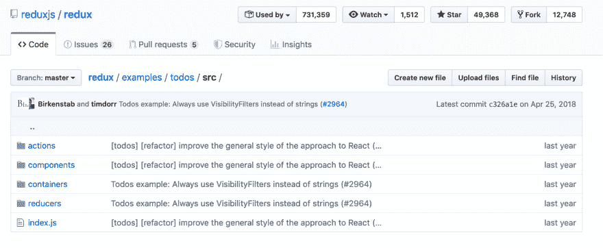

# 为什么你可能不需要 Redux

> 原文：<https://dev.to/polluterofminds/why-you-probably-don-t-need-redux-399o>

[](https://res.cloudinary.com/practicaldev/image/fetch/s--cFzRZ2X8--/c_limit%2Cf_auto%2Cfl_progressive%2Cq_auto%2Cw_880/https://thepracticaldev.s3.amazonaws.com/i/zcyhhzelrc5sumuqf4yt.jpg)

当构建一个单页面应用程序时，管理状态是重要的，但是以一种有效且[干巴巴的](https://en.wikipedia.org/wiki/Don%27t_repeat_yourself)方式做到这一点是困难的。我公司的应用程序 [Graphite](https://graphitedocs.com) 是 React 内置的，所以在早期，我的第一选择是使用 [Redux](https://redux.js.org/) 。Redux 不是 React 专用的，但在 React 应用程序中大量使用。事实上，它通常被认为是事实上的全局状态管理工具。但是当我第一次开始制造石墨时，我不知道我在做什么。所以，Redux 完全是一个谜。这是一个理解的噩梦，它导致了我无法诊断的错误。

幸运的是，我变得更擅长编程了。然而，即使有了知识和经验，当决定采用比我现有的更好的解决方案(通过高阶组件传递道具)时，我仍然选择不实现 Redux。首先，让我告诉你关于[react TN](https://github.com/CharlesStover/reactn)的情况，这是我最终选择的解决方案，然后我会向你解释为什么我认为它在许多应用程序中比 Redux 更好。

简单地说，React 就像 React 本地处理全局状态一样进行反应。当然，有了钩子，React 现在可以本地处理状态，但是 React 甚至支持钩子并可以扩展它们。ReactN 让开发人员决定何时以及如何更新应用程序的全局状态，而不是复杂的 reducers 和 action creators 最终导致更新存储中的状态。在我深入到 ReactN 和 Redux 的更复杂的比较之前，这里有一个简单的例子。在 react 应用程序的`index.js`文件中，您只需像这样初始化您的状态:

```
import React, { setGlobal } from 'reactn';

setGlobal({
  value: "Hi"
});

ReactDOM.render(<App />, document.getElementById('root')); 
```

Enter fullscreen mode Exit fullscreen mode

然后，您可以从任何组件或助手文件中更新状态。下面是一个助手文件的样子(相对于 React 组件):

```
import { getGlobal, setGlobal } = 'reactn';

export function sayBye() {
  const currentVal = getGlobal().value;
  if(currentVal === "Hi") {
    setGlobal({ value: "Bye" });
  }
} 
```

Enter fullscreen mode Exit fullscreen mode

注意，当获取组件外部的当前状态时，您将使用 getGlobal()。当在一个类组件中更新状态时，你已经可以访问当前值，并且可以像这样更新它:

```
import React, { setGlobal } = 'reactn';

export default class Hello extends React.Component {
  const { value } = this.global;
  render() {
    return (
        <div>
            <div>
              <h1>{value}</h1>
            </div>
            {
              value === "Hi" ? 
              <button onClick={() => setGlobal({ value: "Bye" })}>
                Say Bye
              </button> : 
              <button onClick={() => setGlobal({ value: "Hi" })}>
                Say Hi
              </button>
            }
        </div>
    );
  }
} 
```

Enter fullscreen mode Exit fullscreen mode

稍后您将看到一个如何在函数组件中访问状态的示例。

看到多简单了吗？这感觉就像在一个组件中更新状态，但是在你的应用程序中的任何地方都可以访问。可以在 helper 函数中独立访问。您可以在其他组件中访问您的状态。它以全局状态管理的方式工作。当然，你们这些 Redux 爱好者可能会看到这样一句话:“Redux 做的不止这些。”你是对的。Redux 绝对做到这一点。它还能做更多的事情。对于大多数应用来说，这是完全不必要。事实上，这可能会导致代码更难管理和调试。

上面的例子非常简单，但是您可以通过浏览 Graphite 库[这里的](https://github.com/graphite-docs/graphite/client)来查看 ReactN 的运行情况。或者，当然，你可以[阅读文件](https://github.com/CharlesStover/reactn)。

但是我不认为我已经用我简单的例子说服了你。所以，现在，我们将在 React 中构建 Redux 的 todo 应用教程，并使用 ReactN 构建相同的 todo 应用。为了简单起见，我不会遍历每个文件，但我会链接到这两个应用程序的完整存储库，并且我会将这两个应用程序嵌入到这篇博客帖子中，以便您可以进行比较。

让我们从 Redux 版本的文件结构开始，直接取自 Redux:

[](https://res.cloudinary.com/practicaldev/image/fetch/s--tCMgxw8i--/c_limit%2Cf_auto%2Cfl_progressive%2Cq_auto%2Cw_880/https://thepracticaldev.s3.amazonaws.com/i/lvm095nsvn068b6e22li.png)

只看那个 src 文件夹，我已经可以看到两个文件夹不会在这个应用的 ReactN 版本中显示:`actions`和`reducers`。

为了公平起见，我将使用 Redux 人员使用的相同组件/容器文件夹结构来构建 ReactN todo 应用程序。
让我们从比较每个版本的应用程序的`index.js`文件开始。该文件存放在`src`文件夹中。首先，这里是 ReactN 应用:

```
import React, { setGlobal } from 'reactn';
import ReactDOM from 'react-dom';
import App from './components/App';

setGlobal({ 
    todos: [],
    filteredTodos: [], 
    filterBy: "all"
});

ReactDOM.render(<App />, document.getElementById('root')); 
```

Enter fullscreen mode Exit fullscreen mode

正如您在前面的例子中看到的，初始状态在 index.js 文件中被实例化，并流经每个组件。现在，这里是`index.js`文件的 Redux 版本:

```
import React from 'react'
import { render } from 'react-dom'
import { createStore } from 'redux'
import { Provider } from 'react-redux'
import App from './components/App'
import rootReducer from './reducers'

const store = createStore(rootReducer)

render(
  <Provider store={store}>
    <App />
  </Provider>,
  document.getElementById('root')
) 
```

Enter fullscreen mode Exit fullscreen mode

我们已经可以看到一些令人困惑的差异，我们甚至还没有进入实际的应用程序。Redux 版本将`App.js`组件包装在`<Provider>`标签中。还有一个对商店的引用，如果你看一下导入语句，有一个`rootReducer`文件被导入并传递给商店变量。呃，怎么了？

当然，一旦你了解 Redux，这一切都是有意义的，但是问问你自己:如果你仅仅根据复杂性来做决定，你是愿意从 ReactN `index.js`文件开始还是 Redux 文件开始？

由于我不打算逐一查看每个文件并进行比较，所以我们只看另外两个文件。`AddTodo.js`组件和实际管理 todo 动作的文件。首先，下面是我们如何在 Redux 应用中添加 Todos:

```
import React from 'react'
import { connect } from 'react-redux'
import { addTodo } from '../actions'

const AddTodo = ({ dispatch }) => {
  let input

  return (
    <div>
      <form onSubmit={e => {
        e.preventDefault()
        if (!input.value.trim()) {
          return
        }
        dispatch(addTodo(input.value))
        input.value = ''
      }}>
        <input ref={node => input = node} />
        <button type="submit">
          Add Todo
        </button>
      </form>
    </div>
  )
}

export default connect()(AddTodo) 
```

Enter fullscreen mode Exit fullscreen mode

其中一些非常简单。我们有表格。我们正在阻止表单上的默认提交操作。然而...什么？我们有一个调用另一个函数的调度函数？我们还必须在输入字段中添加一个 ref 元素。

好了，现在，这是它在 ReactN 应用程序中的样子:

```
import React from 'reactn'
import { addTodo } from '../helpers/todos';

const AddTodo = () => {

  return (
    <div>
      <form onSubmit={(e) => addTodo(e)}>
        <input id='todo-input' />
        <button type="submit">
          Add Todo
        </button>
      </form>
    </div>
  )
}

export default AddTodo; 
```

Enter fullscreen mode Exit fullscreen mode

这有多简单？我们有一个表单，在提交时调用 addTodo 函数。如此简单。

现在，当你添加待办事项，切换待办事项完整性，过滤待办事项时，实际上发生了什么？嗯，这取决于你用的是 Redux 还是 ReactN。在 Redux 中，这些操作发生在四个文件中，总共 65 行代码。使用 ReactN 应用程序，所有这些操作都发生在一个文件中，总共 45 行代码。当然，65 行和 45 行的差别不是很大，但这是一个很小的应用程序。随着你的应用程序变得越来越复杂，这种差距也越来越大。

让我们快速看一下 Redux 应用程序中处理添加 todo 和过滤的两个主要文件。首先，这里是`actions/index.js`文件:

```
let nextTodoId = 0
export const addTodo = text => ({
  type: 'ADD_TODO',
  id: nextTodoId++,
  text
})

export const setVisibilityFilter = filter => ({
  type: 'SET_VISIBILITY_FILTER',
  filter
})

export const toggleTodo = id => ({
  type: 'TOGGLE_TODO',
  id
})

export const VisibilityFilters = {
  SHOW_ALL: 'SHOW_ALL',
  SHOW_COMPLETED: 'SHOW_COMPLETED',
  SHOW_ACTIVE: 'SHOW_ACTIVE'
} 
```

Enter fullscreen mode Exit fullscreen mode

我们在这个文件上做了很多工作。但是我们将所有的工作发送到另一个文件进行处理(reducers 文件夹处理这个)。下面是`reducers/todos.js`文件:

```
 const todos = (state = [], action) => {
  switch (action.type) {
    case 'ADD_TODO':
      return [
        ...state,
        {
          id: action.id,
          text: action.text,
          completed: false
        }
      ]
    case 'TOGGLE_TODO':
      return state.map(todo =>
        (todo.id === action.id)
          ? {...todo, completed: !todo.completed}
          : todo
      )
    default:
      return state
  }
}

export default todos 
```

Enter fullscreen mode Exit fullscreen mode

和`reducers/visibilityFilters.js`文件:

```
import { VisibilityFilters } from '../actions'

const visibilityFilter = (state = VisibilityFilters.SHOW_ALL, action) => {
  switch (action.type) {
    case 'SET_VISIBILITY_FILTER':
      return action.filter
    default:
      return state
  }
}

export default visibilityFilter 
```

Enter fullscreen mode Exit fullscreen mode

这就是 Redux 所有复杂性的来源。这里发生了太多的事情，除非你有很多使用 Redux 的经验，否则你肯定需要查阅 Redux 的文档。这种复杂性在某些情况下很有用，但对大多数应用程序来说并不适用。下面是 ReactN 应用程序中处理所有待办事项、过滤和状态更新的文件:

```
import { setGlobal, getGlobal } from 'reactn';

//Create new todos
export class Todo {
    constructor(id, todo, status) {
        this.id = id;
        this.todo = todo;
        this.status = status;
    }
}

export function todoFilter(filterBy) {
    setGlobal({ filterBy });
    let todos = getGlobal().todos;
    if(filterBy === "all") {
        setGlobal({ filteredTodos: todos})
    } else if(filterBy === 'active') {
        const activeTodos = todos.filter(todo => todo.status === 'active');
        setGlobal({ filteredTodos: activeTodos });
    } else if(filterBy === 'complete') {
        const completedTodos = todos.filter(todo => todo.status === 'complete');
        setGlobal({ filteredTodos: completedTodos });
    }
}

export function addTodo(e) {
    e.preventDefault();
    let todos = getGlobal().todos;
    const filterBy = getGlobal().filterBy;
    let todoField = document.getElementById('todo-input');
    let newTodo = new Todo(Date.now(), todoField.value, 'active');
    todos.push(newTodo);
    let filteredTodos = filterBy !== "all" ? todos.filter(todo => todo.status === filterBy) : todos;
    document.getElementById('todo-input').value = "";
    setGlobal({ todos, filteredTodos });
}

export function toggleCompleteness(id) {
    let todos = getGlobal().todos;
    let filterBy = getGlobal().filterBy;
    let thisTodo = todos.filter(todo => todo.id === id)[0];
    thisTodo.status === "active" ? thisTodo.status = 'complete' : thisTodo.status = 'active';
    let filteredTodos = filterBy !== "all" ? todos.filter(todo => todo.status === filterBy) : todos;
    setGlobal({ todos, filteredTodos });
} 
```

Enter fullscreen mode Exit fullscreen mode

可能只有我一个人，但这个文件比所有 Redux 应用程序文件的总和更具可读性。我们甚至可以把代码再弄干一点，去掉一些行，但是我觉得这对于这个演示来说没有必要。

那么，这一切意味着什么呢？我们应该完全停止使用 Redux 吗？肯定不是。Redux 有它的位置。问题是许多新的和经验丰富的 JavaScript 开发人员会立即使用 Redux，而不考虑替代方案。让我们来看一下我为全球状态管理推荐的考虑顺序:

*   我的应用程序是否足够小，可以简单地通过高阶组件传递状态？(此处无依赖)。
*   我是否和一个足够小的团队一起工作，以确保涉及状态的代码更新不会变得复杂？(使用 ReactN)。
*   我是否在一个大型团队中开发一个大型应用程序，在这个团队中，对涉及状态的代码的更新是不可管理的？(使用 Redux 或 MobX 或其他大型状态管理框架)

偶然发现 Charles Stover 的 ReactN 包是我作为开发人员迄今为止经历的最自由的事情之一。我非常不想管理我的应用程序中 Redux 的复杂性，坦率地说，我不需要这样做。但是我的应用程序已经变得太大了，以至于不能轻松地支持通过组件传递状态属性。如果你也有类似的情况，探索 ReactN。简单又强大。它对全局状态管理做了合乎逻辑的事情。

如果你想探索 ReactN todo 应用程序的源代码，你可以在这里这样做。

下面是运行中的代码:

[https://codesandbox.io/embed/reactn-todos-3edts](https://codesandbox.io/embed/reactn-todos-3edts)