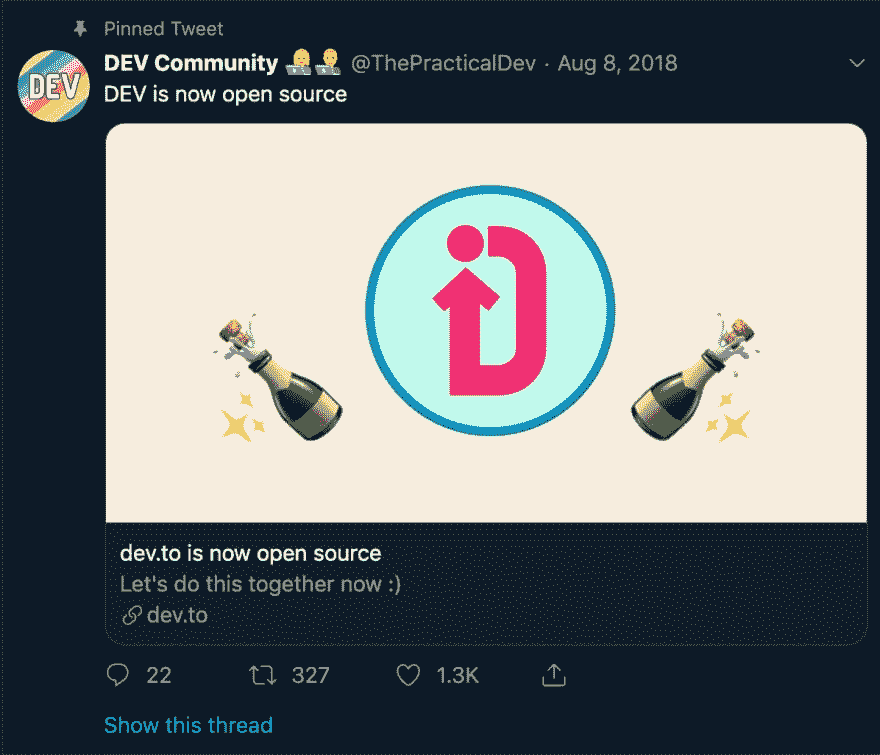

# 为什么接下来要学。射流研究…

> 原文：<https://dev.to/wchr/why-you-should-learn-next-js-5952>

下一个。JS 是一个 javascript 框架，允许开发人员创建服务器渲染的 react web 应用程序，还附带其他好处，使前端开发变得快速。

## 我如何遭遇下一个。JS？

我目前正在用 React 和 Next 重新制作我自己的个人博客。JS 在前端，Express 驱动后端。

那么，为什么我要从头开始重做我的博客呢？在我发布博客的 MVP 之前，我必须做好 SEO，并且让网络爬虫更容易抓取，这反过来有助于搜索引擎评分和索引。我有两个选择:

*   编写我自己的 express 服务器来服务我的 React 应用程序
*   使用像`prerender`和`react-snap`这样的库

所以我尝试了所有的方法，旅程并不是很好:

*   在创建自己的 express 服务器时，我遇到了`Babel`和`webpack`版本不一致的问题。这花了我很长时间，我一遍又一遍地删除了`yarn.lock`文件和 node_modules，我也尝试了`npm`的建议，但什么也没有。

    

*   当使用`prerender`和`react-snap`时，它在我的笔记本电脑上运行得很好，但在我的`Netlify`版本中一直失败。

    

在所有的努力工作和在 SSR 上浪费了近一个月的时间后，我有点放弃了，只是开通了我的博客。在某一天，我在听 [**全栈电台**第 99 集](https://castbox.fm/episode/99%3A-Tim-Neutkens-Building-React-Apps-with-Next.js-id491638-id95523685?country=us)，他在采访[蒂姆·诺特肯斯](https://twitter.com/timneutkens)关于`next`，我记下了关于`next`、
、`...server rendered client applications...`的四个词。我迅速打开一个新标签页，访问了 [`next`](https://nextjs.org) 网站，那是我的*灵机一动*。

## 使用 Next 的优点

*   开箱即用的服务器端渲染以这样一种简单的方式处理 SSR。安装，运行你的应用，打开你的浏览器，你就有了 SSR。SSR 的一些优势有*丰富的链接预览*。

*   静态导出

    Next 还处理静态文件的服务。不需要额外的库。

*   JS 中的 CSS

    编写`CSS in JS`内置`next`中，不需要安装其他
    包如`emotion`、`JSS`等。

*   完全可定制

它自动处理大多数部分，如 SSR 功能，但`next`仍然允许对`Babel`、`webpack`、`routing`和`next-plugins`进行定制。

*   渐进式网络应用

使用`next`创建 PWA 太简单了...我们将调查
[`next features`](//ttps://nextjs.org/features/)

*   准备生产

    Next 速度超快，并且针对更小的构建尺寸进行了优化，使您的 web
    应用程序变得更小更快。

*   零设置

    Next 也处理你的大部分设置过程，比如*文件系统*、*路由*、*热代码重载*和*通用渲染*。

*   被大多数知名公司使用

[Stackshare](https://stackshare.io/) 成功的原因之一是
，因为开发者喜欢知道像**网飞**这样的公司使用
来衡量他们的应用程序，这样我们就可以了解它们，把它们放在我们的简历上，而
可能会在面试中得分。

*   处理静态和动态站点

Next 无缝处理静态和动态站点，无需添加额外的
配置。

*   较小的学习曲线

你还是会写 React，你不会体验到`Angular 1`和`Angular
4`的效果。下一篇文章会处理一些可以节省你很多时间的事情，比如*路由*，但是我会在下一篇文章中得到更多的细节，敬请关注

## 接下来的弊端

这个框架是怎么做到这么完美的？事实并非如此，它有自己的缺陷，比如:

*   Redux

实现 Redux 可能很困难，尤其是在安装期间。

*   处理太多了

Next 处理许多你可能认为理所当然的功能，如果你这样做了，你可能会忽略对它们的研究。

> *注意*:如果你正在考虑使用`next`，使用`react-scripts`一段时间，直到你掌握了重要的概念，尤其是`routing`

到目前为止，这些是我知道的缺点，如果你碰巧知道或面临更多，请分享，以便我把它们添加到这个帖子中。你可以通过评论或推特来实现。

## 总结

TL；DR；

在这篇文章中，我们能够:

*   我为什么开始调查`next`
*   `next`的优点
*   `next`的缺点

## 接下来

在`Next meets React`系列的下一部分，我们将开发一个简单的网络应用程序来掌握每一个`next`特性。

## 免责声明

> *注意* ( *没有嫌隙*):为什么你应该选择`next`只是我的看法，我对你自己处理 SSR 没有问题，我也不反对开发者使用`react-scripts`。

## 反馈

非常感谢您对本文提供反馈。通过 twitter [wachira_dev](https://twitter.com/wachira_dev) 或在这个平台上聊天。

# 敬请期待😁