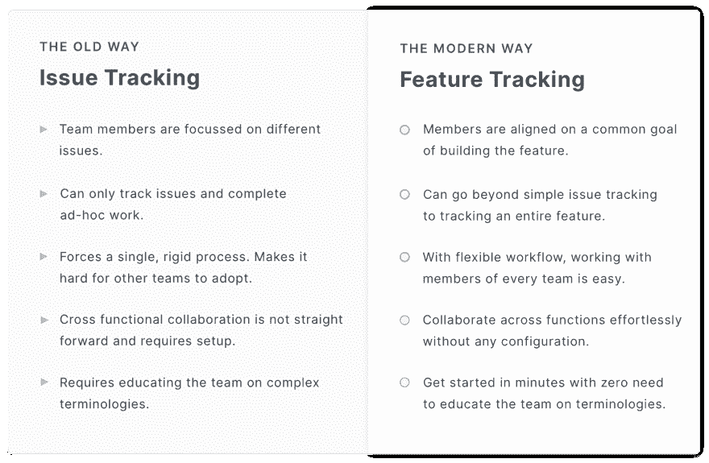
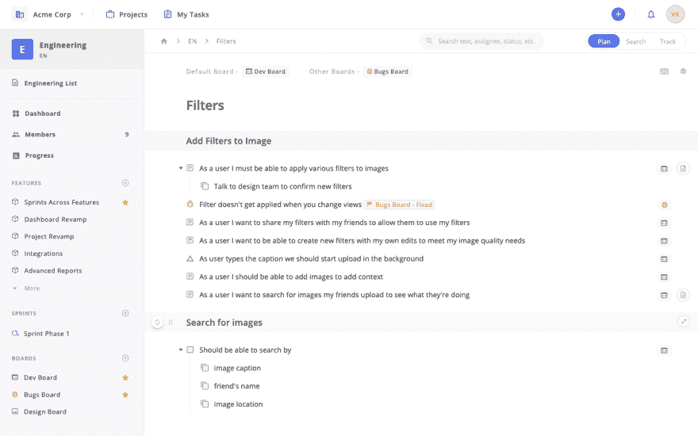
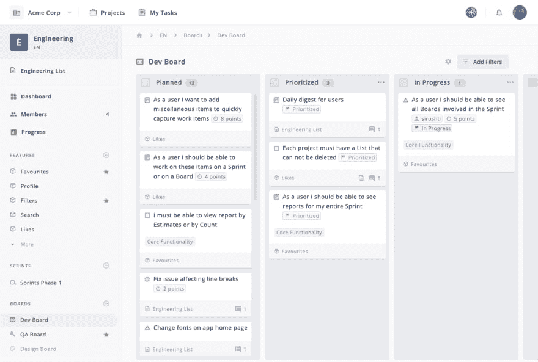

# 为什么您应该从问题跟踪切换到功能跟踪

> 原文：<https://dev.to/svikashk/why-you-should-switch-from-issue-tracking-to-feature-tracking-4f49>

# 什么是特征追踪？

特征跟踪是在每个相关学科中保持特征开发进度更新的过程。

> 特征跟踪有助于保持每个成员都有一个共同的目标，易于交接工作，并提供高质量的特征。

特性跟踪让您可以将每个团队的成员聚集在一起，这样您就可以实时地全面了解每个团队的特性进展，而不是跟踪那些让您为更新而奔波的问题。

* * *

## 特性跟踪如何帮助你的团队发布高质量的软件

我们今天构建特性的方式有一个问题——它不再符合你的最终目标。

想想看——每个产品团队都想发布高质量、无缺陷的特性。当需要构建一个特性时，来自不同功能的成员开始跟踪分配给他们的工作。

当每个成员只关心解决一个特定的问题时，这种方法很有效。

> 但是你不仅仅是在解决问题，对吗？
> 
> 您正在构建帮助客户解决问题的特性和功能。

你需要计划功能，[对它进行优先级排序](https://zepel.io/blog/prioritize-product-feature-backlog/?utm_source=devto&utm_medium=text&utm_campaign=what-is-feature-tracking)，并引入设计师、开发人员和 QA 团队来构建它。我们要求更新，以衡量该功能何时发布及其当前状态。

然而，当我们真正应该跟踪特性的时候，我们却把时间花在了跟踪问题上。

构建功能已经够难了。当每个人都在思考问题时，很难让团队成员达成一个目标。

当成员不能从整体上查看特性的进展时，他们会简单地走向彼此来移交工作，让团队中的其他人得到过时的、陈旧的更新。

修复？

团队需要超越简单的问题跟踪。

特征跟踪将不同学科的成员团结在一个共同的目标上，提供了一个发展的鸟瞰图，并有助于构建高质量的特征。

* * *

## 特征跟踪与问题跟踪:何时使用什么？

当你想跟踪问题时，问题跟踪器非常有用。但是，如果您想超越简单的问题跟踪，并构建产品和功能，问题跟踪器就不够用了。

当然，问题跟踪可以让你把一系列问题集中起来并跟踪它们。但是你不能让你的团队团结起来，关心这个特性，除非你不断更新他们。

* * *

## 如何从问题跟踪切换到特征跟踪

让你的团队开始跟踪特性而不是问题并不会强迫你彻底改变当前的过程。对你来说，这是让每个人在发布你的功能上保持一致的简单而最容易的方法。

最精彩的部分？

不管你使用哪种过程——scrum、看板，甚至简单的任务管理——你都可以从问题跟踪切换到特性跟踪。

让我们来看看如何一步一步地做这件事。

### 第一步:召集每个团队的成员

当您将参与构建要素的每个成员召集在一起时会发生什么？

对于大多数团队来说，它让每个人都了解构建特性所需的一切，显示哪个规程在哪个方面工作，并让所有成员保持一致。

### 第二步:在几秒钟内移交工作，而不是走到他们的办公桌前

既然您已经将来自各个学科的成员聚集在一起，您可能想知道工作流会是什么样子，以及您的团队如何推进工作。

大多数工具都将此简化为分配特定的任务、添加截止日期以及与队友进行对话。当你致力于解决一些最困难的问题时，简单的协作功能是不够的。

他们忘记了，每个团队的核心都是一群与众不同、有自己独特工作方式的人。因此，当涉及到让每个人都在一个特性上一起工作时，团队发现很难采用新的工作流、协作和移交工作。

Zepel 允许您为构建特性所涉及的每个规程添加一块板。这样，每个学科都能以他们想要的方式工作。

当你需要了解某个特定领域的进展时，你只需打开他们的版块，就能快速了解他们的进展。当一个团队需要将工作移交给另一个团队时，您可以通过简单地更改项目的状态，将项目从一个面板移动到另一个面板。

### 第三步:跨专业跟踪功能进展

到目前为止，参与构建您的特性的每个人都应该在使用他们的板或在 Sprint 中取得进展。但是你如何理解他们所做的所有更新呢？

您需要提取开发人员、设计人员和 QA 团队在构建特性时取得的所有进展。

随着 Zepel 的进步，您可以从跟踪单个用户故事的状态到了解您离完成整个功能还有多远。这意味着不再有过时的评论或无休止的会议。

不管您使用什么过程——您可以运行 sprints，使用看板、scrumban，甚至只是一个简单的任务管理——有了 Zepel 的进展，一切都在那里。实时的。跨学科的。

* * *

## 切换到特征追踪的 5 个好处

### 1。你要让每个人都朝着一个共同的目标前进

有了特征跟踪，你的团队不再在没有清晰的筒仓中工作。现在，您实际上可以交流构建特性所需的一切，并最终顺利地部署到生产环境中。

### 2。你可以实时看到每个团队的进展

功能构建是一项团队工作。您需要将每个团队的成员聚集在一起，构建高质量的特性。每个学科都有一个讨论板，不仅每个人都可以用自己喜欢的工作流程工作，而且你可以通过每次更新查看他们的进度。看着你的作品栩栩如生。

### 3。您可以更快地交付高质量的功能

在 Zepel，我们在不到两个月的时间里发布了三个功能，修复了无数的错误，并重新设计了我们的整个应用程序。而且它们甚至不是小的改进！

从简单的问题跟踪到特性跟踪，让我们可以将更多的特性发布到产品中，而不会出现失误。

### 4。你得到了全局的概述

如果您想要做出重要的决策，仅仅知道单个问题或用户故事的状态是远远不够的。

当您离部署还有一周的时候，您需要知道您是否能够按时交付到产品中，您的特性处于什么位置，以及您还有多远。Zepel 为你提供了所有学科的知识。

### 5。适合您的流程

随着您团队的成长，您用来构建特性的过程将会改变。您将从持续部署策略切换到在特定时期运行 sprints 和发布特性。

但是不管你使用什么过程或者改变到什么过程，你总是想知道你的特性的状态。Zepel 与流程无关，因此您可以选择在看板上运行 sprints 或 track。

* * *

## 通过这些资源了解有关要素追踪的更多信息

[打造产品。不是绒毛。如何优先考虑正确的功能](https://zepel.io/blog/prioritize-product-feature-backlog/?utm_source=devto&utm_medium=text&utm_campaign=what-is-feature-tracking)

[我们如何使用 Zepel 为 Zepel 构建特性](https://zepel.io/blog/zepel-project-management-to-build-features/?utm_source=devto&utm_medium=text&utm_campaign=what-is-feature-tracking)

[切换到新的项目管理工具时要问的 5 个问题](https://zepel.io/blog/switching-project-management-tools/?utm_source=devto&utm_medium=text&utm_campaign=what-is-feature-tracking)