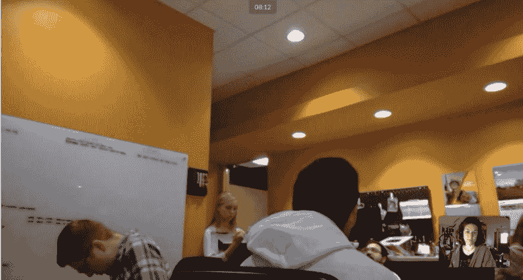

# 远程工作…当您的团队在办公室时

> 原文：<https://dev.to/epicosity/working-remotely-when-your-team-is-in-the-office-3b14>

### 远程工作…当您的团队在办公室时

随着越来越多的企业允许员工远程工作，这是一个热门话题。甚至有越来越多的完全远程的公司。在过去的 10 年里，我一直在为传统的办公室公司和完全远程的公司远程工作。我目前是传统办公室公司为数不多的远程员工之一。

当然，你从每个人那里听到的东西都是有用的:有一个指定的工作区域，休息一下，穿好衣服/准备好一天的工作，就像你在现场工作一样，等等。但是这里有一些我这么多年来在这方面收集到的技巧。

### **做工作**

*   **使用工具** : [特雷罗](http://trello.com)， [Skype](http://skype.com) ， [Slack](http://slack.com) 等等所有这些工具都有助于让你的团队保持有序和联系，同时让远程员工也能轻松参与。白板上的任务列表对于办公室员工来说很棒，但是将它移到 Trello(或类似的东西)将允许团队在他们工作的任何地方查看任务列表。
*   **测试技术**:提前确保视频会议/Skype 通话轻而易举。你能听到吗？你能看见吗？他们能听到你和看到你吗？重要的是要确保所有这些工作都立即进行，而不是因为某人笔记本电脑上的劣质麦克风而错过重要会议。
*   视频会议:考虑召开所有员工(无论是否在办公室)都参加的视频会议。我们每周两次签到，不需要每个人都视频，但有时每个人都视频会工作得更好，特别是在远程客户会议上。

*   **分享所有细节:**确保在日历邀请中随时可以找到任何视频会议链接和电话号码，这样在会议前几分钟就不会出现如何连接到会议的问题。
*   **参与其中**:我发现为文档、流程改进和公司内部网做贡献有助于巩固你在团队中的角色。作为一名远程员工，我一天中不会受到随机干扰，而且我发现我可能会有一点额外的时间来跟踪我工作时的步骤/文档，这可以与团队的其他成员共享。
*   日程安排:把你的日程安排放在整个团队都能看到的日历上。你的正常工作时间，午休，假期是什么时候？团队成员需要知道你的时间表，这样他们就不会在你不在的时候等待回复。
*   获得备份工作:如果你在等待团队成员的回复，确保你有备份工作要做。如果你在办公室，远程员工不能像你一样在同事的办公桌前鬼鬼祟祟，所以如果你需要等待回复，你需要确保你有一些有成效的工作要做。并确保你跟进，以获得你可能在等待的信息。
*   **畅所欲言**:确保作为一名远程员工，你在小组会议上畅所欲言。如果你发现很难在会议中打断对话，看看是否让你的团队增加一个会议主持人，确保每个人都有机会发言，而不必处理滞后和中断对话。
*   **视频示例**:如果你不能和某人现场交谈，制作视频( [VidYard](http://vidyard.com) 等)来记录示例。你需要向团队成员展示如何获取一些信息吗？有没有一个你想展示给别人但不能亲自展示的 bug？一个快速视频抵得上 1000 字吧？

### **获得社会**

*   **到达办公室**:尽可能拜访办公室，亲自参加团队建设活动。无论是在生产方面还是在社交方面，感觉自己是团队的一部分是很重要的。
*   **音乐化:**我们在 [Spotify](http://spotify.com) 上创建了一个团体播放列表，办公室和远程员工可以收听并帮助管理。
*   **发挥创意**:在无法亲自参与的情况下，以数字方式参与活动。当我们公司举办活动时，比如特定的盛装日，我会试着盛装打扮并拍照分享。发挥创造力，即使不在办公室也要尽可能多地参与。

### 实验

*   可以尝试的事情:有几个技巧我还没有尝试过，但我愿意尝试，比如有负责任的合作伙伴，在 slack 上使用像 howdy 这样的站立会议机器人，以及在我们的 slack 组中启动照片分享频道。

你是传统办公室公司仅有的远程员工之一吗？你有什么诀窍让它发挥作用？

* * *