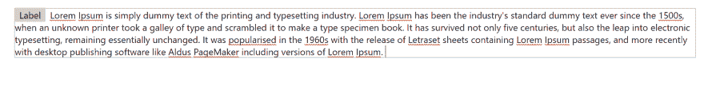

# 在前面带有不可编辑元素的文本输入换行

> 原文：<https://dev.to/rafi993/wrapping-text-input-with-non-editable-element-at-front-23ia>

我最近不得不构建文本输入，该输入换行到下一行，但在开头有不可编辑的元素。显然，用可编辑的内容来构建是相当容易的，这里是实现这一点的代码片段

```
import React, { useCallback } from "react";

const WrappingInput = () => {
  const handlePaste = useCallback(event => {
    event.preventDefault();
    const value = event.clipboardData.getData("text/plain");
    document.execCommand("insertHTML", false, value);
  }, []);

  return (
    <div className="wrapping-input">
      <span>Label</span>
      <span contentEditable onPaste={handlePaste} />
    </div>
  );
};

export default WrappingInput; 
```

Enter fullscreen mode Exit fullscreen mode

以及相应的 css

```
.wrapping-input > span:first-child {
  padding: 0.1em 0.5em;
  background: #ccc;
}

.wrapping-input > span:last-child {
  padding: 0.1em 0.5em;
  outline: none;
} 
```

Enter fullscreen mode Exit fullscreen mode

你会得到这样的文本输入。

[](https://res.cloudinary.com/practicaldev/image/fetch/s--rEq5Oac9--/c_limit%2Cf_auto%2Cfl_progressive%2Cq_auto%2Cw_880/https://thepracticaldev.s3.amazonaws.com/i/xmjeitpkbe7zspcaj94p.PNG)