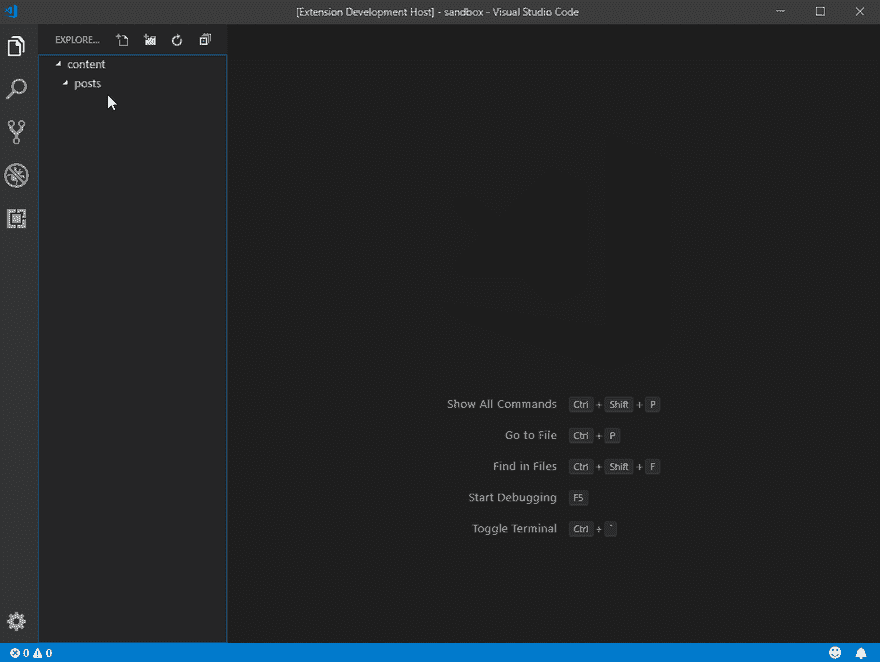
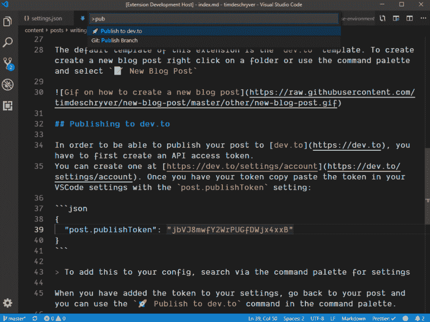

# 使用 VSCode 编写 dev.to 博客文章

> 原文：<https://dev.to/timdeschryver/writing-a-dev-to-blog-post-with-vscode-1fn>

今天，我向大家介绍[📝新的博客文章](https://marketplace.visualstudio.com/items?itemName=timdeschryver.new-blog-post)从 Visual Studio 代码中创建和发布 [dev.to](https://dev.to) 博客文章的简单方法。

## 安装

要安装或在扩展中搜索`📝 New Blog Post`,请前往 https://marketplace.visualstudio.com/items?市场[itemName = timdeschryver . new-blog-post](https://marketplace.visualstudio.com/items?itemName=timdeschryver.new-blog-post)。

## 写一篇开发帖子

这个扩展的默认模板是`dev.to`模板。要创建新的博客文章，在浏览器中右键单击或使用命令面板并选择`📝 New Blog Post`

[](https://res.cloudinary.com/practicaldev/image/fetch/s--N9nI6tPl--/c_limit%2Cf_auto%2Cfl_progressive%2Cq_66%2Cw_880/https://raw.githubusercontent.com/timdeschryver/new-blog-post/master/other/new-blog-post.gif)

## 发布到开发到

为了能够将您的帖子发布到`dev.to`，您必须首先创建一个 API 访问令牌。
你可以在 https://dev.to/settings/account 的[创建一个。一旦你有了你的令牌拷贝，就用`post.publishToken`设置:
将令牌粘贴到你的 VSCode 设置中](https://dev.to/settings/account)

```
{  "post.publishToken":  "jbVJ8mwfY2WrPUGfDWjx4xxB"  } 
```

Enter fullscreen mode Exit fullscreen mode

> 要将它添加到您的配置中，请通过命令面板搜索设置

当你将令牌添加到你的设置中后，回到你的帖子，你可以使用命令面板中的`🚀 Publish to dev.to`命令。

[](https://res.cloudinary.com/practicaldev/image/fetch/s--0b-z7SvD--/c_limit%2Cf_auto%2Cfl_progressive%2Cq_auto%2Cw_880/https://raw.githubusercontent.com/timdeschryver/new-blog-post/master/other/publish-dev-to.png)

## 为什么

我创建这个扩展是为了熟悉 VSCode 扩展。

另外，我写博客的工作流程是:

*   在 VSCode 中编写它们
*   发布到 GitHub
*   现在有一个[的](https://zeit.co/now)触发器可以自动部署一个新版本到 [timdeschryver.dev](https://timdeschryver.dev)
*   在开发目标上手动交叉发布

为了让自己轻松一点，我认为这个扩展是节省几分钟的一个很好的补充🙂。

## 更多信息

要了解更多信息和这个扩展的源代码，请访问 [GitHub repo](https://github.com/timdeschryver/new-blog-post)