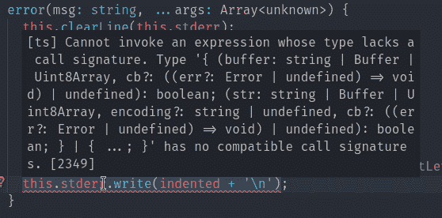
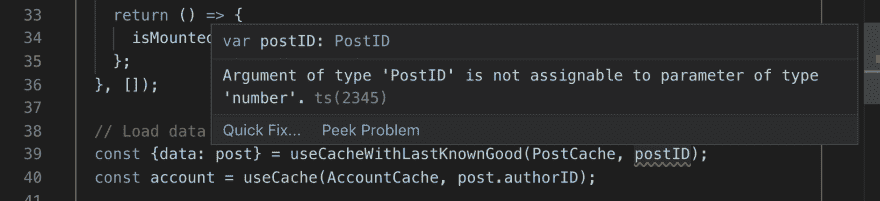
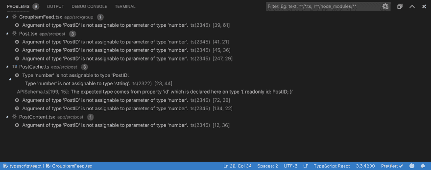

# 编写好的编译器错误信息

> 原文：<https://dev.to/calebmer/writing-good-compiler-error-messages-khc>

当你试图发布一些代码时看到一个错误消息，这一点都不好玩。这意味着你离工作软件又进了一步！许多错误信息完全不可理解，这并没有什么帮助。

[](https://res.cloudinary.com/practicaldev/image/fetch/s--HV_dRkQa--/c_limit%2Cf_auto%2Cfl_progressive%2Cq_auto%2Cw_880/https://calebmer.com/asseimg/writing-good-compiler-error-messages/typescript-error.png)

在花了很多时间[重新设计 Flow 的错误消息](https://medium.com/flow-type/better-flow-error-messages-for-the-javascript-ecosystem-73b6da948ae2)之后，我开发了一个个人风格的指南，用于编写有用的编译器错误消息。在进入风格指南之前，我将分享我对错误信息的看法。

## 哲学

大致上，您可以将开发人员对错误消息的反应分为两类:

*   80% 的时候，开发人员会立即知道修复是什么。该错误将与他们正在处理的代码有关。开发人员甚至可以通过查看 IDE 中红色曲线的位置来知道如何修复这个问题*。不需要阅读错误信息。*
*   20% 的时候，开发人员不会马上知道为什么编译器说他们的代码不正确。编译器可能有一个复杂的规则，虽然不直观，但对程序的安全很重要。在这种情况下，错误消息应该提供足够的信息，使开发人员能够深入研究他们的程序。

在 **80%** 的情况下，开发人员要么快速迭代他们的代码，一个长的错误消息会对他们的生产力造成*的伤害*。他们只需要看一眼消息就知道要修复什么。

在 **20%** 的情况下，很难在一条错误消息中包含足够的上下文来解释问题。错误消息的位置可能远离报告的位置，因为编译器不能确定人的意图。这个错误可能是由一个非常细微的规则引起的，这个规则不容易用错误消息格式来解释。

在 20%的情况下，一个很好的粗略错误消息的例子是 Rust borrow 检查器报告的任何内容或 Elm 无限类型错误消息:

```
I am inferring a weird self-referential type for x:

11| f x = x x
      ^
Here is my best effort at writing down the type. You will see ∞ for parts of
the type that repeat something already printed out infinitely.

    ∞ -> a

Staring at this type is usually not so helpful, so I recommend reading the
hints at <https://elm-lang.org/0.19.0/infinite-type> to get unstuck! 
```

Elm 甚至承认“盯着这个……通常是没有帮助的”。

## 上下文

理解*的上下文也很重要，在这里*开发者会看到一个错误消息。对于一种编程语言，理想情况下，你有很好的编辑器集成，这样用户就可以在像 VSCode 这样的编辑器中看到你的错误信息。

IDE 上下文支持一到两个句子长的简短错误消息。当你悬停在一个错误上时，弹出窗口不会给你太多空间！

[](https://res.cloudinary.com/practicaldev/image/fetch/s--oRwBUArU--/c_limit%2Cf_auto%2Cfl_progressive%2Cq_auto%2Cw_880/https://calebmer.com/asseimg/writing-good-compiler-error-messages/error-popup.png)

许多 ide，比如 VSCode，也有某种面板，可以一次显示所有的错误信息。这个空间的设计也最适合一两句话长的错误信息。

[](https://res.cloudinary.com/practicaldev/image/fetch/s--D1WZWsK_--/c_limit%2Cf_auto%2Cfl_progressive%2Cq_auto%2Cw_880/https://calebmer.com/asseimg/writing-good-compiler-error-messages/problems-pane.png)

思考显示错误信息的上下文对我的风格指南*影响很大*。通常，大多数编译器开发人员在命令行(CLI)中设计他们的错误信息。这就是为什么您会得到打印出代码的彩色多行消息。

我设计错误信息 *IDE 先*，而不是 *CLI 先*。就像你设计一个移动网站一样。IDE 比 CLI 受到更多的限制。如果您设计了一个好的 IDE 消息，您可以很容易地将它应用到 CLI。由于在设计消息时没有考虑到 IDE 的约束，因此将为 CLI 设计的消息应用于 IDE 要困难得多。

## 风格指南

现在你知道了我的哲学和我设计的背景，让我们进入我的错误信息风格指南吧！

*   保持错误消息简短。最好是一个简单明了的句子。这种格式最适合在 IDE 环境中使用。

*   错误位置非常重要，因为这是 IDE 中红色曲线的位置。在触发错误的操作中选择最小的可能位置。如果用户正在编写一个新的操作，错误将指向他们正在工作的地方。如果用户正在重构，错误将指向所有需要更改的操作。

*   不要打印出开发人员很容易在代码中找到的信息。而是打印一个对 IDE 中链接的信息的引用。TypeScript 喜欢在错误消息中打印出巨大的字体，这使得阅读消息变得困难。

*   使用正确的英语语法。这可能是显而易见的，但要编写一个能产生正确英语语法的程序可能很难。将任意的句子片段拼接在一起很容易。给你的句子片段的语法结构制定一些规则。额外增加像冠词这样的语法修饰也是值得的:“一个`String`不是一个`Int`”vs“`String`不是`Int`”。使用开发人员定义的名称时要小心。

*   用第一人称复数写信息。也就是用“我们”。例如“我们看到一个错误”。这将编译器拟人化为一个在开发者代码中寻找 bug 的团队。通过将我们的类型检查器拟人化，错误消息感觉就像一个对话。Elm 的错误消息以使用第一人称而闻名:“我看到一个错误”。第一个人让我觉得有点不舒服。编译器当然不是一个人的，也不是一个人造出来的。我更喜欢用“我们”作为妥协。

*   用现在时代替过去时。不要说“我们发现了”，而要说“我们看到了”。当向用户显示错误时，代码当前处于不良状态。从编译器作者的角度来看，编译器在离散的时间点运行，并在这些时间点“发现”错误。从开发人员的角度来看，IDE 中的错误反映了程序的当前状态，而不是一个离散的编译器运行。更喜欢开发者的 IDE 上下文，用现在时。

*   尽可能降低年级阅读水平。为此，我使用了海明威编辑器。我将粘贴一条错误消息，编辑器告诉我阅读级别(例如，6 年级)。然后，我试图在不牺牲清晰度的情况下，尽可能地降低等级。

*   使用开发人员能够理解的语言，而不是编译器语言。像“标识符”、“令牌”和“表达式”这样的词是编译器专用的。更喜欢开发人员在与同事交谈时使用的名字。还要考虑错误消息的上下文。如果你期望一个变量名，说出来而不是说“期望的标识符”。

*   使用 Markdown 格式化错误信息。如果你想包含一个代码片段，把它放在反斜杠(`)之间，反斜杠在 Markdown 中用来表示内联代码。代码编辑器应该适当地格式化您的消息。

*   如果您使用引号，请确保它们是正确的大括号字符。比如:“短语”而不是“词组”。看出区别了吗？很微妙。我已经养成了在学完印刷术课程后输入这些字符的习惯。 [U+201C (")](https://graphemica.com/%E2%80%9C) 、 [U+201D (")](https://graphemica.com/%E2%80%9D) 、 [U+2018 (')](https://graphemica.com/%E2%80%98) 、 [U+2019 (')](https://graphemica.com/%E2%80%99) 。

遵循本指南将会产生具有一致语气、声音和风格的错误消息。

## 结论

简短明了的错误消息要比冗长详细的错误消息好得多。它们更适合开发人员的 IDE 环境，并且当开发人员试图调试一个特别不直观的错误时，它们不会分散开发人员的注意力。

好的错误消息会让开发人员更有效率。他们将花更少的时间盯着错误信息文本，而花更多的时间来开发用户喜欢的产品。

## IDE 愿望清单

我想从 ide 中获得两个特性来呈现用我的风格指南编写的错误消息。具体来说，我希望在 VSCode、Atom 和其他代码编辑器支持的
[语言服务器协议(LSP)规范](https://microsoft.github.io/language-server-protocol/specification)中包含这些特性。

1.  我希望用 markdown 呈现我的错误消息。目前，至少在 VSCode 中，错误消息是用等宽字体显示的。我的信息被设计成带有内嵌代码片段的适当的英语句子，而不是代码。
2.  我想链接到错误消息中的代码。通常，我会遇到一个错误，显示“`Foo`不是`Bar`”。我希望“`Foo`”成为一个超链接，指向编译器找到`Foo`类型的地方！`Bar`也一样。我可以用 [LSP 的`relatedInformation`字段](https://microsoft.github.io/language-server-protocol/specification#diagnostic)绕过这个问题，但是这和能够写一个内联超链接是不一样的。

## 进一步阅读

*   我对[流程的错误消息重新设计](https://medium.com/flow-type/better-flow-error-messages-for-the-javascript-ecosystem-73b6da948ae2)的声明。
*   Elm 的[人类编译器错误](https://elm-lang.org/blog/compiler-errors-for-humans)帖子。
*   理性也对他们的错误信息给予了很多思考。