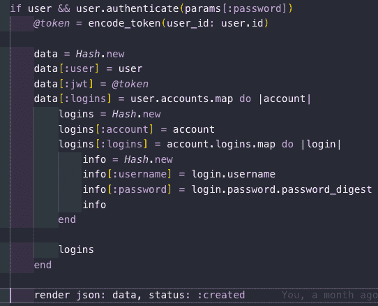
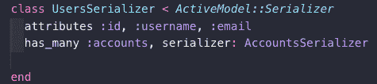
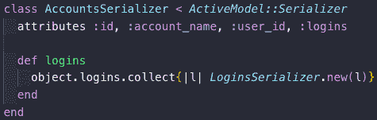
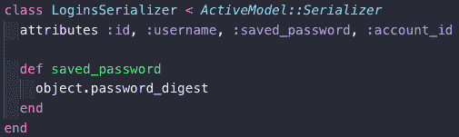
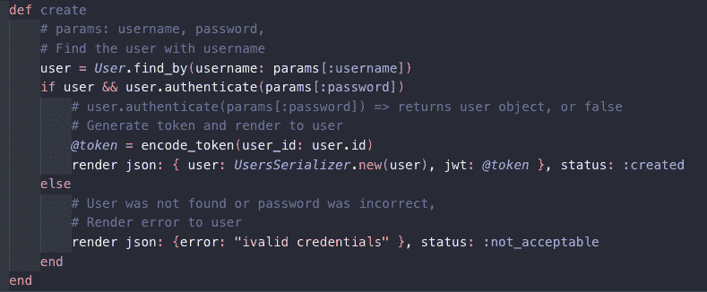
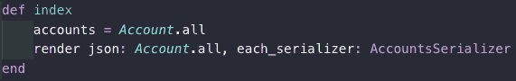
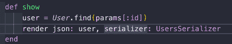

# WTF 反正是序列化器？？

> 原文：<https://dev.to/caffiendkitten/wtf-is-a-serializer-anyway-1dgj>

在我熨斗学校的期末项目中，我遇到了序列化程序的问题。此外，Rails 序列化程序不想访问深度超过 1 级的信息。因为我正在链接信息，这导致了一个问题，如果不将我的所有信息保存在同一个表中(这是我不想做的)，就很难处理。在两位教练的大力帮助下，经过一天的研究，我至少破解了 3 次，终于让它正常工作了，但是当我问及任何可能更好地解释 Rails 序列化程序的文档时，“不，它不再被维护了，因为每个人都在转向 Fast JSON。”我只有这些了...太好了。只是我的运气。我使用不再维护的产品。

但是这让我很好奇...什么是串行器/为什么我要使用它/什么是快速 JSON？

> “序列化是指将对象转换为可保存到磁盘(例如保存到文件或数据存储)、通过流发送(例如 stdout)或通过网络发送的格式的过程。对象序列化的格式可以是二进制或结构化文本(例如 XML、JSON YAML…)。JSON 和 XML 是 web 应用程序中最常用的两种序列化格式。(5)

Ruby on Rails 使用和“active model::serializer”来“封装对象的 JSON 序列化”...简而言之，序列化器用面向对象的开发取代了哈希驱动的开发。”(1)

## 我的嵌套混乱修复

哇！不用构建一个大的信息表就可以嵌套相关数据，这是多么有趣的一种方式。通过序列化，我能够将每个模型分离到不同的表中，并为每个模型使用一个序列化程序来关联它们。我的所有模型都引用了它们所属的事物，但是对于 rails 序列化程序，它似乎看不到超过 1 层的深度。

我最初的修复“老师”设置的是我的数据:

它成功地显示了我的数据，但是顺序都错了。我必须有如此多的枚举级别才能看到什么包含了什么，谁的数据是谁的，以至于它是不可用的。它很恶心，在我放弃并重置到工作状态之前，它扼杀了我的项目大约 30 分钟。幸运的是，我总共只损失了大约两个小时。

然后，我的教练发现这里的问题是我试图序列化一个数据集合(活动关系),就好像它是一个单一的资源。对于集合，您需要指定“each_serializer:”而不仅仅是“serializer:”。我和他们都花了很多时间去寻找，尽管这很令人困惑...serializer:指的是“集合序列化程序”,我需要访问集合中的 each_searalizer。啊...这很有意义，它允许我将我的数据关联到一个漂亮的嵌套散列中。

## 那么这个快速的 JSON 是什么，它是如何让序列化变得更容易的呢？

Fast JSON 是一个“针对 Ruby 对象的闪电般快速的 JSON:API 序列化程序”(4)速度更快，因为它支持 belongs_to、has_many 和 has_one，支持复合文档，是复合文档的优化序列化，有缓存。通过支持 belongs_to 和 has_many，它能够更好地查看集合，并使用“is_collection”标签来指定一个集合的存在，并根据它们的关联关系对它们进行跟踪。

## 那么如何设置一个序列化器呢？

1.  确保您有一个选择序列化程序的宝石。因为在我参加熨斗学校项目的时候，我完成了他们的演练，并使用了“gem”active _ model _ serializer，“~> 0.10.7”。

2.  不要忘记为您想要关联的每个表生成一个序列化程序文件。我对我的所有 4 个表都这样做了。您需要使用“rails g serializer”为每个序列化程序进行单独的生成。因为有许多用户，每个用户可以有许多帐户组，每个组可以有许多登录凭证，但是每个登录凭证只能有一个与之相关的密码。

3.  进入每个序列化程序文件并关联它们。从顶层开始，一步步往下。对我来说，这意味着我必须设置用户的属性:用户名、电子邮件和“has_many :accounts，serializer:accounts serializer”
    
    
    

4.  现在确保每个需要查看数据的控制器都有它需要使用的序列化程序。
    
    
    
    
    每一个都代表我拥有的一个控制器，我需要使用一个串行化器来查看它的相关数据。

### 棘手点

因为在我的项目中，每个用户都有一个帐户组列表，并且每个帐户组都可以有多个相关联的凭据，所以我需要做一些适当的工作，让他们看到每个帐户都有一个针对每个凭据的序列化程序。汪汪。不容易，这就是为什么花了这么长时间。但是，一旦完成，我的数据就能完美地显示出来，并且很容易看出哪些数据与每个用户相关联，以及它与哪个帐户组相关联。

**注意::**我的表都没有任何 has_many 关联。每个表都属于另一个表，所以这是一种单向关系。我不确定如果存在 has_many 关系，序列化程序会如何变化。

#### 参考文献

1.  [https://github . com/rails-API/active _ model _ serializer/tree/v 0 . 9 . 3](https://github.com/rails-api/active_model_serializers/tree/v0.9.3)
2.  [https://docs . Microsoft . com/en-us/dot net/cs harp/programming-guide/concepts/serialization/](https://docs.microsoft.com/en-us/dotnet/csharp/programming-guide/concepts/serialization/)
3.  [https://github . com/rails-API/active _ model _ serializer/issues/1788](https://github.com/rails-api/active_model_serializers/issues/1788)
4.  [https://github . com/网飞/fast _ JSON API #序列化器-定义](https://github.com/Netflix/fast_jsonapi#serializer-definition)
5.  [https://www . acune tix . com/blog/articles/what-is-unsecured-deserialization/](https://www.acunetix.com/blog/articles/what-is-insecure-deserialization/)

###### 请注意，我仍在学习中，如果我说的不正确，请告诉我。我很想了解更多我可能不完全了解的东西。