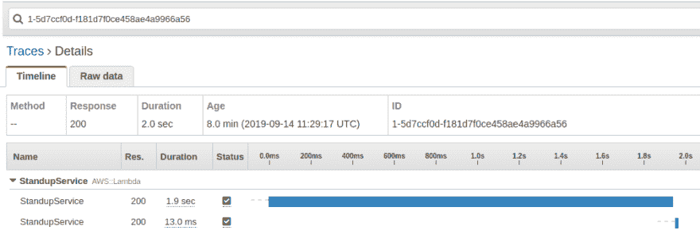
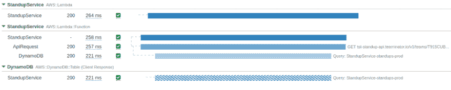
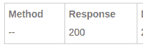

# 兰巴的 x 射线

> 原文：<https://dev.to/wparad/x-ray-in-lamba-e1h>

AWS 引入了一个奇妙的请求跟踪解决方案，渗透到他们的一些更好的产品中。并且可以通过简单的开关自动配置。在 lambda 中，只需要这样的东西:

```
//  CloudFormation  snippet  "LambdaFunction":  {  "Type":  "AWS::Lambda::Function",  "Properties":  {  ...  "TracingConfig":  {  "Mode":  "Active"  }  }  } 
```

Enter fullscreen mode Exit fullscreen mode

现在我们在 X 射线中得到了一些惊人的结果

[](https://res.cloudinary.com/practicaldev/image/fetch/s--t0k8K9_e--/c_limit%2Cf_auto%2Cfl_progressive%2Cq_auto%2Cw_880/https://cdn-images-1.medium.com/max/1009/1%2AA8w_qQNcbRhPyyUj_FKrcg.png)

耶！或者等等，其他的东西呢？

所以我最近发现有些通过 DynamoDB 的请求花费的时间比我希望的要长。[站立& Prosper](https://standup.teaminator.io) (我们的社区站立应用程序)集成了一个 Slack，Slack 要求响应在 3 秒内。所以当一个请求开始需要一段时间时，我的团队会发现(我们会遇到从 Slacks API 返回的大量错误)。但是你会注意到 DynamoDB 不在这里。

另外，仅仅跟踪 DynamoDB 是不够的，如果我想跟踪代码的性能呢？通过 AWS X 射线文档，您将会遇到无用的文档。[点击这里](https://docs.aws.amazon.com/xray-sdk-for-nodejs/latest/reference/)亲自体验一下。

仅在本文档中就有三个词重复出现:

> 自动模式与 aws-xray-sdk-express 模块一起使用，以支持快速应用程序，但是它也可以在快速应用程序之外使用。

(对那些迂腐的人来说，这句话只出现了两次，那一次，单词*然而*被替换成了*但是。)*

不要担心这个问题，您可能没有使用 Express 应用程序，但是即使您使用了，您仍然想知道它是如何工作的，所以我将忽略这一部分(并得到好的东西)。

有一些有趣的方面，将有助于首先解释之前进一步。AWS X-Ray 有一些独特而深奥的术语，我将在这里对其进行定义:

*   AWS X 射线以树形格式记录痕迹。您从根开始，它可能会自动为您创建(如果您使用的是 Lambda，它会自动为您创建，对于其他服务，它不会自动为您创建)，您需要这样做:

```
const segment = new AWSXRay.Segment('ROOT' /\* or something \*/); AWSXRay.setSegment(segment); 
```

Enter fullscreen mode Exit fullscreen mode

*   **段:**这是树的一个节点。创建一个这样的开始跟踪。当 lambda 启动时，已经存在一个段。当你完成跟踪后，**关闭**该段。
*   [*AWS 概念页面*](https://docs.aws.amazon.com/xray/latest/devguide/xray-concepts.html) *，以防你感兴趣*，但无济于事

确实是这样，但是如果没有那两个概念，就有点难以理解是怎么回事了。也忽略其余的文件，它不会有帮助。

现在进入正题。如果你只是想创建一些 X 射线的痕迹，存储和使用它们。你很幸运。调用新 AWSXRay。如上所述进行分段并开始使用:

```
const segment = new AWSXRay.Segment('ROOT');
// You can search through annoations
segment.addAnnotation('indexedData', 'value');

// You cannot search through metadata
segment.addMetadata('NonIndexedData', 'value');
segment.close(); 
```

Enter fullscreen mode Exit fullscreen mode

你完了！

等一下，为什么这与 lambda 的跟踪完全分离…你会看到这一段是你图上的一个单独的节点，完全断开。

好的，结果是 Lambda 为您跟踪并生成片段，但是有一个问题，您不能使用 X 射线提供的任何好功能，因为您实际上不能与 Lambda 创建的片段进行交互！

不要费心去尝试。关于这个话题的投诉[并不少](https://github.com/aws/aws-xray-sdk-node/issues)

> 在 X 射线控制台上看到的 Lambda 段是在 Lambda 的运行时启动代码中创建的，并独立于 X 射线 SDK 异步发送。因此，facade 段是一个占位符，它只包含 Lambda 创建的跟踪 it/父 id/采样决策。它永远不会被发送出去..

啊？所以，管他呢。

> AWS X 射线 SDK 有两种模式:手动和自动。默认情况下，SDK 处于自动模式。您可以使用以下方法翻转 SDK 的模式:

默认情况下，这也令人困惑。忽略这一点，我们将使用 lambda 中的默认值。

这很好，但我仍然希望我的痕迹出现在同一个 X 射线图上。你猜对了。因为文档没有涉及到这一点，所以我创建了一个简单的示例:

首先，安装核心库的实际工作版本。出于某种原因，这不是默认设置，尽管 Lambda 支持异步，但 X-Ray 库不支持。(很抱歉，这直接依赖于 aws-sdk install 将其列为对等依赖项，这意味着您将所有内容都放入 lambda 包中。但是有一个 Github 问题建议支持[类似的变化](https://github.com/aws/aws-xray-sdk-node/issues/113)。)

npm 安装[AWS-Xray-SDK-core @ 2 . 3 . 6-experimental . 1](mailto:aws-xray-sdk-core@2.3.6-experimental.1)

包含 begin 和 end 的单个类，用于处理部分代码的跟踪:

```
const AWSXRay = require('aws-xray-sdk-core');
AWSXRay.middleware.disableCentralizedSampling();
AWSXRay.capturePromise();
AWSXRay.captureAWS(require('aws-sdk'));
AWSXRay.captureHTTPsGlobal(require('http'));
AWSXRay.captureHTTPsGlobal(require('https'));

class XrayManager {
  constructor() {
    this.parentSegment = null;
  }

  begin(type, request) {
    this.parentSegment = AWSXRay.getSegment();
    if (!this.parentSegment) {
      return;
    }

    const segment = this.parentSegment.addNewSubsegment(type);
    // make this the new parent of all future segments
    AWSXRay.setSegment(segment);
    if (request) {
      // Duplicate this information because Lambda doesn't support
      // the default tracking on the parent segment because it isn't real
      segment.addAnnotation('HttpMethod', request.httpMethod);
      segment.addAnnotation('Route', request.route);
      segment.addAnnotation('URL', request.path);

      segment.http = new AWSXRay.middleware.IncomingRequestData({
        headers: {
          'x-forwarded-for': request.headers['X-Forwarded-For'],
          'user-agent': request.headers['User-Agent'],
          'host': request.headers.Host
        },
        method: request.httpMethod,
        url: request.path,
        connection: { secure: request.headers['X-Forwarded-Proto'] === 'https' }
      });
    }
  }

  end(response, error) {
    if (!this.parentSegment) {
      return;
    }
    const segment = AWSXRay.getSegment();
    if (response) {
      segment.addAnnotation('StatusCode', response.statusCode);
      if (response.statusCode === 429) {
        segment.addThrottleFlag();
      }
      if (AWSXRay.utils.getCauseTypeFromHttpStatus(response.statusCode)) {

   segment[AWSXRay.utils.getCauseTypeFromHttpStatus(response.statusCode)] = true;
      }
      segment.http.close(response);
    }
    segment.close(error);
    // pop the stack by reseting the parent segment
    AWSXRay.setSegment(this.parentSegment);
  }
}

module.exports = XrayManager; 
```

Enter fullscreen mode Exit fullscreen mode

然后你需要做的就是

```
// Before the request
const XrayManager = new XrayManager();
XrayManager.begin('ApiRequest', requestObject);
const responseObject = await request(requestObject);
XrayManager.end(responseObject); 
```

Enter fullscreen mode Exit fullscreen mode

并且显示了对这个请求的完整跟踪，在新创建的段中有子请求。

[](https://res.cloudinary.com/practicaldev/image/fetch/s--B3783fmC--/c_limit%2Cf_auto%2Cfl_progressive%2Cq_auto%2Cw_880/https://cdn-images-1.medium.com/max/1024/1%2ATx-k53Op6o04KcAXScNH9g.png)

顶级 Lambda 段阻止方法和状态代码等工作:

[](https://res.cloudinary.com/practicaldev/image/fetch/s--0quvlK6S--/c_limit%2Cf_auto%2Cfl_progressive%2Cq_auto%2Cw_880/https://cdn-images-1.medium.com/max/204/1%2AiH9gjxu4NwOL1LQ_Ym7Myg.png)

这意味着如果你想要它们，你需要创建一个完全独立于当前段的段，这将在你的 X 射线图上创建一个不必要的节点。此外，来自 API 网关响应的`x-amzn-trace-id`与 X-Ray 中创建的不匹配，这意味着跟踪它现在变得非常痛苦。

但事实就是这样，希望这能帮助其他人。还有一个警告。你做了所有你认为正确的事情，**但是**X-Ray SDK 发射器是 UDP 并且与你的 lambda 代码分开跟踪。你不能等待它。因此，当你创建一些段时，它们实际上不会出现在 X 射线中，直到再运行一个 lambda is 执行。后续执行将允许前面的代码完成。

你可能会想 oh context . callbackwaitsforemptyeventloop = true；很好，试试看，看看会发生什么。结果发现 Nodejs8.0(可能还有 Lambda Nodejs10.x)的异步处理有一个错误，当返回一个异步函数结果时，该属性不起作用。