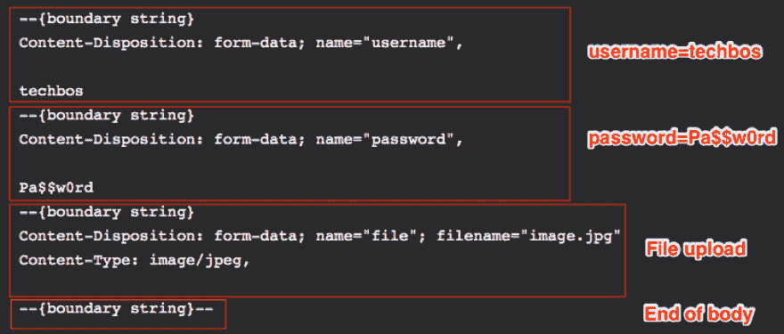

# “x-www-form-urlencoded”或“form-data”😵？两分钟内解释完毕。

> 原文：<https://dev.to/getd/x-www-form-urlencoded-or-form-data-explained-in-2-mins-5hk6>

# TL；速度三角形定位法(dead reckoning)

如果你需要上传文件，`form-data`是你唯一的选择。否则，他们的工作是一样的。`form-data`是一种比`x-www-form-urlencoded`更奇特的数据编码方式。你可以把`x-www-form-urlencoded`想象成`.txt`档，把`form-data`想象成`.html`档。最终，它们都交付了一些 http 负载。

尝试**🏀getd.io 游乐场链接🏀**下面看看标题和正文的样子:

*   [发送带有 x-www-form-urlencoded 的请求](https://getd.io/workspace?r=%7B%22requestMode%22%3A%22BROWSER%22%2C%22method%22%3A%22POST%22%2C%22url%22%3A%22https%3A%2F%2Fgetd.io%2Fplayground%2Frequest%22%2C%22params%22%3A%5B%5D%2C%22headers%22%3A%5B%5D%2C%22body%22%3A%22%22%2C%22formData%22%3A%5B%5D%2C%22formUrl%22%3A%5B%7B%22isEnabled%22%3Atrue%2C%22key%22%3A%22username%22%2C%22value%22%3A%22techbos%22%7D%2C%7B%22isEnabled%22%3Atrue%2C%22key%22%3A%22password%22%2C%22value%22%3A%22Pa%24%24w0rd%22%7D%5D%2C%22bodyEditorFormat%22%3A%22formUrl%22%7D)
*   [发送带有表单数据的请求](https://getd.io/workspace?r=%7B%22requestMode%22%3A%22BROWSER%22%2C%22method%22%3A%22POST%22%2C%22url%22%3A%22https%3A%2F%2Fgetd.io%2Fplayground%2Frequest%22%2C%22params%22%3A%5B%5D%2C%22headers%22%3A%5B%5D%2C%22body%22%3A%22%22%2C%22formData%22%3A%5B%7B%22type%22%3A%22KEY_VALUE%22%2C%22data%22%3A%7B%22isEnabled%22%3Atrue%2C%22key%22%3A%22username%22%2C%22value%22%3A%22techbos%22%7D%7D%2C%7B%22type%22%3A%22KEY_VALUE%22%2C%22data%22%3A%7B%22isEnabled%22%3Atrue%2C%22key%22%3A%22password%22%2C%22value%22%3A%22Pa%24%24w0rd%22%7D%7D%5D%2C%22formUrl%22%3A%5B%5D%2C%22bodyEditorFormat%22%3A%22formData%22%7D)

# 内容类型

|  | **内容类型** |
| --- | --- |
| x-www-form-urlencoded | `application/x-www-form-urlencoded` |
| 表单数据 | `multipart/form-data; boundary={boundary string}` |

关于`form-data`的一个小提示:通常浏览器会生成一个随机的`{boundary string}`，例如`----WebKitFormBoundaryKGUmWkAsjo5nUBp2`，但是如果你愿意，你也可以指定你自己的。示例见下文。

# 请求有效载荷

假设您有一个包含以下字段的登录表单:

| **字段** | **值** |
| --- | --- |
| 用户名 | 泰克诺斯 |
| 密码 | Pa$$w0rd |

当您提交表单时，`x-www-form-urlencoded`的有效负载如下所示。注意琴弦是如何`encodeURIComponent()`d .
的

```
username=techbos&password=Pa%24%24w0rd 
```

对于`form-data`，每个(键，值)对都在它自己的部分中编码，用`{boundary string}`作为分隔符。在这里，我还在最后包含了一个示例部分，向您展示文件上传是什么样子的:

```
--{boundary string}
Content-Disposition: form-data; name="username",

techbos
--{boundary string}
Content-Disposition: form-data; name="password",

Pa$$w0rd
--{boundary string}
Content-Disposition: form-data; name="file"; filename="image.jpg"
Content-Type: image/jpeg,

--{boundary string}-- 
```

内嵌解释:

[](https://res.cloudinary.com/practicaldev/image/fetch/s--gRcWyTJ_--/c_limit%2Cf_auto%2Cfl_progressive%2Cq_auto%2Cw_880/https://thepracticaldev.s3.amazonaws.com/i/pzucwhmiybpy01w42z0q.png)

# API 发送请求

|  | x-www-form-urlencoded | 表单数据 |
| --- | --- | --- |
| [fetch()](https://developer.mozilla.org/en-US/docs/Web/API/Fetch_API/Using_Fetch) | `body`作 [`URLSearchParams`](https://developer.mozilla.org/en-US/docs/Web/API/URLSearchParams) | `body`作 [`FormData`](https://developer.mozilla.org/en-US/docs/Web/API/FormData) |
| [请求()](https://github.com/request/request#forms) | [`form`选项](https://github.com/request/request#applicationx-www-form-urlencoded-url-encoded-forms) | [`formData`选项](https://github.com/request/request#multipartform-data-multipart-form-uploads) |
| [axios()](https://github.com/axios/axios) | `data`作 [`URLSearchParams`](https://developer.mozilla.org/en-US/docs/Web/API/URLSearchParams) | `data`作 [`FormData`](https://developer.mozilla.org/en-US/docs/Web/API/FormData) |

# 处理响应的 API

对于`x-www-form-urlencoded`，使用 [bodyParser](https://github.com/expressjs/body-parser) ，它会将有效载荷解析成`{ key, value }`格式的`req.body`。

```
express.use(bodyParser.urlencoded({ extended: true }));
express.post('/my-form-endpoint', (req, res) => {
  console.log(req.body.username); // print 'techbos'
}); 
```

[Express v4.16.0+](https://expressjs.com/en/4x/api.html#express.urlencoded) 也内置了相同的功能。

对于解析`form-data`，你可以使用[卫生员](https://github.com/mscdex/busboy)或者[强大的](https://github.com/node-formidable/node-formidable)这样的包。见他们的医生。

你最喜欢哪个库来发送/处理表单？在下面留下评论，分享你的❤️❤️❤️经验吧！

查看 [getd.io](https://getd.io) 并留下一些反馈，告诉我们你希望在下一个❤️❤️❤️中看到哪些功能！