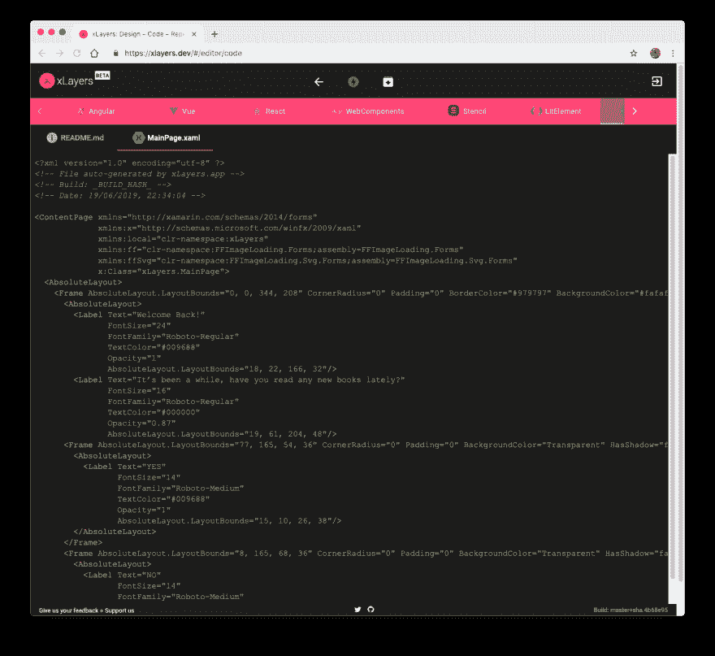

# xLayers - v1.0.0-beta 5

> 原文：<https://dev.to/xlayers/xlayers-v1-0-0-beta-5-47ld>

我们很高兴宣布 xLayers 的新版本:v1.0.0-beta 5🎉🎉

在这个版本中，我们有一些新的特性、改进和小的修复。

此版本的一些亮点是:

*   升级到 Angular V8
*   对 Xamarin 的支持
*   多种翻译(英语，NL)
*   更新了对模板一的支持

完整的变更日志[点击这里](https://github.com/xlayers/xlayers/releases/tag/1.0.0-beta.5)

以下是草图设计生成的示例 Xamarin 代码:

如果您有任何问题或想要向我们提供反馈，请发送 DM 或在我们的 Github 上创建一个问题。

在 Twitter 上关注`@xlayers_`了解更多关于 xLayers 的更新。你也可以通过在[公开集体](https://opencollective.com/xlayers)上捐款来支持我们