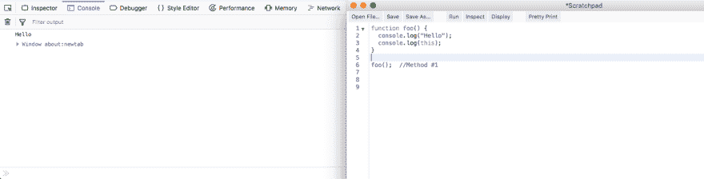
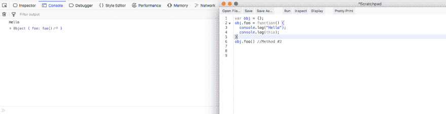
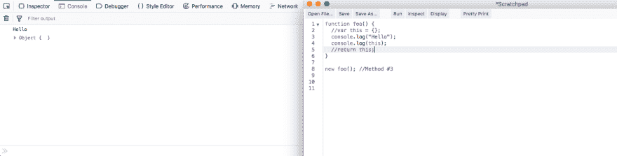
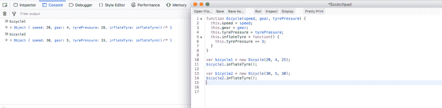
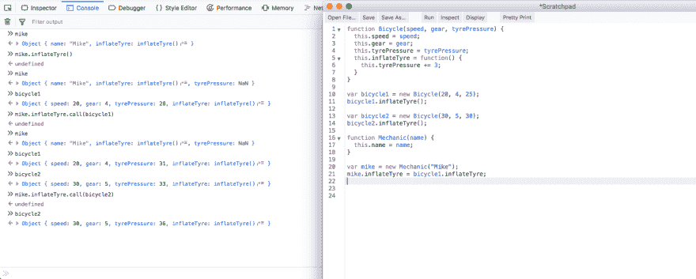

# YDKJS —对象和原型—第 2 部分

> 原文：<https://dev.to/nabendu82/ydkjs-objects-and-prototypes-part2-1k95>

欢迎来到本系列的第 2 部分。

这个系列全部来自于 **Kyle Simpson** 的学习，也来自于 **Kaushik Kothagul** 来自 [Javabrains](https://www.youtube.com/user/koushks/playlists?view=50&shelf_id=1&sort=dd) 的令人惊叹的 youtube Javascript 系列，它也受到了**你不知道的 JS** 的影响。

让我们从第 1 部分的左侧开始。我们看到了执行一个函数的三种方法。我们会看到这三个方法中的**这个**变量是什么。

**方法#1** 中的变量 **this** 是如下例所示的窗口。

 *这是窗口对象*

**方法#2** 中的变量 **this** 就是对象本身，如下图所示。

 *这是物体本身*

**方法#3** 中的变量 **this** 是空对象，是在我们使用 **new** 关键字时由 JS 引擎创建的。

 *新的是空的物体*

现在，让我们看下面的例子来理解执行函数的**方法# 4** 。我们有一个简单的构造函数**自行车**，它也有一个名为**充气玩具**的属性，这是一个函数。接下来我们有两个变量 bicycle1 和 bicycle2，用新的关键字调用它们。他们还调用了 **inflateTyre** 函数，并更新了各自变量的 **tyrePressue** 。这是因为这与**自行车 1** 或**自行车 2** 有关。

 *理解方法四*

现在，让我们添加一个**机械师**麦克。他应该能给任何自行车充气，就像自动充气自行车一样。现在，**机师**只有一个名字属性。我们添加了 mike，使其具有 bicycle1 inflateType 属性。
但是如果我们尝试执行 **mike.inflateTyre()** ，它会给出未定义的**，当我们在控制台中再次看到 mike 变量时，它会将**轮胎压力**显示为 **NaN** (不是数字)。这是因为 Mechanic 没有一个名为 **inflateTyre** 的属性，当我们这样做时，在第 5 行调用 inflateTyre，它使用 tyrePressure 作为 undefined 和`undefined + 3 is equal to NaN`。此外，自行车 1、**轮胎压力**没有增加 3。**

 ** *理解方法四*

现在，我们如何解决这个问题。这就是调用函数的方法#4 发挥作用的地方。我们对每个函数都有一个属性，因为我们知道函数在 JS 中也是对象。这个属性叫做 **call** ，它的主要好处是我们可以用任何对象调用它，然后 this 将引用那个对象。
我们分别通过 Mike . inflateTyre . call(bicycle1)和 Mike . inflate type . call(bicycle2)用 bicycle 1 和 bicycle 2 对象调用 inflate type。我们可以看到迈克能给任何自行车的轮胎充气。
*之所以会发生这种情况，是因为这里面的自行车函数现在是分别循环而不是像早先的麦克变量。*

 *最后方法四*

本系列的第 2 部分到此结束。**