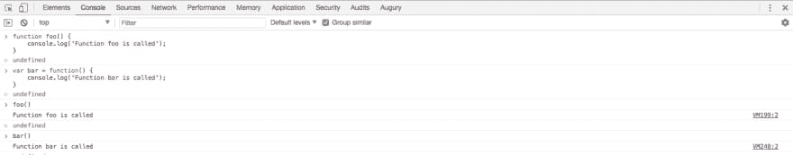
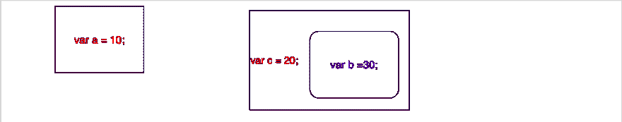
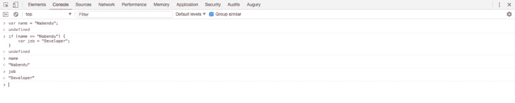
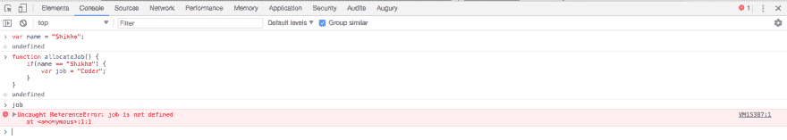
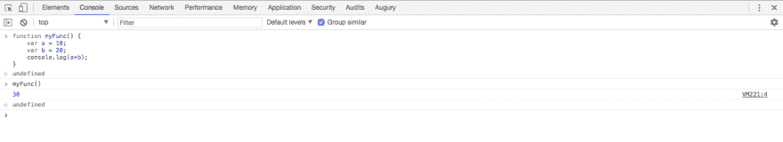
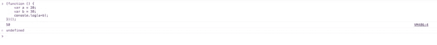

# YDKJS —范围和闭合—第 1 部分

> 原文：<https://dev.to/nabendu82/ydkjs-scopes-and-closures-part1-2c82>

每个 Javascript 开发者都知道一件事，他们对 Javascript 了解不够。在顶层，它只是 var，for，if else 就像任何其他编程语言一样，但是如果你想深入了解 JS 是如何工作的。没有比传奇系列丛书[更好的地方了**的《你不知道的 JS**](https://www.amazon.in/You-Dont-Know-JS-Volumes/dp/9352136268?tag=googinhydr18418-21&source=ps-sl-shoppingads-lpcontext&tag=googinkenshoo-21&ascsubtag=4a820bb3-e3c5-4d47-ab00-16253c9fc78e) 】凯尔·辛普森。它也可以在这个[网站](https://maximdenisov.gitbooks.io/you-don-t-know-js/content/)上免费阅读。

这个系列全部来自于 **Kyle Simpson** 的学习，也来自于 **Kaushik Kothagul** 来自 [Javabrains](https://www.youtube.com/user/koushks/playlists?view=50&shelf_id=1&sort=dd) 的令人惊叹的 youtube Javascript 系列，它也受到了**你不知道的 JS** 的影响。

让我们从函数开始。因为，据说函数是 javascript 中的一等公民。它们实际上是 Javascript 中的对象。在 JS 中创建函数基本上有两种方法。

 *两种方式创建函数*

现在让我们进入范围的概念。每当我们通过说 **var a = 10** 来声明一个变量时，我们就在全局范围内声明它，即我们代码的每一部分都可以访问它。我们有时需要他们，但大多数时候他们制造混乱。

所以，我们把声明放在一个范围内，它只能在这个范围内被访问。将作用域视为盒子，任何东西都不能超出它。

考虑下图。

 *范围框*

现在变量 **a** 只能在它的盒子里访问。我们也可以有盒中盒。在第二个例子中，内部作用域/盒子可以访问它的变量 **b** 和 **c** 。但是外部作用域/盒子不能访问变量 **b** 。

现在，我们如何在 Javascript 中定义这些范围/框。这与 C、C++、Java 等语言有些不同。

在这些语言中, **if 语句**创建了一个作用域，当我们试图访问变量 **job** 时，下面将给出 undefined。

 *如果不创建范围*

> Javascript 是函数作用域，在 JS 中创建作用域的唯一方法是创建函数。这并不完全正确，他们在语言中增加了一些新的内容(在 ES6 中),以不同的方式创建了作用域。我们稍后将研究它们。但是在大多数情况下，您使用函数来创建作用域。

因此，为了在 JS 中创建一个作用域，我们将一个变量放在一个函数中。

 * JS 按函数作用域*

现在让我们看看如何让一个函数不污染全局命名空间。考虑下面的例子。

 *全局功能*

现在，我们创建了局部变量 a 和 b，然后创建了一个全局函数 **myFunc** 。有时我们不想要这种行为。所以，在这种情况下一个**生命** *(立即调用函数表达式)*就来了。以上可以重构如下。

 *人生*

在这里，我们创建一个匿名函数并立即调用它。