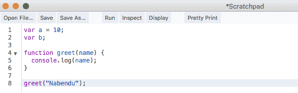
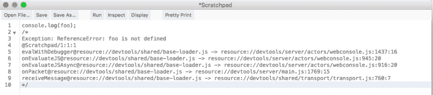
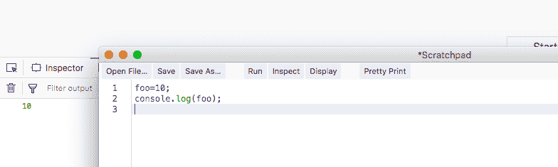
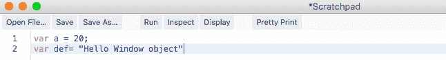
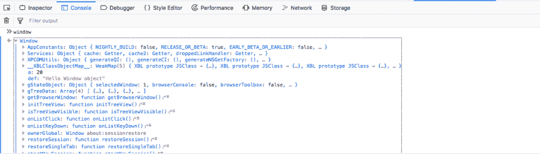
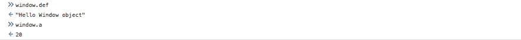

# YDKJS —范围和闭合—第 2 部分

> 原文：<https://dev.to/nabendu82/ydkjs-scopes-and-closures-part2-9ej>

欢迎来到 YDKJS 系列的第二部分。正如在第 1 部分中所讲的，这个系列是基于我从传奇系列书籍 Kyle Simpson 的《你不知道的 JS》和 Javabrains 的 Kaushik Kothagul 的《Javascript》系列中学到的。

在详细理解范围之前，我们必须理解两个概念。JS 中的每个操作不是**读操作**就是**写操作**。

考虑下面的陈述-

> **有 a = 10 个；**

现在这是一个**写操作**，因为我们将 10 写入变量 a。

现在，考虑下面的语句。

> **console.log(一)；**

这是一个**读取操作**，因为我们读取了变量 a 的值。

让我们考虑另一个例子。

> **有 a =10 个；
> 有 b；
> b = a；**

现在，这一行中的 **b=a** 很有趣，因为对于 **a** 来说，这是一个**读操作**，而对于 **b** 来说，这是一个**写操作**。

让我们考虑另一个例子来使这个概念更加清楚。

 *读写示例*

现在在第 4 行，有一个**写操作**，因为当从第 8 行调用 *greet("Nabendu")* 时，我们在这里有**函数 greet(name="Nabendu")** 。因此，将名称变量赋值为“Nabendu”。
第 5 行是通常的读取操作，我们正在读取 a 的值。

让我们来看一个与读写操作相关的更重要的概念。

> 如果我们使用一个没有声明的变量。可以进行写操作，但不可以进行读操作。

让我们来看一个更清楚的例子。

 *读操作*

在上面的例子中，我们试图对一个变量 foo 进行读操作，甚至没有声明它，编译器抛出了一个错误。

现在考虑下面。

 *写操作*

我们在第 1 行进行写操作，即 foo=10。这里我们也没有声明 foo。现在这是完全正确的，编译器不会抛出错误。

窗口对象是所有全局变量作为属性创建的对象。

让我们在 firefox scratchpad 中定义以下两个变量，然后重新加载并运行。

 *火狐便签本*

在 firefox 控制台写窗口，我们可以看到包含这两个变量的窗口对象。

 *窗口对象*

同样，可以访问这两个变量作为窗口对象的属性。

 *窗口对象属性*